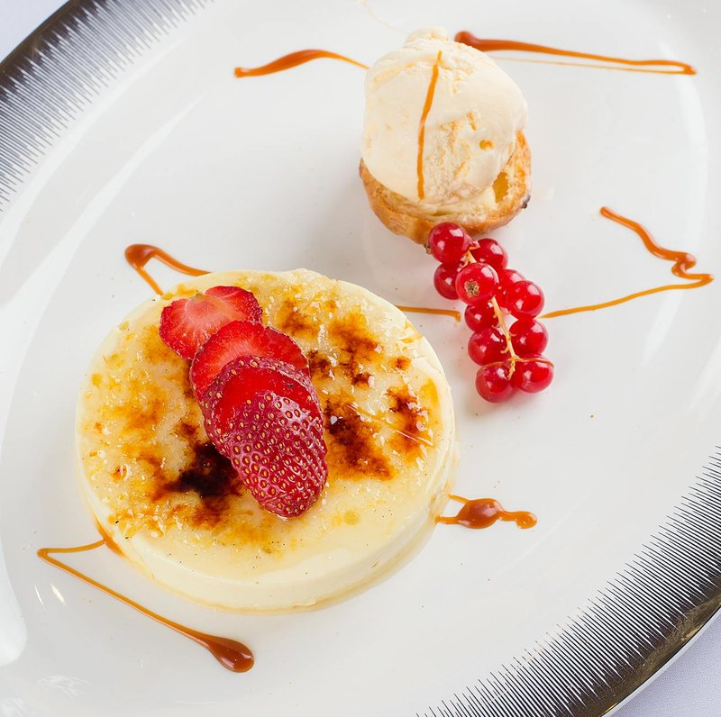

# Crème Brûlée

*The French dinner-party dessert: a chilled vanilla custard topped with a glassy amber crust of caramelised sugar, cracked with a spoon.*

**Serves:** 6

**Prep Time:** 25 minutes (plus 4+ hours chilling)

**Cook Time:** 45 minutes

## Overview
A vanilla pod splits and scrapes into a saucepan with double cream; warmed to just below simmer and infused 20 minutes off heat. Egg yolks whisk with sugar until pale; the warm infused cream pours slowly into the yolks while whisking; everything strains into a clean jug. Ramekins fill in a deep oven tray; boiling water pours into the tray for a bain-marie to come halfway up the ramekins. Baked at 130°C for 35-50 minutes (depending on ramekin size) until just-set with a slight jiggle in the centre. Left to cool and refrigerated overnight to firm. Just before serving, sugar sprinkles in a thin layer over each; torched (or grilled) until amber-glassy.

## Ingredients

### Custard
- 500 ml double cream
- 1 vanilla pod (split and scraped) OR 2 teaspoons good vanilla bean paste OR 1 tablespoon vanilla extract
- 6 egg yolks (large, room temperature)
- 80 g caster sugar
- A pinch of salt

### Caramel topping
- 6 teaspoons caster sugar (or unrefined demerara - gives a deeper amber colour)

### Equipment
- 6 shallow ramekins (10-12 cm wide, 3 cm deep) - wider/shallower is better than deep
- A deep roasting tin (for the bain-marie)
- Boiling water
- A kitchen blowtorch (ideal) OR a domestic broiler / grill

## Method

### Stage 1 - Infuse the cream
1. Pour the double cream into a saucepan.
1. Split the vanilla pod lengthwise; scrape out the seeds; add both seeds and pod (or paste / extract) to the cream.
1. Heat over medium-low until just below a simmer - small bubbles at the edges, gentle steam. Don't boil.
1. Off heat; cover; rest 20 minutes for the vanilla to infuse.
1. (If using extract instead of pod, you can skip the 20-minute rest.)

### Stage 2 - Egg yolks
1. In a wide bowl, whisk egg yolks with sugar until pale, thick and ribbon-y - about 2 minutes.
1. Whisk in the salt.

### Stage 3 - Temper
1. Pour the warm cream slowly into the yolks, whisking continuously (don't dump it all at once or the yolks scramble at the bottom of the bowl).
1. Whisk until smooth.
1. Strain through a fine sieve into a measuring jug - catches the vanilla pod and any cooked egg specks.
1. Skim any foam from the surface (gives a smooth baked top).

### Stage 4 - Bain-marie
1. Heat oven to 130°C (110°C fan).
1. Place 6 ramekins in a deep roasting tin.
1. Carefully pour the custard into each ramekin, dividing evenly (about 130 ml per ramekin in a 10 cm ramekin).
1. Pour just-boiled water into the roasting tin around the ramekins to come halfway up their sides.
1. Carefully transfer to the oven.

### Stage 5 - Bake
1. Bake 35-50 minutes (35 for shallow wide ramekins; 50 for deeper / narrower).
1. The custards are done when:
   - The edges are set firm
   - The centre has a SLIGHT jiggle when the tray is tapped (but doesn't slosh)
1. Don't overbake - the custards continue setting as they cool.

### Stage 6 - Cool and chill
1. Lift the ramekins out of the water bath (oven mitts!); cool to room temperature.
1. Cover each with cling film (don't let it touch the surface).
1. Refrigerate at least 4 hours, ideally overnight.

### Stage 7 - Caramelise (just before serving)
1. Pat the surface of each chilled custard dry with kitchen paper if any condensation has formed.
1. Sprinkle 1 teaspoon caster sugar evenly across each custard surface - a thin uniform layer is the target, not a thick mound (thick caramelises unevenly).
1. **Blowtorch method**: Hold the torch about 5 cm from the surface; move in small circles. The sugar melts, bubbles, then turns amber - about 30-60 seconds per ramekin. Move on as soon as the colour is even amber.
1. **Broiler method**: Place ramekins on a tray; slide under a screaming-hot broiler 5-8 cm from the heat. Watch every second - the sugar can go from amber to burnt-black in 10 seconds. About 90 seconds total.
1. The finished surface should be a glassy amber sheet, tappable with a spoon.

### Stage 8 - Serve
1. Wait 1-2 minutes for the caramel to set fully (it goes from molten to glass).
1. Serve immediately - within 5-10 minutes the caramel softens as it absorbs moisture from the custard underneath.
1. Crack the surface with the back of a spoon at the table; eat with the spoon scooping caramel + custard together.

## Notes
- **Cream only (no milk):** Some recipes lighten with milk. Pure double cream gives the silkiest, densest, most luxurious texture. The custard is rich on purpose.
- **Don't overbake:** Overbaked crème brûlée is granular and rubbery. Pull it out with a SLIGHT jiggle in the centre; carryover does the rest. Better slightly underdone than over.
- **Shallow ramekins are right:** Wider, shallower ramekins (3 cm deep, 10-12 cm wide) give the best ratio of caramel-to-custard. Deep narrow ones give too much custard per square inch of caramel.

## Storage
- Refrigerate baked, uncaramelised custards 3 days, covered.
- Once caramelised, serve within 10 minutes - the sugar topping softens.
- Doesn't freeze well - the custard separates on thaw.
