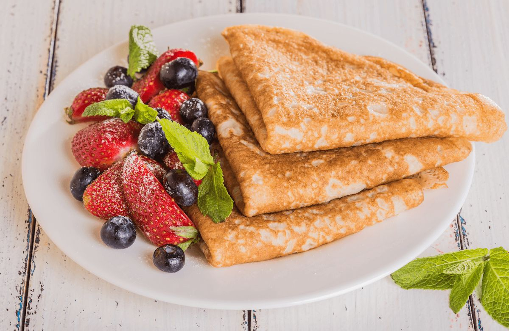

# Crêpes

*France's thin pancake: a loose batter of flour, eggs, milk and butter swirled in a hot pan and cooked seconds till lacy at the edges.*

**Prep Time:** 5 minutes

**Cook Time:** 1 minute

**Yield:** 16 - 18

## Ingredients
- 125 grams plain flour
- 15 grams caster sugar
- pinch of salt
- 2 eggs
- 325 ml milk
- 100 ml double cream
- few drops of vanilla extract
- 20 grams [Clarified Butter (Beurre Clarifié)](../../../base-ingredients/baking/clarified-butter.md) (to cook)

## Overview
Crêpes are the foundation of French pâtisserie and bistro snacking: tissue-thin pancakes with a subtle vanilla scent that can hold any filling sweet or savoury you can think of. The batter is the simplest possible (flour, eggs, milk, melted butter, a pinch of salt, a splash of vanilla) but needs a proper rest of at least half an hour, overnight better, so the flour hydrates and the air bubbles settle out; rushed batter gives tough rubbery crêpes. A hot non-stick pan with the smallest possible slick of butter is essential; a ladleful of batter swirls around the pan, the crêpe sets in 20 seconds, and a confident wrist flips it. Eaten with chocolate spread, with sugar and lemon, with Grand Marnier (Suzette), or with cooked spinach and ham. The simplest party trick a French cook ever had.

## Method
### To make the batter
1. Put the flour, sugar and salt into a bowl.
1. Add the eggs, mix well with a whisk, then stir in 100 ml of the milk to make a smooth batter.
1. Gradually stir in the rest of the milk and the cream.
1. Leave the batter to rest in a warm place for about an hour.

### To cook
1. Give the batter a stir and flavour with the vanilla extract,
1. Brush a 22 cm crêpe pan with a little clarified butter and heat.
1. Ladle in a little batter and tilt the pan to cover the base thinly.
1. Cook the crêpe for about 1 minute.
1. As soon as little holes appear on the surface of the crêpe, turn it over and cook the other side for 30 - 40 seconds.
1. Transfer to a plate and cook the rest of the batter, stacking the crêpes interleaved with greaseproof paper as they are cooked.

## Notes
- Resting the batter for approximately one hour allows the flour to fully hydrate and develops gluten, resulting in tender crépes rather than tough ones
- The tilting motion essential when initially pouring batter is the skill that separates perfect thin crépes from thick pancakes; practice develops the muscle memory
- The quick flip timing (when small holes appear) is learned through practice; too early and the crépe tears, too late and it browns before cooking through
- Cooking only 30-40 seconds on the second side maintains delicate texture; overcooked second sides become crispy rather than tender

## Serving
Serve crépes warm or at room temperature with sweet or savory fillings and accompaniments. They adapt to any dessert concept from simple lemon and sugar to elaborate cake-like constructions. Their neutral flavor allows other components to shine.

## Storage
Cooled crépes stack beautifully on a plate and keep at room temperature, covered with plastic wrap, for up to 2 days. They can also be frozen between sheets of parchment paper for up to one month; thaw at room temperature before use. Reheat gently in a dry pan if needed, though room-temperature serving is often preferable.

*Typically French, these classic crêpes can be filled with numerous delicious ingredients, ranging from lemon and sugar, to crème patissière and fruits. The choice is limited only by the imagination.*
*The vanilla extract can be replaced by orange water or a little grated lemon zest.*
