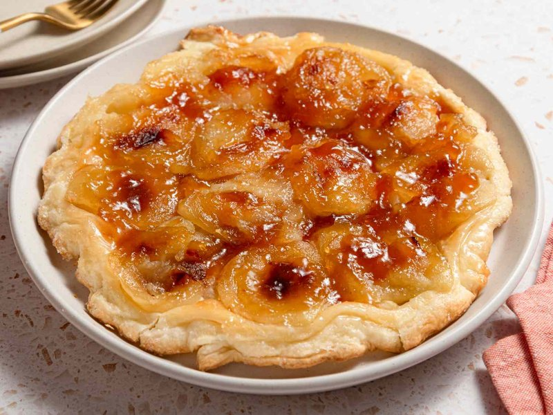

# Tarte Tatin

*The French upside-down apple tart: apples caramelised in butter and sugar under a buttery lid, then turned out so the apples sit on top.*

**Serves:** 6 (one 24 cm tart)

**Prep Time:** 25 minutes

**Cook Time:** 50 minutes

## Overview
Tarte Tatin is the great French upside-down apple tart, named for the Tatin sisters who first served it (probably by accident) at their hotel in the Loire in the 1880s. A puff pastry round (homemade or all-butter shop-bought) cuts to fit the pan; refrigerated. In a heavy ovenproof pan (cast iron or copper Tatin pan), sugar caramelises directly with butter to a deep amber syrup. Off heat, peeled and halved (or quartered) apples, preferably a firm tart variety like Granny Smith, Braeburn or Cox, pack tightly into the pan rounded-side-down on the caramel. Returns to medium heat for five minutes to start the apples cooking. The pastry drapes over the top, edges tucked in around the apples. Bake at 200°C for thirty to thirty-five minutes until the pastry is deep golden. Rest for five minutes; then carefully invert onto a flat serving plate (the dramatic moment). Glazed-amber apples sit on top of crisp pastry. Eat warm with thick cream.

## Ingredients

### Pastry
- 320 g all-butter puff pastry (one ready-rolled sheet, or homemade)

### Caramel
- 130 g caster sugar
- 80 g unsalted butter (cubed)
- A pinch of salt
- 1 teaspoon vanilla extract (optional)

### Apples
- 8 apples (medium, about 1.2 kg, Granny Smith, Braeburn, Cox's Orange Pippin, or Bramley)

### To serve
- Crème fraîche (the classic)
- Vanilla ice cream
- Cold double cream

### Equipment
- 24 cm heavy ovenproof frying pan (cast iron is ideal; or a dedicated tatin pan)

## Method

### Stage 1 - Prep the pastry
1. Cut the puff pastry into a disc slightly LARGER than your pan - about 26 cm if your pan is 24 cm (the excess tucks in around the apples).
1. Place on a piece of baking paper; refrigerate while you make the caramel and apples.

### Stage 2 - Peel and halve the apples
1. Peel the apples; halve through the core; scoop out the cores with a melon baller or a teaspoon (a clean elegant cavity).
1. Keep the apple halves in their natural shape - don't slice them.

### Stage 3 - Caramel
1. Heat oven to 200°C (180°C fan).
1. Place the heavy frying pan over medium heat.
1. Sprinkle the sugar in an even layer; let it begin to melt at the edges (about 2 minutes).
1. As patches of caramel form, gently swirl the pan (don't stir).
1. After 5-7 minutes, the sugar should be fully melted into a deep amber syrup - the colour of a strong espresso. Watch closely; it goes from amber to burnt-black fast.
1. Add the butter and a pinch of salt; whisk gently until incorporated. The mixture may bubble dramatically - that's fine.
1. Off heat; stir in vanilla.

### Stage 4 - Arrange the apples
1. While the caramel is still hot but no longer bubbling, arrange the apple halves in the pan ROUNDED-SIDE DOWN (so when inverted, this becomes the top).
1. Pack them tightly in a circle, with one half in the centre. They'll shrink during baking - packed tight is right.

### Stage 5 - Pre-cook the apples
1. Return the pan to medium-low heat for 5-7 minutes - the apples soften slightly, drink up some caramel, and the syrup thickens.
1. (You can also skip this step if your apples are tender - go straight to the oven.)

### Stage 6 - Drape the pastry
1. Lift the chilled pastry disc; drape over the apples.
1. Tuck the edges DOWN inside the pan around the apples (between the apples and the pan walls).
1. Pierce the pastry with a fork in 4 places to allow steam to escape.

### Stage 7 - Bake
1. Transfer to the oven; bake 30-35 minutes until the pastry is deep golden brown and risen.
1. If the pastry browns too quickly, cover loosely with foil.

### Stage 8 - Rest
1. Lift out of the oven (the handle is HOT - use oven mitts!).
1. Rest 5 minutes only - too long and the caramel sets and the tart sticks.

### Stage 9 - Invert (the dramatic moment)
1. Place a wide flat serving plate (larger than the pan) upside-down on top of the pan.
1. With confidence - and oven mitts on both hands - flip the whole thing over in one motion.
1. Tap the bottom of the pan if anything sticks.
1. Lift the pan away; the tart should sit on the plate with apples on top, glazed amber-mahogany, pastry below.
1. If an apple half stuck to the pan, lift it out with a spatula and place it back on the tart.

### Stage 10 - Serve
1. Cut into wedges.
1. Serve warm with a generous spoonful of crème fraîche, or a scoop of vanilla ice cream.

## Notes
- **Heavy ovenproof pan is essential:** Cast iron or a dedicated copper tarte tatin pan retains heat and gives even caramelisation. A thin pan gives spotty caramel and a soggy bottom. The pan must also go from stovetop to oven - no plastic handles.
- **Don't stir the caramel:** Stirring crystallises the sugar. Swirl the pan gently, don't move the spoon through.
- **Invert while still warm:** If the tart cools fully, the caramel sets and the tart sticks. 5 minutes' rest is right; longer is risky. If it does stick, return to medium-low heat for 30 seconds to soften the caramel, then try again.

## Storage
- Best within 2 hours of baking.
- Refrigerate 2 days; reheat the whole tart (or slices) at 180°C 10 minutes.
- Doesn't freeze well - the pastry goes soggy.
