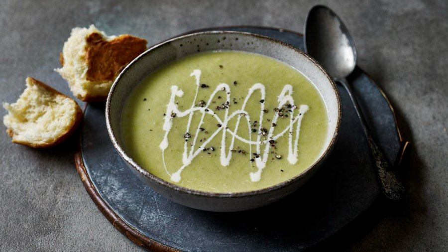

# Leek and Potato Soup

*Potage Parmentier*

**Serves:** 6

**Prep Time:** 10 minutes

**Cook Time:** 40 minutes

## Overview
Potage Parmentier is the French potato-and-leek soup named for the 18th-century agronomist Antoine-Augustin Parmentier, the man who lobbied Louis XVI's court into accepting potatoes as proper food. The technique is the simplest in French cooking: leeks soften gently in butter without colour, peeled and cubed potatoes join, then stock covers everything. Simmer until the potatoes collapse, blend smooth, finish with a generous swirl of double cream and a pinch of salt. The seasoning matters more than you'd think, taste, adjust, taste again. Serve hot with chives, or chilled as vichyssoise on a summer terrace.

## Ingredients

### Fat
- 50 grams butter

### Vegetables
- 1 onion (finely chopped)
- 3 leeks (white part only, sliced)
- 1 celery stalk (finely chopped)
- 200 grams potatoes (chopped)

### Aromatics
- 1 garlic clove (finely chopped)

### Seasonings
- 750 ml chicken stock
- 220 ml whipping cream

### Garnish
- 2 tablespoons chives (chopped)

## Method

### Stage 1 - Sweat vegetables
1. Melt the butter in a large saucepan and add the onion, leek, celery and garlic.
1. Cover the pan and cook, stirring occasionally over a low heat for 15 minutes, or until the vegetables are softened but not browned.

### Stage 2 - Simmer soup
1. Add the potato and stock to the pan, and bring to the boil.
1. Immediately reduce the heat to low and simmer, uncovered for 20 minutes.

### Stage 3 - Puree and finish
1. Move the pan off the heat, and allow to cool slightly, then purée in a blender.
1. Return the soup to the pan, and bring back to the boil, pour in the cream and check for seasoning.
1. Serve either hot or well chilled, and garnish with chives.

## Notes
- **Leeks:** Use only the white and light green parts; rinse well to remove dirt.
- **Pureeing:** Blend until smooth for a creamy texture; adjust cream for desired richness.
- **Serving:** Can be served hot or chilled; chilling enhances flavors.

## Serving
- Serve hot or chilled, garnished with chopped chives.

## Storage
- Refrigerate up to 3 days; reheat gently.
- Freezes well up to 2 months; thaw and reheat with a splash of cream.
