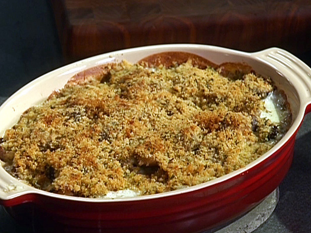

# Brussels Sprouts au Gratin

*This wonderfully delicious side dish complements any roast dinner. If you wish, add some cooked pancetta at the end and top with freshly grated lemon rind.*

**Serves:** 4

**Prep Time:** 10 minutes

## Overview
Brussels sprouts au gratin is the side dish that turns the most maligned vegetable on the British table into something even sprout-sceptics ask for seconds of. You parboil the sprouts briefly so they're tender at the centre but still hold their shape, drain them well, and pack them tight into a buttered dish. A topping of breadcrumbs, finely grated pecorino, chopped garlic, parsley and a generous slick of olive oil scatters across the top. A hot oven crisps the topping to deep gold while the sprouts beneath finish softening. The contrast between the sweet-toasted sprout and the salty crunchy crust is the entire point. Serve with roast chicken or beef.

## Ingredients
- 480 grams Brussels sprouts
- 180 grams dried breadcrumbs
- 180 ml Extra origin olive oil
- 120 grams flat leaf parsley (finely chopped)
- 4 cloves garlic (finely chopped)
- 180 grams pecorino cheese (freshly grated)
- salt
- pepper

## Method
1. Preheat the oven to 200°C. 
1. Parboil the Brussels sprouts in boiling salted water for 5 minutes, then remove and plunge in a bowl of ice cold water to refresh, drain thoroughly.
1. Drizzle 2 tablespoons of the oil in an oven-proof oval dish just big enough to hold all of the sprouts. 
1. Mix together the breadcrumbs, cheese, parsley, garlic and remaining oil in a small bowl. 
1. Season with salt and pepper. Sprinkle the mixture over the Brussels sprouts.
1. Put the dish in the middle of the oven and cook for 15 minutes. 
1. Remove from the oven, drizzle with a little olive oil and serve at once.

## Notes
- Plunging the parboiled sprouts in ice cold water immediately stops the cooking and keeps them bright green.
- Drain the sprouts thoroughly before adding them to the dish, excess water will prevent the topping from crisping properly.
- Use freshly grated pecorino rather than pre-grated for a better melt and flavour in the topping.
- For extra richness, stir through cooked pancetta and finish with freshly grated lemon zest just before serving.

## Serving
- Serve with: roast chicken, roast beef, or any traditional roast dinner
- Temperature: hot, straight from the oven
- Amount: one portion per person as a side dish

## Storage
- Leftovers can be refrigerated in an airtight container for up to 2 days.
- Reheat in the oven at 180°C for 10-12 minutes to restore the crispy topping; avoid the microwave as it softens the breadcrumbs.
