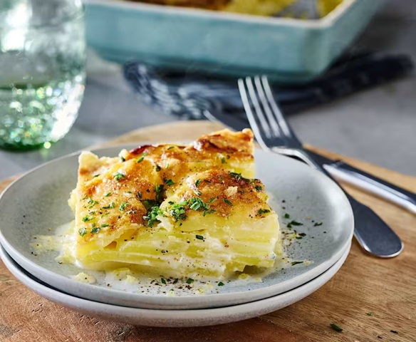

# Gratin Dauphinois

*The defining French potato side: waxy slices layered in a buttered garlic-rubbed dish, drowned in nutmeg cream and baked slow till golden.*

**Serves:** 6 (as a side)

**Prep Time:** 20 minutes

**Cook Time:** 1 hour 30 minutes

## Overview
Waxy potatoes (Yukon Gold, Charlotte, or any low-starch variety) are peeled and sliced very thinly, 2-3 mm. A wide shallow gratin dish (or oven-safe heavy pan) is rubbed all over with a halved garlic clove, then heavily buttered. A cream-and-milk mixture warms in a saucepan with crushed garlic, salt, pepper, and a generous grating of nutmeg, brought just to a simmer, then strained. Potatoes layer in the dish, overlapping like shingles, with a sprinkle of salt and a few grinds of pepper between layers. The infused cream pours over to come up to (not over) the top layer. Baked at 160°C for about 90 minutes until the potatoes are fork-tender and the top is bubbling and golden-brown.

## Ingredients

- 1.2 kg waxy potatoes (Charlotte, Yukon Gold, Roseval - peeled)
- 6 garlic cloves (4 for infusing the cream; 2 halved for rubbing the dish + extra slivers between layers)
- 500 ml double cream
- 300 ml whole milk
- 1 fresh bay leaf
- A generous grating of fresh nutmeg (about ½ teaspoon)
- 1 ½ teaspoons salt (to taste - be generous)
- ½ teaspoon white pepper
- 40 g unsalted butter (for the dish + dotting on top)

## Method

### Stage 1 - Slice the potatoes
1. Peel the potatoes.
1. Slice as thinly as you can manage - 2-3 mm thick. A mandoline gives the most consistent results; a sharp knife also works.
1. Do NOT rinse the sliced potatoes - the starch is what helps thicken the cream into the gratin. Just keep them in a bowl ready to use.

### Stage 2 - Infuse the cream
1. In a saucepan, combine cream, milk, 4 crushed garlic cloves, the bay leaf, nutmeg, salt and pepper.
1. Heat over medium-low until just below a simmer (about 80°C - gentle steam, no rolling bubbles).
1. Off heat; let stand 10 minutes to infuse.

### Stage 3 - Prepare the dish
1. Heat oven to 160°C (140°C fan).
1. Take a shallow gratin dish or oven-safe heavy pan (about 22 x 28 cm or 24 cm diameter).
1. Rub the inside all over (base and sides) with the cut side of the halved garlic clove - pressing the garlic into the surface so it leaves a film of garlic essence.
1. Generously butter the inside with about 30 g of the butter.

### Stage 4 - Layer
1. Strain the cream mixture into a measuring jug (discard the garlic and bay).
1. Layer half the sliced potatoes in the dish in slightly overlapping rows (like fish scales / roof shingles).
1. Season with a generous pinch of salt and a grind of pepper.
1. Pour over half the warm cream - enough to just cover the potatoes.
1. Layer the remaining potatoes on top - try to keep neat overlapping rows on the top layer for a tidy gratin look.
1. Season again; pour over the remaining cream. The cream should come up to (but not over) the top layer of potatoes.

### Stage 5 - Dot with butter
1. Dot the top with the remaining 10 g of butter in small pieces.

### Stage 6 - Bake
1. Place the dish on a baking tray (catches any drips).
1. Bake 1 hour 15 minutes to 1 hour 30 minutes.
1. The gratin is done when:
   - A knife slips easily through all the layers
   - The top is deep golden brown with bubbling cream visible at the edges
   - The cream around the edges has thickened to a clinging sauce
1. If the top isn't browning enough, increase the heat to 200°C for the last 10 minutes (or briefly broil 2-3 minutes).

### Stage 7 - Rest
1. Lift out of the oven; rest 15 minutes.
1. This lets the gratin set; it slices cleaner and the cream redistributes.

### Stage 8 - Serve
1. Spoon onto plates alongside roast lamb, roast beef, or any rich main.

## Notes
- **Waxy potatoes only:** Floury potatoes (Maris Piper, King Edward) disintegrate into mash. Waxy potatoes (Charlotte, Yukon Gold, Roseval) hold their shape in distinct layers. This is non-negotiable.
- **No cheese in classic Dauphinois:** The cheese-topped gratin you may know is a different dish - gratin Savoyard or gratin Lyonnais. Authentic Dauphinois is just potatoes and cream, allowing the spuds to shine.
- **Don't rinse the sliced potatoes:** Rinsing removes the surface starch, which is what binds the cream into the gratin. Slice and go straight to layering.

## Storage
- Refrigerate 4 days; reheat covered with foil at 160°C 25 minutes.
- The gratin is excellent on day 2 - the flavours marry overnight.
- Doesn't freeze well; the cream separates.
