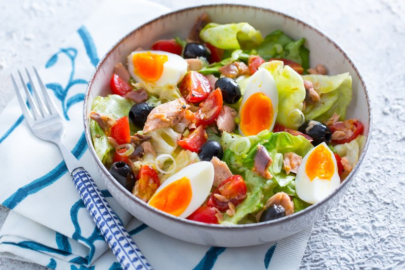

# Salade Niçoise

*A Provençal market-day plate: tomatoes, eggs, beans, olives, anchovies and tuna, dressed with good olive oil and vinegar.*

**Serves:** 4 (as a main-course salad)

**Prep Time:** 30 minutes

**Cook Time:** 15 minutes

## Overview
Eggs hard-boil; cool; peel; quarter. New potatoes simmer in salted water until tender; drain; halve while warm; toss with a spoon of vinegar. Green beans blanch briefly; cool. Tomatoes wedge (the best you can find). The dressing: red wine vinegar, olive oil, Dijon mustard, crushed garlic, salt and pepper whisks together. Composition on a wide platter: a base of lettuce leaves (optional, traditional purists skip), then arranged piles of each cooked / prepared ingredient, wedges of tomato, halved eggs, halved potatoes, green beans, drained tuna chunks, niçoise olives, anchovy fillets. Drizzled with the dressing. Scattered with basil. Eaten with crusty bread.

## Ingredients

### Cooked / boiled
- 4 eggs (large)
- 400 g small new potatoes (charlotte or other waxy)
- 200 g fresh green beans (trimmed)
- 2 teaspoons salt (for blanching)

### Tomatoes
- 4 ripe medium tomatoes (best you can find - mixed colours and sizes are good)

### Tuna and anchovies
- 1 (200 g) tin of best-quality tuna in olive oil (Spanish ventresca or Italian if available; not water-packed)
- 6 anchovy fillets in olive oil (drained)

### Olives and other
- 80 g Niçoise olives (the small, dark, Provençal variety - or substitute Kalamata)
- 1 red onion (small, sliced very thin, optional, NOT traditional Niçoise)
- 1 green pepper (small, sliced thin, optional, traditional in some Provençal versions)

### Dressing
- 5 tablespoons extra-virgin olive oil
- 2 tablespoons red wine vinegar
- 1 teaspoon Dijon mustard
- 1 garlic clove (crushed to a paste with a pinch of salt)
- ½ teaspoon salt
- ½ teaspoon black pepper

### To finish
- 1 small bunch fresh basil (leaves torn)
- A small handful of fresh flat-leaf parsley (chopped)
- Crusty bread to serve
- Optional: a butterhead lettuce (or romaine, leaves separated) as a base

## Method

### Stage 1 - Eggs
1. Bring a pot of water to a boil.
1. Gently lower the eggs in; cook 9 minutes (for fully set yolks) or 8 minutes (for a slightly creamy centre).
1. Drain; refresh in cold water; peel.

### Stage 2 - Potatoes
1. Bring a pot of salted water to a boil.
1. Add the new potatoes (whole, skins on if small; halved if larger).
1. Boil 12-15 minutes until a knife slides through easily.
1. Drain; halve while warm; toss with 1 tablespoon of red wine vinegar (the warm potatoes absorb the dressing better).

### Stage 3 - Green beans
1. Bring a separate pot of well-salted water to a boil.
1. Blanch the trimmed green beans 3-4 minutes until just tender, bright green.
1. Drain; refresh in cold water; drain again; pat dry.

### Stage 4 - Tomatoes
1. Cut each tomato into 6-8 wedges.
1. Sprinkle with a pinch of salt; let stand 5 minutes (releases juice and intensifies flavour).

### Stage 5 - Dressing
1. In a small bowl, whisk olive oil, red wine vinegar, Dijon mustard, garlic-salt paste, salt and pepper to a smooth emulsion.
1. Taste; adjust.

### Stage 6 - Compose
1. **With lettuce**: line a wide flat platter with butterhead or romaine leaves.
1. **Without** (purist style): use the bare platter.
1. Arrange the components in distinct piles or zones, not mixed:
   - Tomato wedges in one section
   - Quartered eggs in another
   - Halved potatoes in another
   - Green beans piled together
   - Tuna chunks broken into rough pieces in the centre
   - Anchovies laid across the tuna
   - Olives scattered
   - Sliced red onion / pepper if using
1. Each ingredient should be visible and separately identifiable.

### Stage 7 - Dress
1. Drizzle the dressing over the entire platter - generously over the vegetables and tuna.
1. Scatter torn basil and chopped parsley.
1. Final crack of black pepper.

### Stage 8 - Serve
1. Bring the platter to the table.
1. Provide a wide spoon for serving and offer crusty bread.
1. Pour a chilled rosé (a Provençal one if possible) alongside.

## Notes
- **The purist debate:** Niçoise purists (Auguste Escoffier disagreed; Jacques Médecin, mayor of Nice, insisted) say no cooked vegetables - potatoes and green beans are out, and only raw vegetables go in. This recipe gives the international version with both, but it's worth knowing the purist version exists.
- **Tuna in olive oil, not water:** The quality of the tuna matters more than almost anything else. Spanish ventresca (tuna belly) is the best; good Italian or Portuguese tinned tuna in olive oil is the next step down. Water-packed tuna gives a sad salad.
- **Compose, don't toss:** Niçoise is a composed salad. The visual variety on the plate is part of the appeal. Tossing everything together is wrong.

## Storage
- Best within 1 hour of assembly.
- Components keep separately 24 hours: cooked potatoes, cooked beans, hard-boiled eggs (peeled, in water), dressing. Assemble fresh.
- Don't store the assembled salad.
