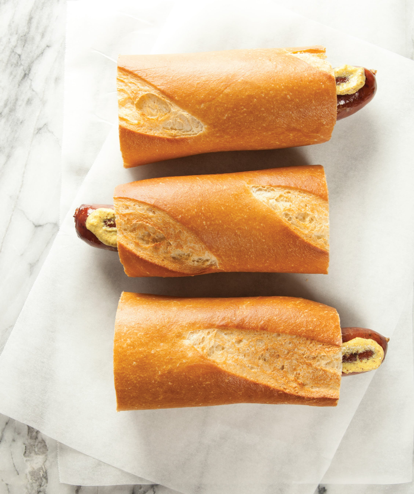

# French Baguette Hot Dog

*The French boulangerie-style hot dog: a long Strasbourg-style frankfurter tucked into a hollowed-out section of fresh baguette, smothered in shredded Gruyère cheese, and broiled till the cheese bubbles golden over the bread. A French-Alsatian late-night classic; the simpler, more elegant cousin of the American hot dog.*

**Serves:** 4

**Prep Time:** 10 minutes

**Cook Time:** 12 minutes

## Overview
The French hot dog (often called "hot-dog à la française" or just "hot dog" on French menus, particularly Alsatian and Lorraine cafés) is the bread-forward, cheese-melted French take on the American hot dog and a fixture of late-night Parisian street stalls, train-station snack counters, and Alsatian Imbiss-style stands across the Strasbourg region (where the German-French border culinary influence is strongest): a long Strasbourg-style frankfurter (the traditional French hot dog sausage, also called "saucisse de Strasbourg") tucked into a section of fresh baguette that's been hollowed out lengthwise to create a deep groove (NOT split open like an American hot dog bun; the baguette is tunnel-cut). The dog is smothered in a generous heap of shredded Gruyère cheese (or Emmental) and placed under a hot grill till the cheese melts, bubbles and goes deep golden. Served simply, with maybe a touch of Dijon mustard. Eat warm.

## Ingredients

### Sausages
- 4 long Strasbourg-style frankfurters (about 20cm; quality natural-casing pork-and-beef; or German bratwurst as substitute)
- 1 tablespoon vegetable oil

### Bread
- 1 large fresh baguette (about 60cm); cut into 4 sections of about 15cm each

### Cheese
- 250 g Gruyère cheese (grated); or 50/50 Gruyère + Emmental

### Optional spreads
- 4 tablespoons Dijon mustard
- 2 tablespoons crème fraîche
- A few cornichons (small French pickles) on the side

### To serve
- A green salad with vinaigrette
- A glass of dry Alsatian Riesling or Pinot Blanc
- Or a small beer (Kronenbourg, Fischer)

## Method

### Stage 1 - Cook the sausages
1. Bring a pan of water to a gentle simmer.
2. Add the sausages; warm 6 minutes (don't boil hard; they split).
3. (Or pan-fry in oil over medium heat for 8 minutes for charred edges.)

### Stage 2 - Tunnel-cut the baguette
1. Take each 15cm baguette section.
2. With a long thin serrated knife, cut a slit along the long axis of the top - about 1.5 cm deep and the full length of the section, but stopping 1cm short at each end (the baguette stays whole; you're just creating a tunnel-pocket from the top).
3. With the tip of the knife, scoop out the soft white interior to widen the tunnel into a proper trough that a sausage can lie in.

### Stage 3 - Build
1. Preheat the grill (broiler) to high.
2. Spread Dijon mustard (if using) thinly along the inside of each baguette trough.
3. Slide a warm sausage into each trough.
4. Top each sausage with a generous heap of grated Gruyère - pile it on top of the sausage and let some cascade down the sides onto the baguette top.

### Stage 4 - Broil
1. Place the loaded baguettes on a baking sheet.
2. Slide under the hot grill, about 12cm from the heat.
3. Broil 3-5 minutes till the cheese is fully melted, bubbling, and deeply golden in spots.
4. Watch closely - the moment between "perfectly golden" and "burnt" is short.

### Stage 5 - Serve immediately
1. Optional: a small dollop of crème fraîche or extra mustard on the side.
2. Cornichons.
3. A green salad with vinaigrette.
4. A glass of wine.

## Notes
- **Tunnel-cut, not split:** the baguette stays a single piece; the sausage sits inside.
- **Gruyère under a hot grill:** the cheese should bubble and brown. Pale melted cheese is undercooked.
- **Strasbourg-style frankfurter:** longer and thinner than American; matches the baguette length.
- **Eat warm:** the cheese-bread combo loses its magic as it cools.

## Variations
**With caramelised onions:** add a layer of caramelised onions inside the baguette before the sausage.
**Alsatian-style:** add a thin layer of choucroute (sauerkraut) under the sausage.
**With raclette cheese:** swap Gruyère for raclette for a fonduier melt.
**With ham and cheese:** add a slice of jambon de Paris (French ham) under the sausage.
**Croque-dog:** smear béchamel inside the baguette before the sausage and Gruyère, for a croque-monsieur-hot-dog hybrid.

## Serving
At a Parisian boulangerie counter; at a Strasbourg Christmas-market stall; at an Alsatian winstub for a casual late dinner; at home with a salad and Riesling.

## Storage
- Best immediately while the cheese is melty.
- Cooked sausages refrigerate 4 days.
- Don't assemble in advance; the bread crisps once and not again.
