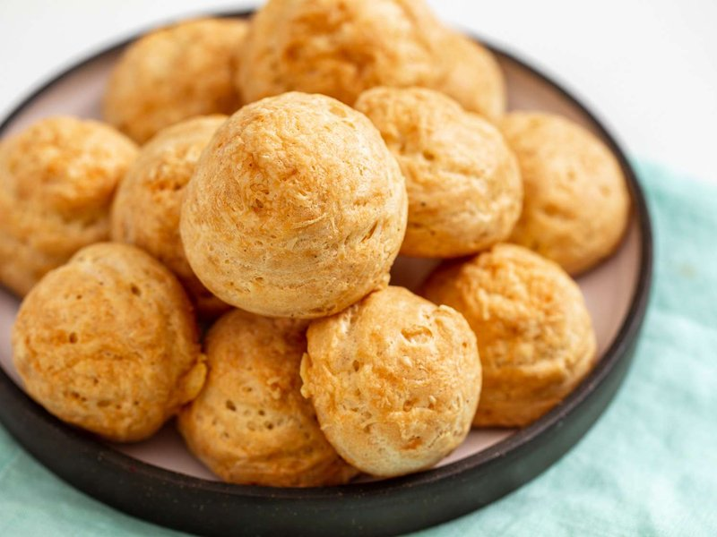

# Gougères

*Burgundy's apéritif puff: small choux-pastry rounds flavoured with grated Gruyère and Comté, baked till puffed and crisp outside, hollow within.*

**Serves:** 6 (makes ~30 small gougères)

**Prep Time:** 25 minutes

**Cook Time:** 25 minutes

## Overview
Choux dough cooks on the stovetop: milk + water + butter + salt come to a rolling boil; flour is dumped in all at once; cooked for 1-2 minutes until the dough comes together as a ball that pulls away from the pan walls. Cooled slightly. Eggs whisk in one at a time to a smooth thick pipe-able paste. Grated Gruyère, Comté and a touch of Dijon mustard fold through. Piped or spooned into small mounds on a baking tray; brushed with egg wash; sprinkled with more cheese. Baked at 220°C for 10 minutes then 200°C for 15 more - the puffs rise dramatically, crack, and turn deep golden. Served warm.

## Ingredients

### Choux base
- 125 ml whole milk
- 125 ml water
- 100 g unsalted butter (cubed)
- ½ teaspoon salt
- A pinch of caster sugar
- A pinch of black pepper
- 150 g plain flour (sifted)
- 4 large eggs (room temperature, beaten)
- 1 teaspoon Dijon mustard

### Cheese
- 100 g Gruyère cheese (finely grated)
- 50 g Comté or aged Cheddar (finely grated)
- A grating of fresh nutmeg

### To finish
- 1 egg yolk (beaten with 1 tablespoon milk - for egg wash)
- 30 g extra grated Gruyère (for sprinkling on top)
- A pinch of paprika (optional)

## Method

### Stage 1 - Heat the oven
1. Heat oven to 220°C (200°C fan).
1. Line two baking trays with paper.

### Stage 2 - Choux paste
1. In a saucepan, combine milk, water, butter, salt, sugar and pepper.
1. Bring to a rolling boil over medium-high heat.
1. As soon as it boils vigorously, reduce to medium and tip in ALL the flour at once.
1. Stir vigorously with a wooden spoon for 90 seconds - the paste comes together into a smooth shiny ball that pulls cleanly away from the pan walls.
1. Tip into a wide bowl; spread thinly; rest 5 minutes to cool slightly (so the eggs don't scramble on contact).

### Stage 3 - Add eggs
1. Add a third of the beaten eggs; stir hard with a wooden spoon until fully absorbed and the paste re-smooths.
1. Continue with the next third; mix to incorporate.
1. Add the final third gradually - STOP when the paste reaches the right consistency: it should form a smooth glossy V-shape from a wooden spoon, not running off too quickly.
1. You may not need all the eggs depending on flour absorbency. If too stiff, add more egg (or a beaten egg in a separate bowl as backup). If too runny, you've over-added and the gougères won't hold their shape.

### Stage 4 - Cheese and mustard
1. Fold in the grated Gruyère, Comté, Dijon mustard and a grating of nutmeg.
1. The paste should be flecked with visible cheese.

### Stage 5 - Pipe
1. Transfer the paste to a piping bag with a 1 ½ cm plain round nozzle.
1. Pipe walnut-sized mounds onto the prepared trays, leaving 4 cm between each (they expand).
1. Smooth any pointed tops with a wet finger (sharp peaks burn).
1. (No piping bag? Use two spoons to dollop small mounds.)

### Stage 6 - Glaze
1. Brush each mound with egg-yolk wash.
1. Sprinkle a small pinch of extra grated Gruyère on each.
1. Dust with paprika (if using).

### Stage 7 - Bake
1. Bake at 220°C for 10 minutes (the gougères puff dramatically).
1. Reduce heat to 200°C (180°C fan); bake another 15-18 minutes until deep golden brown and the puffs feel light (not heavy) when lifted.
1. DO NOT open the door for the first 18 minutes - a temperature drop collapses them.

### Stage 8 - Cool slightly and serve
1. Lift onto a rack.
1. Eat warm - within 30 minutes of baking, they're at their best (crisp outside, softly hollow inside).

## Notes
- **Don't add all the eggs blindly:** Different flours absorb different amounts. The visual cue (smooth V-shape from the spoon, slightly slow to fold back) matters more than the egg count. If you stop a third of an egg short, that's fine.
- **Cheese choice matters:** Gruyère + Comté is the classic Burgundian pairing - both are nutty, well-aged, melt well. Aged Cheddar substitutes; Emmental works but is milder. Don't use a fresh / soft cheese (mozzarella, brie) - they weep moisture and the gougère deflates.
- **Don't open the oven door:** Choux pastry rises dramatically on internal steam. A burst of cold air mid-bake collapses the puffs. Trust the timing.

## Storage
- Best within 1 hour of baking.
- Cooled cooked gougères refrigerate 2 days; re-crisp at 180°C 5 minutes (microwave makes them soggy).
- Pipe and freeze raw gougères on a tray, then bag - keeps 2 months. Bake from frozen at 200°C 25-28 minutes.
