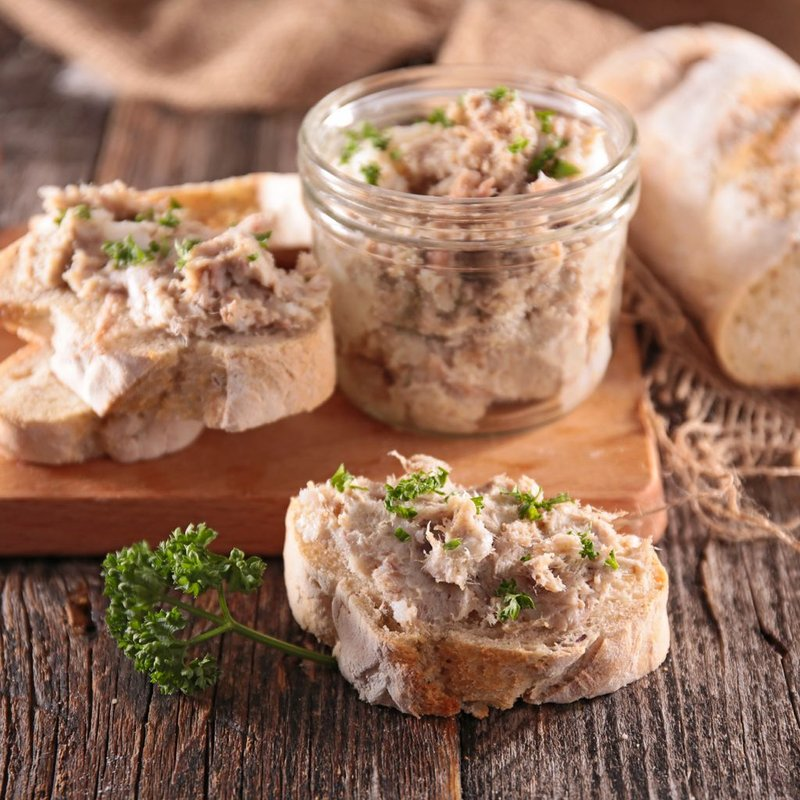

# Rillettes de Porc

*The Loire's potted pork: shoulder slow-cooked for hours in its own fat with garlic and wine, shredded into jars, sealed with lard.*

**Serves:** 8 (makes about 600 g in 2-3 small jars)

**Prep Time:** 20 minutes

**Cook Time:** 4 hours

## Overview
Rillettes are the French country preservation of slow-cooked pork pulled into long strands and packed under its own fat into jars, the kind of thing that lives in the cold larder of a French farmhouse and gets brought out for unexpected guests. Pork shoulder (fatty cuts only, lean cuts will go dry) cuts into 3 cm chunks. Pork back fat (or lard) adds extra cooking fat; shallots, garlic, bay, thyme, white wine and a glass of water go into the pot. Three to four hours at the lowest oven temperature, covered, until the pork is completely tender and the fat has rendered into a clear pool. Drain the fat off and reserve; pull the pork into long strands with two forks. Pack into sterilised jars; season; pour reserved fat on top to seal the surface. Three to five days in the fridge lets the flavours mature dramatically. Serve with toasted baguette, cornichons and mustard.

## Ingredients

### Pork
- 1.2 kg boneless pork shoulder (with fat - about 25-30% fat content; lean cuts won't work)
- 200 g pork back fat OR lard (cubed)
- 2 shallots (finely diced)
- 6 garlic cloves (crushed)
- 4 sprigs fresh thyme
- 2 fresh bay leaves
- 6 black peppercorns
- 6 juniper berries (optional, traditional)
- 1 small piece of mace (optional)
- 200 ml dry white wine
- 200 ml water

### Seasoning (at the end, to taste)
- 1 ½ to 2 teaspoons salt (depending on the saltiness of the pork)
- 1 teaspoon black pepper
- ¼ teaspoon ground white pepper (optional)
- 1 tablespoon brandy (or armagnac, optional)

### Equipment
- A deep ovenproof pot with a tight-fitting lid (cast iron is ideal)
- 2-3 sterilised glass jars (200-300 ml each, with vinegar-resistant lids)

### To serve
- 1 fresh baguette (sliced and toasted)
- Cornichons (small French pickled gherkins)
- Dijon mustard
- A dry white wine (chenin blanc, sauvignon blanc, or muscadet) or sparkling cider

## Method

### Stage 1 - Prep
1. Heat oven to 120°C (100°C fan).
1. Cut the pork shoulder into 3 cm chunks. Don't trim the fat - it's essential.
1. Cube the back fat or lard into 1 cm pieces.

### Stage 2 - Combine
1. In a deep ovenproof pot, combine pork, back fat, shallots, garlic, thyme, bay leaves, peppercorns, juniper and mace.
1. Pour in the wine and water.
1. The liquid should come about a third up the pork.

### Stage 3 - Slow cook
1. Cover with a tight-fitting lid.
1. Place in the oven for 3 hours 30 minutes to 4 hours.
1. The pork is done when it can be crushed easily with the back of a fork; there should be a clear pool of melted fat at the surface, with some liquid below.
1. Don't stir during cooking.

### Stage 4 - Drain
1. Lift the pot out of the oven; let cool until just warm enough to handle (45 minutes).
1. Set a sieve over a heatproof bowl; tip the contents through.
1. Reserve all the strained liquid (it's mostly fat with some flavoured pan-juice).
1. Pick out and discard the thyme stems, bay leaves and peppercorns.

### Stage 5 - Shred
1. Tip the drained pork into a wide bowl.
1. Discard any large gristly pieces.
1. Shred the pork with two forks into long strands - NOT a paste. Some chunks are good; you want texture.
1. Tradition says: never use a food processor - it gives a paste, not strands.

### Stage 6 - Season and combine
1. Add salt, pepper (black and white), and brandy if using.
1. Pour in about 100 ml of the reserved fat (or enough to make the mixture moist and bind-able but not soupy).
1. Stir with a fork to integrate.
1. Taste; adjust salt and pepper liberally - cold rillettes need MORE salt than warm rillettes seem to (you'll be eating them cold from the jar).

### Stage 7 - Jar
1. Pack the rillettes firmly into sterilised glass jars, pressing down to eliminate air pockets.
1. Leave 1 cm of headspace at the top.
1. Pour the remaining reserved fat over the top of each jar to seal the surface (a fat-cap of 5 mm).
1. Cool to room temperature.
1. Seal jars; refrigerate.

### Stage 8 - Mature
1. Refrigerate at least 3 days, ideally 5, before eating. The flavours mature dramatically - day-of, the rillettes taste of pork-and-salt; day-5, they're complex, savoury, and faintly sweet.

### Stage 9 - Serve
1. Bring out of the fridge 30 minutes before serving - rillettes are eaten at room temperature.
1. Open the jar; the fat-cap protects everything underneath.
1. Spoon out generously; spread thickly onto toasted baguette.
1. Garnish each toast with a cornichon, a dab of mustard.
1. Pair with a chilled dry white wine.

## Notes
- **Fatty pork is non-negotiable:** Lean pork shoulder gives dry, chalky rillettes. Look for shoulder with visible white fat marbling; if your butcher doesn't have fatty shoulder, ask for pork belly cubes mixed in (50/50 with leaner shoulder).
- **Shred, don't paste:** Long strands of meat give rillettes their characteristic texture and look - a food processor turns them into a pâté, which is a different dish entirely.
- **The fat cap is the preservation:** A complete fat seal over the top of each jar protects the rillettes from oxygen and extends the fridge life dramatically (to 3 weeks). Skipping the cap shortens the keep to 1 week.

## Storage
- Refrigerate, sealed: 3 weeks with a complete fat cap; 1 week without.
- Once a jar is opened, eat within 5 days.
- Freezes 6 months in jars (leave 2 cm of headspace for expansion).
- Excellent on toast for breakfast / brunch in the days after a dinner party.
