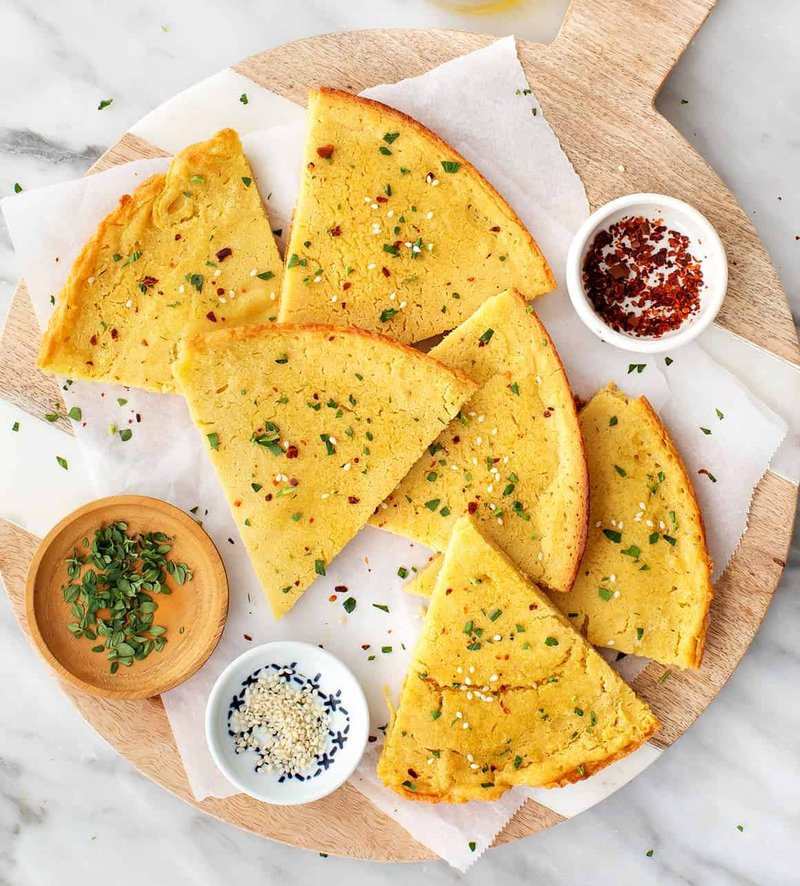

# Socca

*Nice's market snack: a thin chickpea-flour pancake cooked on a copper pan, sliced with a spatula, eaten hot from a paper cone.*

**Serves:** 4 (makes one 30 cm socca)

**Prep Time:** 5 minutes (plus 1 hour batter rest)

**Cook Time:** 12 minutes

## Overview
Socca is the Niçoise chickpea pancake, sold from copper pans at street corners across the old town of Nice, a thick crepe-like flatbread that's crisp at the edges and creamy in the centre. The batter is humble: chickpea flour (gram flour, besan), water, olive oil and salt whisked smooth and rested at least an hour (overnight is even better, gives the chickpea flour time to hydrate fully and lose its raw bitterness). A heavy ovenproof pan (cast iron is ideal) heats to smoking-hot under a high grill; a generous slick of olive oil goes in; the batter pours to 5 mm depth. Eight to twelve minutes under the broiler turns the surface golden and the edges crisp-charred, with the centre just set and faintly bubbling. Slide out, rough-slice, scatter with salt and black pepper, eat hot with fingers.

## Ingredients

- 200 g chickpea flour (gram flour / besan, sold at Indian or health-food shops)
- 500 ml water (room temperature)
- 5 tablespoons extra-virgin olive oil (4 in the batter; 1 in the pan)
- 1 ½ teaspoons fine salt
- 1 teaspoon coarsely ground black pepper
- 1 teaspoon fresh rosemary (very finely chopped, optional but classic in Provence)
- A pinch of cumin (optional)

### To finish
- Flaky sea salt
- Extra coarse black pepper
- 1 lemon (wedges, optional)
- A dish of olive oil for drizzling (small)
- A glass of Provençal rosé (the traditional pairing)

## Method

### Stage 1 - Batter
1. In a wide bowl, sift the chickpea flour to remove lumps.
1. Pour in the water gradually, whisking smoothly, the batter should be lump-free, thin (like single cream), pourable.
1. Whisk in 4 tablespoons of olive oil, the fine salt, black pepper, rosemary and cumin (if using).
1. Rest at room temperature at least 1 hour, ideally 4 hours or overnight in the fridge.
1. The rest lets the chickpea flour fully hydrate and develops a smoother texture in the finished socca.

### Stage 2 - Heat the pan
1. Place a heavy 28-30 cm ovenproof frying pan (cast iron is best) under the broiler.
1. Heat the broiler to maximum.
1. Heat the empty pan 5 minutes until smoking-hot.

### Stage 3 - Oil the pan
1. Carefully pull the pan from the oven (oven mitts!).
1. Pour in 1 tablespoon of olive oil; tilt to coat the entire base.

### Stage 4 - Pour the batter
1. Give the rested batter a final whisk.
1. Pour all of it into the hot oiled pan, it should sizzle immediately.
1. The batter should be a 5 mm thick layer (if too thick / shallow, use a slightly larger or smaller pan next time).

### Stage 5 - Broil
1. Slide the pan back under the broiler on the top rack, about 8-10 cm from the heat.
1. Cook 8-12 minutes, the socca puffs, bubbles, and the top should darken to deep golden with charred patches at the edges.
1. Test by gently lifting a corner with a spatula, the bottom should be golden-crisp, the centre just set with a slight wobble.
1. If the top is browning too fast but the centre is still wet, lower the rack one position.

### Stage 6 - Slide out
1. Run a thin spatula around the edge and under the socca to release it.
1. Slide onto a wide board.

### Stage 7 - Slice and serve
1. With a wide knife or a pizza wheel, slice into rough triangular wedges, Niçoise tradition is irregular, hand-torn-looking pieces, not neat geometry.
1. Sprinkle generously with flaky sea salt and cracked black pepper.
1. Optional: a squeeze of lemon, a final drizzle of olive oil, more rosemary.
1. Eat warm, with the fingers, no plate, no fork.

## Notes
- **Rest the batter:** Raw chickpea-flour batter tastes of raw chickpea (chalky, slightly bitter). A 1-hour minimum rest lets the flour hydrate and the off-flavour mellow. An overnight rest is dramatically better.
- **A blazing-hot pan is essential:** Socca needs a screaming-hot surface to set the bottom into a crisp crust before the centre cooks through. Cast iron retains heat best; a regular non-stick pan loses heat when the batter hits it.
- **Don't aim for perfect:** Socca is meant to be irregular. Bubbles, scorched edges, slightly variable thickness, all good. A perfectly even, golden, flat socca is wrong; it looks like a savoury pancake, not a market-stall classic.

## Storage
- Best within 30 minutes.
- The batter keeps refrigerated 3 days; in fact, day-2 or day-3 batter often makes better socca than fresh batter (the hydration is more complete).
- Cooked socca: refrigerate 1 day; re-crisp under a hot broiler 3 minutes (microwave makes it rubbery).
