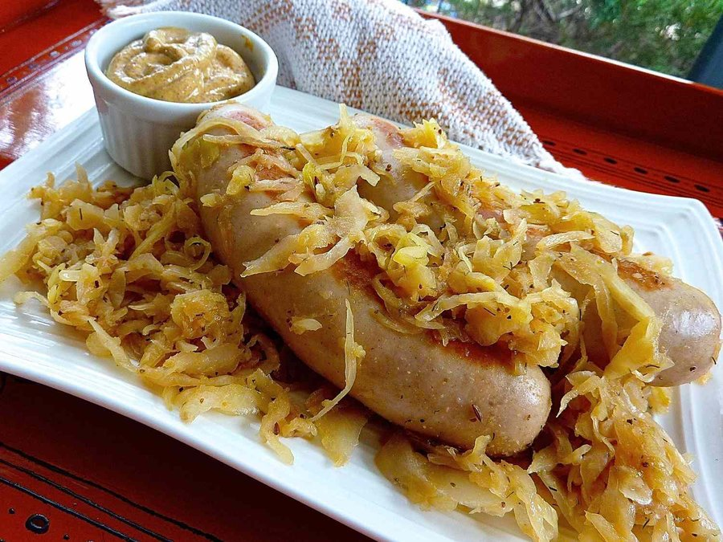

# Bratwurst with Sauerkraut

*Germany's grill staple: fine pork-and-veal sausages poached gentle, then grilled till the casing crackles. Served on caraway sauerkraut.*

**Serves:** 4

**Prep Time:** 15 minutes

**Cook Time:** 35 minutes

## Overview
Bratwurst is less a single sausage than a whole family of them, with each German region defending its own version: long thin Nürnberger, plump Thüringer, the white veal Weisswurst of Bavaria, the smoked Frankfurter that became the American hot dog. What unites them is a fine grind of pork (often with veal), gentle seasoning of marjoram, white pepper, mace and a little caraway, and traditional natural casings. Authentic preparation matters: a raw bratwurst should never be slapped onto a screaming grill, because the high fat content scorches the outside before the inside cooks and the casing splits losing all the juice. The German method is a gentle two-stage cook: poach the sausages in barely simmering water or weak beer for 8-10 minutes until the inside is just set, then finish on a medium-hot grill for 3-4 minutes per side to colour the casing and add a touch of smoke. The accompanying sauerkraut is not the cold pickle from the jar but a warm braise: jarred kraut squeezed, then simmered with onion, bacon fat or butter, caraway seed, a bay leaf and a splash of white wine or apple juice for 25 minutes until soft and mellow. Difficulty is low; the only thing to get right is not boiling the sausages (a hard boil makes them swell and burst) and not impaling them on a fork (every puncture is a juice leak). Mustard is non-negotiable: sweet Bavarian süßer Senf for Weisswurst, sharp medium Düsseldorf or Löwensenf for everything else.

## Ingredients

### Bratwurst
- 8 fresh bratwurst (about 120 g each)
- 500 ml weak lager (or water)
- 1 bay leaf
- 5 g caraway seeds
- ½ onion (sliced)

### Braised sauerkraut
- 600 g jarred sauerkraut (drained and lightly squeezed)
- 1 onion (finely chopped)
- 50 g smoked bacon lardons (or 30 g butter for meatless)
- 5 g caraway seeds
- 2 juniper berries (crushed)
- 1 bay leaf
- 150 ml dry white wine (or apple juice)
- 100 ml chicken (or vegetable stock)
- 5 g sugar
- salt
- pepper

### To serve
- Sharp German mustard (Löwensenf medium-hot or Düsseldorf)
- Crusty rye bread (or pretzel rolls)

## Method

### Stage 1 - Sauerkraut
1. Render the bacon lardons in a wide pan over medium heat until the fat runs and the lardons are crisp at the edges.
1. Add the onion; cook 5-6 minutes until soft and translucent.
1. Add caraway, crushed juniper and bay; stir 30 seconds.
1. Tip in the squeezed sauerkraut; stir to coat in the fat.
1. Pour in the wine and stock; add the sugar.
1. Bring to a simmer; reduce heat to low; cover loosely and braise 25-30 minutes, stirring occasionally.
1. Season with salt and pepper; the kraut should be soft and tangy, with most liquid absorbed.

### Stage 2 - Poach the bratwurst
1. Combine the lager (or water), bay, caraway and sliced onion in a wide pan; bring to a bare simmer (about 75-80°C, never boiling).
1. Slip in the bratwurst; keep the liquid at the gentlest possible quiver.
1. Poach 8-10 minutes until the sausages are firm to the touch and grey-pink throughout.
1. Lift out carefully with tongs (not a fork) and drain on a tray.

### Stage 3 - Grill
1. Heat a charcoal or gas grill to medium. Oil the grates lightly.
1. Lay the bratwurst across the grates at a slight angle.
1. Grill 3-4 minutes per side, turning gently with tongs, until the casings are crisp, golden-brown and beginning to mark.
1. Resist pressing them with a spatula; you'll lose the juices you just preserved.

### Stage 4 - Serve
1. Spoon a generous bed of warm sauerkraut onto each plate.
1. Lay two bratwurst across the sauerkraut.
1. Add a generous dollop of mustard alongside and a wedge of rye bread or a pretzel roll.

## Notes
- **Never pierce the casing:** use tongs, not a fork. Every hole is a juice leak.
- **Beer in the poach:** any cheap pilsner works; the flavour barely transfers but the malt aroma is pleasant.
- **Don't boil:** a rolling boil bursts the casings. Aim for a quiet poach, surface barely moving.
- **Sauerkraut tip:** rinse if it's very sharp; squeeze out the brine before braising so the kraut can absorb new flavours.

## Storage
- Bratwurst keeps 3 days refrigerated; reheat in a covered pan with a little stock.
- Sauerkraut keeps a week and improves on day two as the flavours meld.
- Both freeze well separately for up to 2 months.
