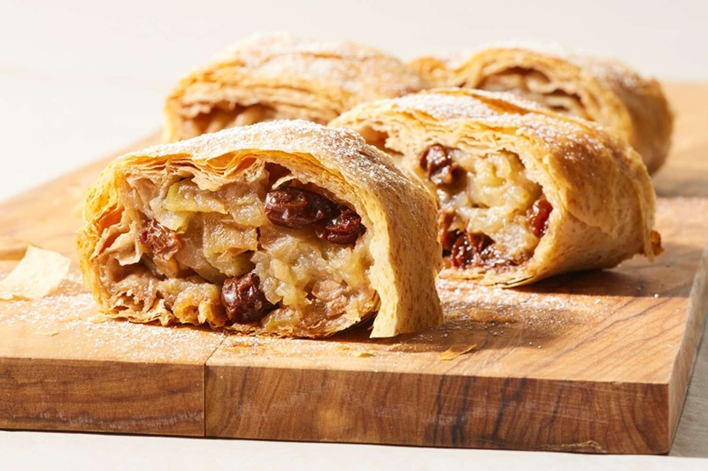

# Apfelstrudel

*Vienna's gift to German baking: paper-thin stretched pastry wrapped around cinnamon-spiced apple, raisins, breadcrumbs and walnuts, baked golden.*

**Serves:** 8

**Prep Time:** 45 minutes (plus 30 minutes resting)

**Cook Time:** 35 minutes

## Overview
Apfelstrudel is the Viennese-Bavarian pastry every German-speaking grandmother makes for Sunday afternoon coffee, paper-thin pastry rolled around a buttery apple-cinnamon-raisin filling and baked until the surface goes shatteringly crisp. The dough is the trick: a simple flour-egg-oil mix knead until silky, rest covered so the gluten relaxes, then stretch it over a floured cloth until you can read newsprint through it (the proper Austrian test). A filling of grated and sliced tart apples (a mix of soft and firm), sugar, cinnamon, raisins, lemon zest and butter-toasted breadcrumbs (which absorb the apple juices and stop the pastry going soggy) spreads across the stretched dough. The cloth lifts and helps roll the whole thing into a long log. Brush with melted butter, bake at 180°C for forty minutes until deep gold and crackly. Eat warm with a jug of vanilla sauce and a strong coffee.

## Ingredients

### Strudel dough
- 250 g strong white flour (high gluten)
- 1 egg (large)
- 2 tablespoons sunflower oil
- 130 ml warm water
- ½ teaspoon salt
- A little extra oil (for resting)

### Apple filling
- 1.2 kg tart apples (Bramley, Granny Smith, or Boskoop; peeled, cored)
- 100 g caster sugar
- 2 teaspoons ground cinnamon
- 1 lemon (zest)
- 1 tablespoon lemon juice
- 80 g raisins (soaked in 3 tablespoons rum or apple juice for 30 minutes)
- 60 g walnuts (roughly chopped)

### Breadcrumb buttering
- 100 g unsalted butter
- 100 g fine fresh white breadcrumbs

### To assemble and finish
- 80 g unsalted butter (melted; for brushing)
- 2 tablespoons icing sugar (for dusting)

## Method

### Stage 1 - Make the dough
1. In a bowl, whisk the flour and salt.
2. Beat the egg, oil and warm water together.
3. Pour into the flour; mix to a sticky dough.
4. Turn out and knead vigorously for 10 minutes; slap the dough against the work surface every few seconds. It transforms from sticky to silky and elastic.
5. Shape into a ball; brush with oil; cover with a warm bowl.
6. Rest 30 minutes (room temperature). This relaxes the gluten so it can stretch.

### Stage 2 - Filling preparation
1. Slice half the apples thinly; coarsely grate the other half (the grated apple sets the filling so it doesn't soak the pastry).
2. Toss in a bowl with the sugar, cinnamon, lemon zest, lemon juice.
3. Drain the raisins; add with the walnuts. Set aside.
4. Melt the 100 g butter in a wide pan; add the breadcrumbs.
5. Toast over medium heat for 5-6 minutes, stirring, until golden and smelling nutty. Cool.

### Stage 3 - Stretch the dough
1. Spread a large clean cotton cloth (about 80 x 60 cm) on a table. Dust generously with flour.
2. Roll the rested dough out on the cloth to a rectangle about 40 x 30 cm.
3. Now stretch: slide your floured hands palm-down underneath the dough. Use the backs of your hands to gently pull it outward from underneath, working all around the edges.
4. Keep going until the dough is so thin you can see the cloth weave through it (60 x 50 cm or larger). It's allowed to tear at the edges; trim later.
5. Brush the surface with melted butter.

### Stage 4 - Fill and roll
1. Heat the oven to 200°C (180°C fan). Line a large tray with parchment.
2. Scatter the toasted breadcrumbs over the dough, leaving 10 cm clear at the top edge and 5 cm clear at the sides.
3. Pile the apple mixture in a long ridge along the bottom edge (10 cm from the bottom).
4. Fold the bottom edge of dough over the filling.
5. Fold the side flaps in over the ends.
6. Using the cloth as a sling, roll the strudel away from you tightly, like a sleeping bag, into a long log.
7. Roll onto the lined tray, seam-side down. Curve into a horseshoe if it's too long for the tray.

### Stage 5 - Bake
1. Brush the strudel generously with melted butter.
2. Bake 30-35 minutes, brushing with more butter twice during baking, until deep golden and crackly.
3. Cool 15 minutes (the pastry crisps as it cools; cutting hot makes it gummy).

### Stage 6 - Serve
1. Dust thickly with icing sugar.
2. Slice on a slight diagonal; expect a few crumbs (that's right).

## Notes
- **The stretch is the whole technique:** Strong flour gives the stretchy gluten you need. Plain flour will tear too easily. The dough should stretch to paper-thin (you'll see the pattern of the cloth through it).
- **Breadcrumbs are not optional:** They absorb the juices from the apples and stop the pastry going soggy. Without them, you get a wet bottom.
- **Quick-route shortcut:** Filo pastry (5-6 sheets brushed with butter and stacked) makes a reasonable cheat strudel. It's not the real thing but it works on a Wednesday.

## Variations
- **Quark-strudel (Topfenstrudel):** Same dough; fill with sweetened quark, vanilla, raisins and lemon zest.
- **Cherry strudel:** Replace apples with morello cherries (drained well) and almonds.

## Serving
- Serve warm with: A snowfall of icing sugar and either lightly whipped vanilla cream, vanilla custard, or vanilla ice cream.

## Storage
- Best on the day. Keeps 2 days at room temperature, loosely covered.
- Reheat at 160°C for 10 minutes to re-crisp.
- Freezes 2 months baked; reheat at 170°C for 20 minutes from frozen.
