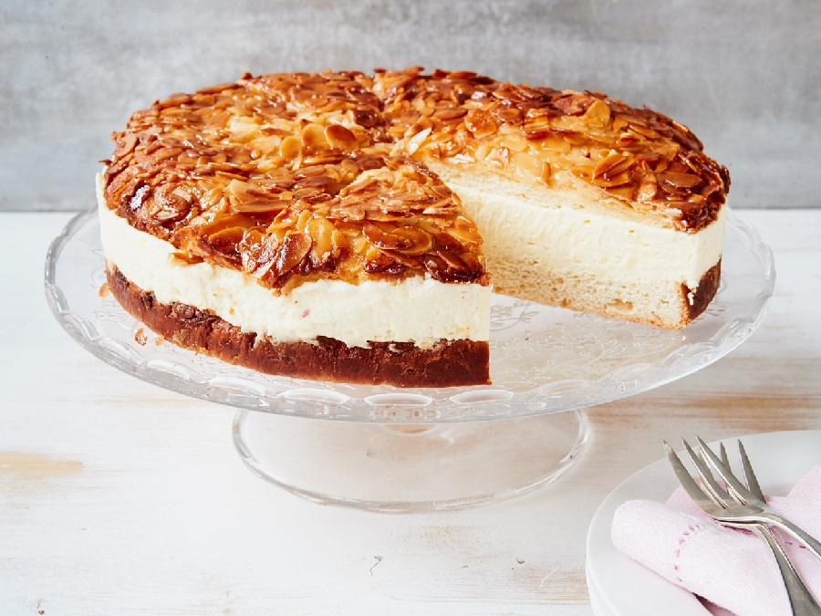

# Bienenstich

*Germany's bee-sting cake: a soft yeasted base crowned with a caramelised honey-butter-almond top that hardens to brittle. Split and filled with vanilla cream.*

**Serves:** 10

**Prep Time:** 40 minutes (plus 1 ½ hours proving)

**Cook Time:** 35 minutes

## Overview
A milk-and-butter enriched yeast dough proves to soft and pillowy. A honey-almond topping (butter, honey, sugar, cream, flaked almonds) cooks on the stovetop until thickly bubbling, then spreads on the proved dough and bakes together: the dough rises, the topping caramelises golden and chewy. Once cooled, the cake splits horizontally and fills with thick vanilla pastry cream (Konditorcreme) lightened with whipped cream.

## Ingredients

### Yeast dough
- 350 g strong white flour
- 7 g instant dried yeast (1 sachet)
- 50 g caster sugar
- 1 teaspoon salt
- 150 ml warm whole milk
- 1 egg (large)
- 60 g unsalted butter (soft)

### Honey-almond topping
- 80 g unsalted butter
- 80 g caster sugar
- 3 tablespoons runny honey
- 60 ml double cream
- 120 g flaked almonds
- ½ teaspoon vanilla extract
- A pinch of salt

### Vanilla pastry cream filling
- 500 ml whole milk
- 1 vanilla pod (split and scraped), or 2 teaspoons vanilla extract
- 5 egg yolks (large)
- 100 g caster sugar
- 40 g cornflour
- 50 g unsalted butter
- 250 ml double cream (very cold)

## Method

### Stage 1 - Make the dough
1. In a large bowl, whisk the flour, yeast, sugar and salt.
2. Beat the warm milk and egg together; pour into the flour.
3. Mix with a wooden spoon until shaggy, then turn out and knead 8-10 minutes until smooth and elastic.
4. Knead in the soft butter, piece by piece, until fully incorporated and the dough is silky.
5. Cover; prove in a warm place 1 hour until doubled.

### Stage 2 - Pastry cream (make ahead, needs to cool)
1. Bring the milk and vanilla pod (and seeds) almost to a boil in a heavy pan.
2. Whisk the yolks, sugar and cornflour in a bowl until pale.
3. Pour the hot milk slowly onto the yolks, whisking, then return to the pan.
4. Cook on medium heat, whisking constantly, until very thick (3-4 minutes). It should mound on the whisk.
5. Off heat, whisk in the butter (and vanilla extract if not using a pod).
6. Press cling film directly onto the surface; cool completely, then chill at least 1 hour.

### Stage 3 - Shape and second prove
1. Line a 24 cm round springform tin with parchment.
2. Knock back the dough; press evenly into the tin.
3. Cover; prove 30 minutes in a warm place until puffy.

### Stage 4 - Topping
1. Combine the butter, sugar, honey and cream in a small pan.
2. Bring to a gentle boil; cook 2-3 minutes, stirring, until thickened slightly and a uniform pale gold.
3. Off heat, stir in the flaked almonds, vanilla and salt.
4. Cool 5 minutes so it spreads without deflating the dough.

### Stage 5 - Bake
1. Heat the oven to 180°C (160°C fan).
2. Spread the warm (not hot) topping evenly over the proved dough.
3. Bake 30-35 minutes until the topping is deep golden and the dough is cooked through (a skewer in the dough comes out clean).
4. Cool 15 minutes in the tin; release; cool completely on a rack.

### Stage 6 - Cream filling
1. Whip the very cold double cream to soft peaks.
2. Whisk the chilled pastry cream smooth (it firms up; a beat brings it back).
3. Fold the whipped cream into the pastry cream in three additions. The filling should be thick but airy.

### Stage 7 - Fill
1. Slice the cooled cake horizontally with a long serrated knife: through the middle.
2. Tip: cut the almond top into 10 wedges first while the bottom is still whole. Then split horizontally. This lets you fill the soft bottom and replace the pre-cut top neatly.
3. Spoon the cream filling onto the bottom; smooth.
4. Replace the wedged top; press very lightly so cream just shows at the edges.
5. Chill at least 1 hour before serving.

## Notes
- **Pre-cut the top before filling:** The almond topping shatters if you try to slice a finished cake. Cutting the top into wedges first, then assembling, gives clean slices.
- **Don't overcook the topping on the stove:** Stop while it's still pourable. It will fully caramelise in the oven.
- **Filling balance:** All-pastry-cream is too dense; all-whipped-cream collapses. The 2:1 ratio gives the right pillow.

## Variations
**Quick filling:** Just sweetened whipped cream or whipped cream folded into ready-made custard.
**Individual Bienenstich:** Bake as buns; split and fill each one. Bakery-counter classic.

## Serving
Serve cold from the fridge but let slices sit 10 minutes so the cream softens slightly. With strong coffee.

## Storage
- Keeps 2 days refrigerated, covered.
- Doesn't freeze well once filled (cream weeps); unfilled cake freezes 1 month.
