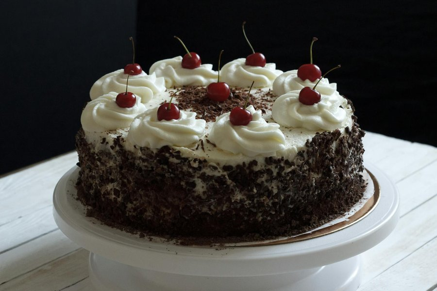

# Black Forest Cake

*Germany's Black Forest cake: three layers of chocolate sponge drowned in kirsch, sandwiched with morello cherries and vanilla whipped cream.*

**Serves:** 12

**Prep Time:** 1 hour (plus 2 hours chilling)

**Cook Time:** 30 minutes

## Overview
A genoise-style chocolate sponge bakes in three thin layers (or one thick layer split into three). Each layer brushes liberally with kirsch syrup. A morello cherry compote spreads between layers along with vanilla-scented whipped cream. The whole cake masks in cream, then dresses with dark chocolate curls and whole drained cherries. Needs to chill at least 2 hours so the layers set.

## Ingredients

### Chocolate sponge
- 6 eggs (large, room temperature)
- 180 g caster sugar
- 1 teaspoon vanilla extract
- 120 g plain flour
- 50 g cocoa powder (unsweetened, Dutch processed)
- 30 g cornflour
- 80 g unsalted butter (melted, cooled)

### Cherry filling
- 700 g morello cherries in syrup (jarred; drained, syrup reserved)
- 2 tablespoons caster sugar
- 1 tablespoon cornflour
- 100 ml of the reserved cherry syrup

### Kirsch syrup
- 100 ml cherry syrup (reserved from the jar)
- 80 ml kirsch (cherry brandy)
- 2 tablespoons caster sugar

### Whipped cream
- 800 ml double cream (very cold)
- 60 g icing sugar
- 2 teaspoons vanilla extract
- 1 tablespoon kirsch (optional)

### To decorate
- 120 g dark chocolate (70%; for shavings)
- 12 whole drained morello cherries (for the top)

## Method

### Stage 1 - Bake the sponge
1. Heat the oven to 180°C (160°C fan). Line a 23 cm round tin with parchment and grease the sides.
2. In a large bowl set over a pan of simmering water, whisk the eggs, sugar and vanilla until pale and warm to the touch (about 4 minutes).
3. Lift off the heat. Whisk with an electric mixer on high for 6-8 minutes until tripled in volume and ribbon-stage (a trailing ribbon holds 5 seconds on the surface).
4. Sift the flour, cocoa and cornflour together. Fold into the eggs in three additions, gently, with a large spatula.
5. Drizzle the melted butter around the edge; fold in just until incorporated.
6. Pour into the tin; level lightly.
7. Bake 25-30 minutes until the top springs back and a skewer comes out clean.
8. Cool 10 minutes in the tin; turn out onto a rack. Cool completely.

### Stage 2 - Cherry filling
1. Drain the cherries (reserve the syrup).
2. In a small pan, whisk 100 ml cherry syrup, the sugar and cornflour.
3. Bring to a simmer; stir until thickened and glossy (1-2 minutes).
4. Stir in the drained cherries (keep back 12 for decoration).
5. Cool completely.

### Stage 3 - Kirsch syrup
1. Warm 100 ml cherry syrup with the sugar until dissolved.
2. Cool; stir in the kirsch.

### Stage 4 - Whipped cream
1. Whip the very cold cream with the icing sugar and vanilla to soft-medium peaks.
2. Fold in the optional 1 tablespoon kirsch.
3. Reserve 200 ml for piping; keep both portions cold.

### Stage 5 - Split and soak
1. Slice the cooled sponge horizontally into 3 even layers using a long serrated knife.
2. Set the bottom layer on a cake board or stand.
3. Brush generously with kirsch syrup (about a third per layer).

### Stage 6 - Assemble
1. Spread a third of the cherry filling on the bottom layer, leaving a 1 cm border.
2. Pipe or dollop a third of the cream over the cherries; smooth.
3. Set the middle layer on top; press lightly; brush with kirsch syrup.
4. Spread the next third of cherries and another third of cream.
5. Top with the final layer; brush with the last of the kirsch syrup.

### Stage 7 - Mask and decorate
1. Cover the top and sides of the cake with the remaining (non-reserved) cream; smooth with a palette knife.
2. Chill 1 hour to firm.
3. Make chocolate shavings: drag a vegetable peeler down a slab of dark chocolate, slightly warmed in your hand.
4. Press shavings onto the sides; scatter over the top.
5. Pipe 12 cream rosettes around the top edge; nestle a cherry into each.
6. Chill at least 1 more hour before slicing.

## Notes
- **Kirsch is non-negotiable for the real thing:** It's literally in the name (Kirschtorte = cherry-brandy torte). Substitute extra cherry syrup with 1 teaspoon almond extract if you must, but it's not the same cake.
- **Morello cherries, not sweet:** Black Forest cake uses sour morellos. The sweet-and-sour balance is the point. Jarred Bavarian or Polish morellos are best.
- **Cream needs to be very cold:** Stick the bowl and whisk in the freezer 15 minutes before whipping. Warm cream won't hold its peaks for the masking.

## Variations
**Alcohol-free:** Skip the kirsch; soak with cherry syrup plus 1 teaspoon almond extract. Won't keep the German "Kirschtorte" name legally in Germany but tastes fine.
**Plated dessert version:** Bake the sponge in a tray, cut rounds, layer in glasses with cream and cherries; ready in 30 minutes.

## Serving
Serve cold from the fridge, but let slices sit 10 minutes before eating so the sponge softens. Coffee alongside.

## Storage
- Keeps 3 days refrigerated, covered.
- Doesn't freeze well once assembled (the cream weeps on thaw). Unfilled sponges freeze 2 months.
