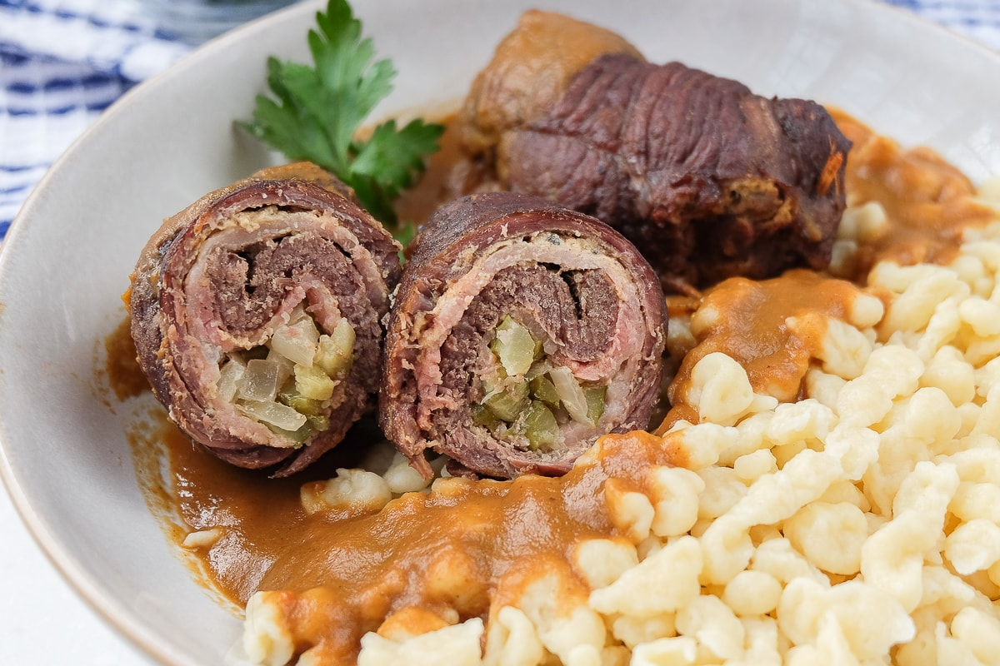

# Rouladen (Beef Rolls with Bacon, Onion and Pickle)

*Germany's Sunday-lunch centrepiece: thin slices of top-round beef spread with Dijon mustard, layered with smoky bacon, slices of sweet onion and dill pickle, rolled tight, tied with kitchen string (or fastened with cocktail sticks), seared, then braised slowly in red wine and stock for 2 hours till the meat is fork-tender. Served sliced into pinwheels with a deep red wine gravy, mashed potatoes, and red cabbage.*

**Serves:** 6

**Prep Time:** 30 minutes

**Cook Time:** 2 hours

## Overview
Rouladen (literally "rolled things") is one of Germany's most beloved Sunday-lunch dishes, the traditional big-deal meal at every birthday, Christmas Eve dinner, wedding luncheon and Sonntagsbraten (Sunday roast). Thin slices of top-round beef are spread with Dijon mustard, layered with smoky streaky bacon, sliced sweet onion and dill pickle, rolled tight, tied with kitchen string, seared brown in butter, then braised gently in red wine and beef stock with carrots, onions and bay till the beef is fork-tender. The braising liquid is strained, thickened into a deep mahogany gravy and ladled over the sliced pinwheels at the table. Served with mashed potatoes (or buttered noodles), and the traditional pairing of braised red cabbage (rotkohl). The flavour is profound: beefy, smoky, slightly sweet from the onion and pickle, with the rich gravy tying everything together.

## Ingredients

### Rouladen (6 portions)
- 6 thin slices of top-round beef (about 5 mm thick, 12-15 cm wide, 15-18 cm long; about 1.2 kg total)
- 6 tablespoons Dijon mustard
- 12 slices of smoked streaky bacon (the German "geräucherter Speck" or any smoked bacon)
- 1 large onion (sliced very thin into half-moons)
- 4 large dill pickles (cut into 6 wedges each, lengthways; about 24 wedges total)
- Fine sea salt and coarsely ground black pepper

### Braising base
- 4 tablespoons butter (for browning the rolls)
- 2 medium onions (chopped)
- 2 carrots (chopped)
- 2 sticks celery (chopped)
- 4 garlic cloves (smashed)
- 2 bay leaves
- 1 tablespoon tomato paste
- 500 ml dry red wine (Spätburgunder Pinot Noir is the traditional German wine)
- 700 ml beef stock
- 1 tablespoon redcurrant jelly (or any berry jam; modern Bavarian touch)
- 2 teaspoons coarsely ground black pepper

### Gravy thickening
- 3 tablespoons cornflour mixed with 4 tablespoons cold water (slurry)
- 100 ml double cream (for finishing)
- 1 teaspoon Dijon mustard (for finishing)

### To serve
- 1 kg mashed potatoes (with butter and milk)
- 600 g braised red cabbage (rotkohl)
- A glass of red wine alongside

### Equipment
- Kitchen string (for tying)
- A wide deep Dutch oven or braising pan (for the long braise)

## Method

### Stage 1 - Beat the beef
1. Place each slice of beef between two sheets of cling film.
2. Beat gently but firmly with a meat mallet (or the bottom of a heavy saucepan) till the slice is 3 mm thick - about 50% thinner than starting.
3. Don't tear the meat; gentle blows till it stretches out.

### Stage 2 - Prep the fillings
1. Lay each piece of beef flat on the counter.
2. Spread 1 tablespoon of Dijon mustard evenly over.
3. Sprinkle with salt and pepper.

### Stage 3 - Layer the fillings
1. On each piece of beef, layer:
   - 2 slices of bacon
   - A handful of sliced onion (about 2 tablespoons)
   - 4 pickle wedges arranged across the width
2. Don't overfill - the rolls need to close properly.

### Stage 4 - Roll and tie
1. Starting from the short end (the end with the pickles closest), roll the beef tightly around the filling.
2. Tuck the long sides in slightly as you roll (helps contain the filling).
3. Tie with kitchen string in 2-3 places (or fasten with 2 cocktail sticks per roll).

### Stage 5 - Brown
1. In a wide deep Dutch oven, heat 4 tablespoons butter over medium-high heat.
2. Brown the rouladen in batches, turning to brown all sides (about 6-8 minutes per batch).
3. Don't crowd the pan.
4. Set browned rouladen aside on a plate.

### Stage 6 - Sweat the aromatics
1. In the same pan, add the chopped onions, carrots, and celery.
2. Cook 8-10 minutes till the vegetables are soft and golden.
3. Add the garlic and tomato paste; cook 1 minute.
4. Add the bay leaves.

### Stage 7 - Deglaze and braise
1. Pour in the red wine; reduce 5 minutes (alcohol burns off).
2. Add the beef stock, redcurrant jelly, and pepper.
3. Return the browned rouladen to the pan (with any resting juices).
4. The liquid should come about 2/3 up the rouladen.
5. Bring to a gentle simmer.

### Stage 8 - Slow braise
1. Cover with the lid.
2. Reduce heat to LOW.
3. Braise gently for 90-120 minutes till the beef is fork-tender.
4. Turn the rouladen once or twice during cooking.

### Stage 9 - Rest and make the gravy
1. Lift out the rouladen carefully (don't break them); place on a warm plate; cover loosely.
2. Strain the braising liquid through a fine sieve into a clean saucepan (press the vegetables to extract).
3. Reduce by a third over high heat (about 8-10 minutes).
4. Whisk in the cornflour slurry; thicken 2-3 minutes.
5. Stir in the cream and mustard.
6. Taste; adjust seasoning.

### Stage 10 - Serve
1. Remove the strings (or cocktail sticks) from the rouladen.
2. Slice each into 4-5 pinwheel rounds.
3. Plate with mashed potatoes and red cabbage.
4. Ladle the deep mahogany gravy generously over.
5. Drink a glass of red wine alongside.

## Notes
- **Beat the beef thin enough to roll:** about 3 mm. Thicker rolls don't braise evenly.
- **Tie with string:** the traditional German technique. Cocktail sticks work but string holds shape better during the long braise.
- **Brown thoroughly before braising:** the Maillard reaction is the flavour foundation.
- **Long slow braise:** 90-120 minutes minimum. Less and the beef is tough.
- **Strain the gravy:** smooth, glossy gravy is the traditional German style.

## Variations
**Bavarian rouladen with bratwurst:** add a slice of bratwurst inside each roll alongside the bacon - heartier variant.
**Rouladen with sauerkraut:** stuff with a small amount of sauerkraut alongside the pickle - even more sour.
**Rouladen mit Pflaumen (plum rouladen):** add 1-2 prunes to the filling - sweet-savoury Berlin variant.
**Modern open rouladen:** layer all the fillings on a single sheet of beef, fold once, and braise as one piece - easier, less traditional.
**Mini rouladen (canapé):** make smaller rolls (8-9 cm) with single-slice fillings; serve as starters.
**Vegetarian rouladen:** use sliced aubergine or grilled portobello mushroom in place of beef; smoked tofu in place of bacon. Modern variant.
**Pressure cooker rouladen:** brown then pressure-cook for 40 minutes high pressure - faster, less time for flavour development.

## Serving
At a German Sunday family lunch (the traditional setting - the "Sonntagsbraten") · at a German Christmas Eve dinner · at a German wedding luncheon · at a German birthday celebration · at a Bavarian beer-hall as a special-occasion dish · at a German-themed dinner abroad · at home for a special Saturday-evening dinner-for-two with a bottle of Spätburgunder.

## Storage
- Refrigerates 3 days; the flavour deepens overnight.
- Freezes 3 months (in the gravy); defrost in the fridge before reheating.
- Reheat gently in a low oven (150°C) for 25-30 minutes or in a saucepan with extra gravy.
- Leftover sliced rouladen on rye bread with mustard and pickle makes excellent next-day lunch.
- The gravy alone (without the rouladen) makes excellent base for other German sauces.
