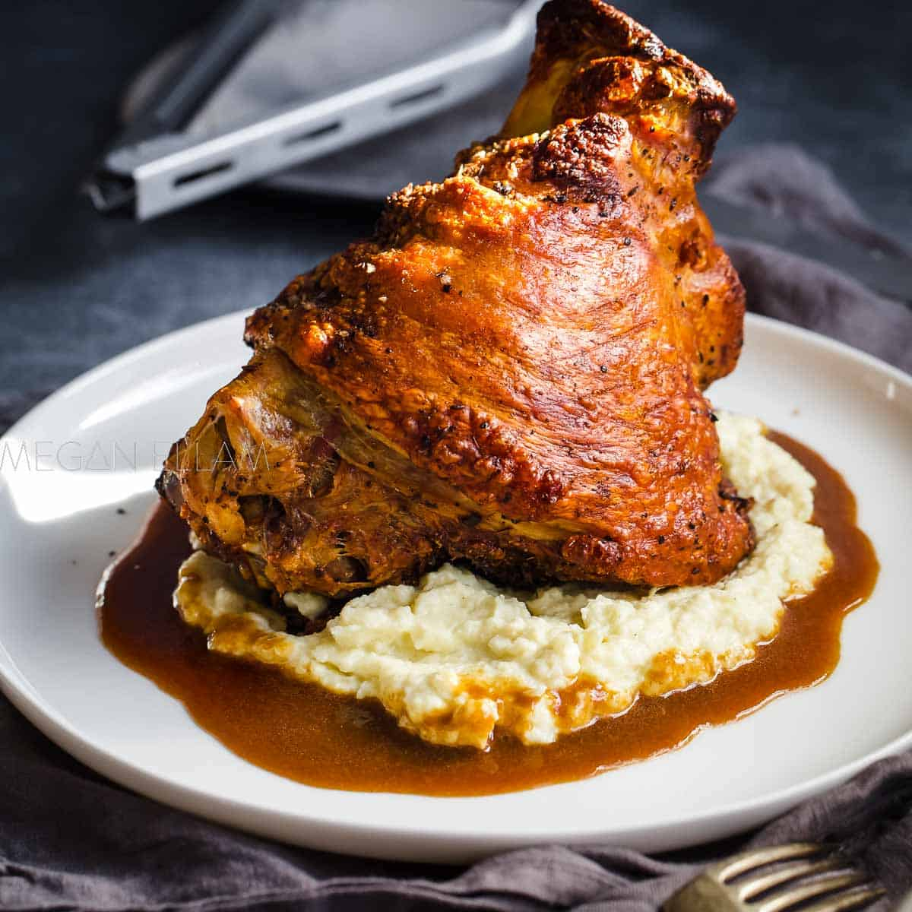

# Schweinshaxe (Roasted Pork Knuckle)

*Bavaria's beer-garden centrepiece: a whole pork knuckle (lower hind leg with skin on) brined, slow-roasted till the meat is meltingly tender and the skin crackles into glass-like crackling, served with a generous mound of sauerkraut, a steamed potato dumpling (knödel), and a stein of cold Munich lager. The dish that defines Bavarian beer-hall dining.*

**Serves:** 4 (one knuckle per person OR shared 2)

**Prep Time:** 20 minutes (plus 12-24 hour brine)

**Cook Time:** 3 hours

## Overview
Schweinshaxe (literally "pig knuckle") is Bavaria's most iconic beer-garden dish - the centrepiece of every Bavarian Biergarten lunch from Munich's Hofbräuhaus to the smallest Alpine village inn. The cut is the lower hind leg of a pig: a piece of meat with skin on, bones in, plenty of connective tissue, and a thick layer of subcutaneous fat. Cooked properly, the meat falls off the bone in deeply savoury chunks, the fat melts into a confit-like richness, and the skin transforms into glass-like crackling that shatters under the knife. The Bavarian technique: brine the knuckle overnight in salt-water with juniper, bay and peppercorns; score the skin; slow-roast for 2 hours at moderate heat over a bed of vegetables, then crank the heat for the final 30 minutes to crackle the skin (or - the canonical Bavarian shortcut - roast at moderate heat throughout, then finish under a grill or torch for the crackling). Served with traditional accompaniments: sauerkraut (canonical), bread dumplings (semmelknödel) or potato dumplings (kartoffelknödel), and a generous stein of Bavarian lager. Three details: BRINE OVERNIGHT (essential for moisture; without brine the meat goes dry during the long roast), SCORE THE SKIN deeply (diamonds, every 1 cm; lets the fat render and the crackling form), and HIGH HEAT AT THE END for the crackling (a final 30 minutes at 220°C or under the grill).

## Ingredients

### For 4 pork knuckles
- 4 fresh pork knuckles (about 1 kg each, skin on, bone in)
- 4 litres cold water (for brine)
- 200 g salt
- 100 g brown sugar
- 2 tablespoons juniper berries (crushed)
- 6 bay leaves
- 1 tablespoon black peppercorns
- 1 tablespoon caraway seeds

### Roasting bed
- 2 onions (roughly chopped)
- 2 carrots (roughly chopped)
- 4 garlic cloves (smashed)
- 1 small bunch fresh thyme
- 500 ml dark German beer (Dunkel or Weissbier; or use stock)
- 500 ml chicken stock or water

### Spice rub
- 1 tablespoon caraway seeds (lightly crushed)
- 2 tablespoons coarse rock salt
- 1 tablespoon coarsely cracked black pepper
- 4 tablespoons sunflower oil

### To serve
- Sauerkraut (warmed; about 600 g)
- 4 large kartoffelknödel (potato dumplings) or semmelknödel (bread dumplings)
- A jug of dark gravy (made from the pan drippings + flour)
- 4 steins of cold Bavarian lager (Helles or Dunkel)
- A small dish of Bavarian sweet mustard (the canonical condiment)

## Method

### Stage 1 - Brine the pork knuckles (the night before)
1. Bring 1 litre of water to a boil with the salt, sugar, juniper, bay, peppercorns, and caraway.
2. Stir till salt and sugar dissolve.
3. Pour into a large container; add the remaining 3 litres cold water.
4. Cool to room temperature.
5. Submerge the pork knuckles in the brine.
6. Refrigerate 12-24 hours.

### Stage 2 - Score the skin
1. Take the knuckles out of the brine; pat dry thoroughly.
2. With a very sharp knife or a Stanley blade, score the skin in a diamond pattern (cuts about 5 mm deep, 1 cm apart).
3. Don't cut into the meat below.

### Stage 3 - Season
1. Rub the knuckles with the sunflower oil.
2. Press the caraway-salt-pepper rub all over (especially into the scoring).

### Stage 4 - Set up the roasting tray
1. Preheat oven to 180°C / 160°C fan / 350°F.
2. Place the chopped onions, carrots, garlic, and thyme in the bottom of a deep roasting tray.
3. Pour over the beer and stock.
4. Sit the knuckles on top of the vegetables (the meat shouldn't touch the liquid; the steam rises around it).

### Stage 5 - Slow-roast
1. Roast at 180°C for 2 hours.
2. Baste the knuckles every 30 minutes with the pan juices (helps the meat stay moist).
3. The vegetables will break down; the broth will deepen.

### Stage 6 - Crank for crackling
1. Increase oven temperature to 220°C / 200°C fan / 425°F.
2. Roast 25-30 minutes more.
3. The skin should bubble dramatically and turn deep golden brown.
4. Optional finishing: a final 2-3 minutes under a hot grill or with a kitchen torch to crisp any last patches.

### Stage 7 - Rest
1. Lift the knuckles out of the tray; place on a board.
2. Rest 10 minutes loosely covered with foil.

### Stage 8 - Make the gravy
1. Strain the pan juices into a saucepan (press the vegetables to extract).
2. Skim off most of the fat (save 2 tablespoons for the roux).
3. In a small pan, make a roux: 2 tablespoons reserved fat + 2 tablespoons flour; cook 2 minutes.
4. Slowly whisk in the strained pan juices.
5. Simmer 5 minutes till the gravy thickens.
6. Taste; season with salt and pepper.

### Stage 9 - Serve
1. On each warm plate, place a whole knuckle (or half a shared knuckle).
2. Add a generous mound of warm sauerkraut alongside.
3. Add a potato dumpling.
4. Spoon gravy over the dumpling.
5. Add a small dish of sweet mustard.
6. Drink Bavarian lager from a stein.

## Notes
- **Brine overnight:** non-negotiable. Without brine, the long roast dries the meat.
- **Score deeply:** the scoring is what creates the crackling. Don't be shy.
- **High heat at the end:** the crackling needs intense heat in the last 30 minutes. Don't skip.
- **Eat the crackling first:** Bavarian etiquette - start with the crackling while it's at peak crisp.
- **Use Bavarian lager:** the canonical pairing. Helles (pale lager) is most popular; Dunkel (dark lager) is excellent.

## Variations
**With apple-mustard sauce:** swap the gravy for a sauce of cooked apples, mustard, and a splash of cider - autumn Bavarian variant.
**With horseradish cream:** serve with a horseradish-and-cream sauce alongside - modern restaurant touch.
**Smoked schweinshaxe (Eisbein, Berlin variant):** the Berlin version is smoked rather than roasted, and served simmered instead of roasted; different dish entirely.
**With dumpling-on-bread (Knödel im Brot):** swap the knödel for slices of stale bread sautéed in butter - Bavarian rustic variant.
**Schweinshaxe Kassler:** uses cured (kassler) pork rather than fresh - easier to cook, less crackling.
**Schweinshaxe with cabbage instead of sauerkraut:** lightly braised cabbage rather than fermented kraut - easier, less assertive.

## Serving
At a Munich beer garden (the canonical setting) · at the Hofbräuhaus in Munich · at Oktoberfest · at a Bavarian Sunday family lunch · at a Bavarian-themed restaurant abroad · at home with a stein of lager and a Wagner opera in the background.

## Storage
- Cooked knuckles refrigerate 3 days; reheat in a 180°C oven for 15-20 minutes.
- Don't freeze the cooked knuckle (the crackling goes soft).
- Leftover meat shredded onto sandwiches with mustard and pickled cabbage makes excellent next-day lunch.
- The pan drippings make excellent gravy base; freeze 3 months.
