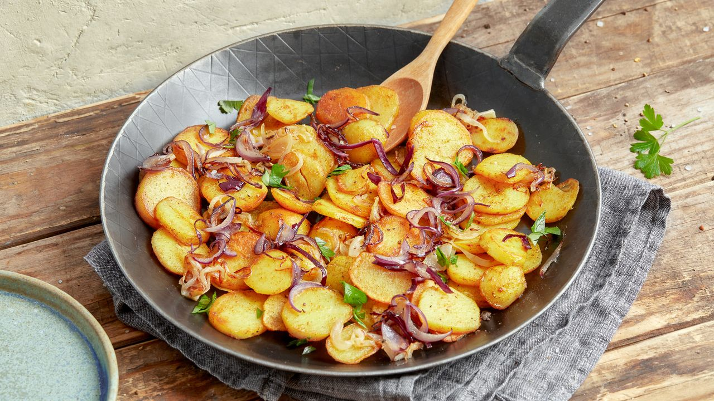

# Bratkartoffeln (German Pan-Fried Potatoes)

*Germany's everyday potato side: boiled potatoes (ideally yesterday's leftovers), sliced and pan-fried in lard or butter with diced bacon and chopped onion till deeply golden and crisp at the edges. The canonical German pub potato side; the dish that turns a sausage-and-sauerkraut plate into a feast.*

**Serves:** 4 (as a side)

**Prep Time:** 10 minutes

**Cook Time:** 20 minutes

## Overview
Bratkartoffeln (literally "frying potatoes") is Germany's most everyday and most universally beloved potato preparation - found at every German Gasthaus, every beer garden, every Hausfrau's table, and every leftover-Sunday-roast Monday lunch. The dish has dual purposes: it's the canonical accompaniment to virtually every German savoury dish (bratwurst, schnitzel, fried egg, smoked sausages, etc.), AND it's a brilliant use of leftover boiled potatoes from the previous day. The construction is straightforward: cold cooked potatoes (yesterday's boiled or roast; or freshly boiled and refrigerated 1 hour) are sliced into 5 mm rounds; diced streaky bacon (or smoked Speck) is rendered in a heavy pan until crisp; finely diced onion is sweated in the bacon fat till translucent and sweet; the sliced potatoes are added to the pan and fried, undisturbed for several minutes at a time, till each slice has a deep golden-brown crust. Seasoned with salt, pepper, and (in many German regions) a pinch of caraway. The finished dish is golden-brown, slightly crisp at the edges, with sweet bacon-onion notes throughout.

## Ingredients

### For 4 portions
- 1 kg waxy potatoes (Charlotte, Anya, or Maris Peer; or floury potatoes work too)
- 4 tablespoons lard OR 4 tablespoons butter OR 4 tablespoons goose fat (the German canonical fat hierarchy)
- 150 g smoked streaky bacon (cubed; or smoked Speck)
- 2 medium onions (finely diced)
- 1 teaspoon caraway seeds (lightly crushed; optional but very German)
- 1 teaspoon fine sea salt
- 1 teaspoon coarsely ground black pepper
- A small handful of chopped fresh parsley (for garnish)
- A small handful of chopped fresh chives (for garnish)

### Optional Bavarian touches
- 1 teaspoon Bavarian sweet mustard
- A splash of beer (instead of water in the pan; gives a slight beery edge)
- 1 tablespoon vinegar (added at the end for the Berlin-style tangy version)

### Serving alongside
- Bratwurst
- Schnitzel
- Smoked sausages
- Fried eggs (the "Bratkartoffeln mit Spiegelei" classic breakfast/lunch)
- Roast pork
- Frikadellen (German meatballs)

## Method

### Stage 1 - Cook the potatoes (the day before, or 1 hour ahead)
1. Place the potatoes whole (skin on) in a large pot.
2. Cover with cold water; add 1 tablespoon salt.
3. Bring to a boil; reduce to simmer.
4. Cook 20-25 minutes till tender but not falling apart (a knife should slide in with slight resistance - slightly underdone).
5. Drain; cool to room temperature.
6. Refrigerate at least 1 hour (overnight is ideal - the texture is much better cold).

### Stage 2 - Slice
1. Peel the chilled potatoes (the skin slips off easily).
2. Slice into 5 mm rounds.
3. The slices should hold their shape; don't crumble.

### Stage 3 - Render the bacon
1. In a large heavy frying pan or cast-iron skillet, melt 2 tablespoons of the fat over medium-high heat.
2. Add the cubed bacon; cook 4-6 minutes till crisp and the fat has rendered.
3. Lift out the crisp bacon with a slotted spoon; reserve.
4. Leave 2-3 tablespoons of fat in the pan.

### Stage 4 - Sweat the onion
1. In the bacon fat, add the diced onions.
2. Cook 6-8 minutes till soft, sweet, and golden (not brown).
3. Lift out the onions; reserve with the bacon.
4. Add the remaining 2 tablespoons of fat to the pan.

### Stage 5 - Fry the potatoes
1. Increase the heat to medium-high.
2. Once the fat is shimmering, add the sliced potatoes in a single layer (cook in batches if needed; don't crowd).
3. Fry UNDISTURBED for 3-4 minutes till the bottom is golden-brown.
4. Flip each slice (or stir gently to turn).
5. Fry another 3-4 minutes.
6. Continue till the potatoes are deeply golden on at least two sides and crisp at the edges (about 12-15 minutes total).

### Stage 6 - Combine
1. Return the reserved bacon and onions to the pan.
2. Sprinkle the caraway, salt, and pepper.
3. Stir gently to combine.
4. Cook 2 minutes more.

### Stage 7 - Serve
1. Transfer to a serving dish.
2. Scatter chopped parsley and chives over.
3. Serve hot.

## Notes
- **Cold cooked potatoes are essential:** the canonical Bratkartoffeln uses yesterday's leftovers. Fresh-boiled potatoes are too wet to crisp properly.
- **Cast iron + medium-high heat:** a non-stick pan won't develop the right crust. Cast iron, well-heated, is the German standard.
- **Undisturbed frying:** let each side fry without stirring for 3-4 minutes. That's how the crust forms.
- **Lard or goose fat is canonical:** German Hausfrauen use rendered animal fat. Butter alone gives a softer result.
- **Caraway is regional:** in Bavaria, caraway is almost mandatory. In northern Germany, less common.

## Variations
**Bratkartoffeln mit Speck (with bacon):** the canonical version described above.
**Bratkartoffeln vegetarian:** skip the bacon; use 4 tablespoons butter; add 2 tablespoons smoked paprika to the pan for the smoky note.
**Bratkartoffeln with egg (mit Spiegelei):** top with a fried egg with a runny yolk - the canonical German breakfast/lunch.
**Bratkartoffeln Berlin-style (sour):** add 1 tablespoon white vinegar at the end - sharper, Berlin variant.
**Bratkartoffeln Schwäbisch (with Maultaschen broth):** add a splash of beef stock at the end - Swabian variant.
**Bratkartoffeln with apple:** add a small diced apple to the pan with the onion - Hessian variant, slightly sweet.
**With sauerkraut:** stir in a small handful of sauerkraut at the end - Bavarian fusion variant.
**With smoked tofu (vegan):** swap bacon for diced smoked tofu - modern German vegan variant.

## Serving
At every German Gasthaus alongside any sausage or schnitzel (the canonical setting) · at a Berlin breakfast with fried egg on top · at a Bavarian beer garden alongside grilled meat · at a Hessian Sunday lunch · at a German pub as the standard side · at home as a quick weeknight side · at a German Christmas dinner alongside roast goose.

## Storage
- Refrigerate 2 days; reheat in a hot pan with a small extra knob of fat to restore some crispness.
- Don't freeze (the texture suffers).
- Leftover bratkartoffeln with a fried egg the next morning is the canonical German breakfast.
- The boiled potatoes can be cooked 2 days ahead.
- Best eaten fresh from the pan; the crispness is at its peak in the first 15 minutes.
