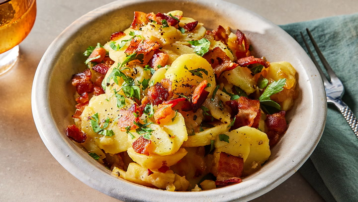

# German Potato Salad

*Bavarian warm potato salad: waxy potatoes sliced and dressed while hot with a bacon-vinegar-mustard dressing, the fat clinging to every slice. No mayonnaise: this is the Southern German version, sharp and savoury, eaten with sausages or pork knuckle in beer gardens.*

**Serves:** 6

**Prep Time:** 15 minutes

**Cook Time:** 30 minutes

## Overview
German potato salad is the warm cousin of the cold American picnic version, no mayonnaise in sight, just hot vinegar-bacon dressing poured over still-warm potatoes that drink the dressing into their flesh. Waxy potatoes (Charlotte, Maris Piper, Yukon Gold) boil in their skins until tender; you peel them while still warm (the skin slips off easily) and slice them into thick coins. A hot dressing of rendered smoked bacon, sliced onion, stock, white wine vinegar, Dijon mustard and a touch of sugar pours over the warm potatoes. The potatoes soak up the dressing in minutes. Eats warm or at room temperature, never fridge-cold; the dressing solidifies if chilled.

## Ingredients

### Potatoes
- 1 kg waxy potatoes (Charlotte, Anya, or Yukon Gold)
- 1 tablespoon salt (for the boiling water)

### Dressing
- 150 g smoked streaky bacon (cut into 5 mm lardons)
- 1 onion (large, finely chopped)
- 200 ml hot chicken stock (or vegetable stock)
- 4 tablespoons white wine vinegar
- 1 tablespoon German mustard (or Dijon mustard)
- 2 teaspoons caster sugar
- 1 teaspoon salt
- Freshly ground black pepper

### To finish
- 3 tablespoons fresh chives (finely chopped)
- 1 tablespoon flat-leaf parsley (chopped)
- 2 tablespoons neutral oil (sunflower or rapeseed)

## Method

### Stage 1 - Cook the potatoes
1. Scrub the potatoes; leave skins on.
2. Place in a large pot, cover with cold water, add the salt.
3. Bring to a boil, then simmer for 18-22 minutes (depending on size) until a knife slides through with slight resistance.
4. Drain; cool just enough to handle.

### Stage 2 - Slice while warm
1. Peel the potatoes with a small knife (the skins slip off easily when warm).
2. Slice into 5 mm thick coins.
3. Pile into a wide, warmed bowl. Don't fridge them; they need to be warm to absorb the dressing.

### Stage 3 - Bacon dressing
1. Render the bacon in a dry pan over medium heat for 5-6 minutes until crisp and the fat is golden.
2. Add the chopped onion; cook 4 minutes until translucent.
3. Pour in the hot stock, vinegar, mustard, sugar, salt and a few grinds of pepper.
4. Whisk to combine; bring to a quick simmer for 1 minute.

### Stage 4 - Combine
1. Pour the hot dressing (including the bacon and onion) over the warm potatoes.
2. Drizzle the oil over.
3. Toss gently with two spoons so the slices don't break.
4. Rest 10 minutes so the potatoes drink the dressing.

### Stage 5 - Serve
1. Taste; adjust salt and vinegar.
2. Scatter chives and parsley.
3. Serve warm or at room temperature.

## Notes
- **Waxy potatoes only:** Floury potatoes (Maris Piper, King Edward) collapse into mush. Charlotte or Anya hold the slice.
- **Dress them warm:** This is the whole technique. Cold potatoes won't absorb the dressing and you'll get oily slices in puddled dressing.
- **No mayonnaise here:** The mayo-bound version is a Northern German variant. This Bavarian version is sharper and lighter.

## Serving
Serve with: Bratwurst, Wiener schnitzel, roast pork, frikadellen. Beer-garden standard.

## Storage
- Best eaten the day it's made.
- Keeps 2 days refrigerated but bring back to room temperature and refresh with a splash of vinegar before serving.
