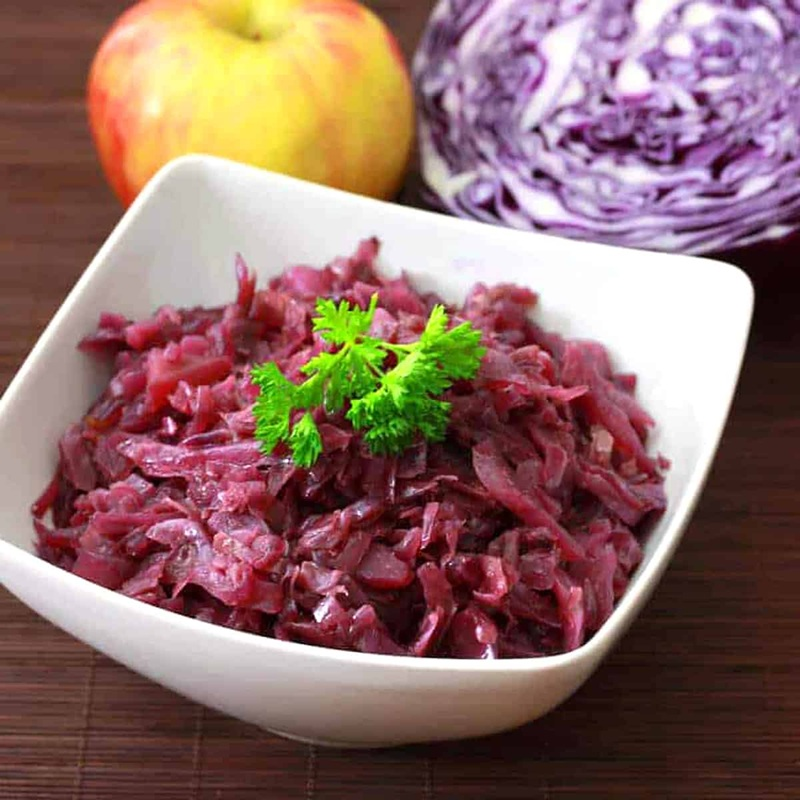

# Rotkohl

*German braised red cabbage: shredded red cabbage cooked slowly with apple, vinegar, sugar and warm spices until glossy and sweet-sour. The non-negotiable side for Sauerbraten, roast goose, pork knuckle and Christmas dinner. Better the next day.*

**Serves:** 6

**Prep Time:** 15 minutes

**Cook Time:** 1 hour 15 minutes

## Overview
Rotkohl is the German braised red cabbage that anchors every Christmas dinner across the country, a slow-cooked sweet-sour side of finely shredded cabbage perfumed with apple, clove and cinnamon. You shred the red cabbage as fine as you can (the finer the cut, the silkier the finished dish). It braises low and slow with grated apple, red wine vinegar, a splash of red wine and a couple of spoons of sugar. Whole cloves, bay leaves and a cinnamon stick perfume the pot. The vinegar is the trick: acid keeps the cabbage's vivid purple, where alkaline conditions would turn it blue-grey. An hour or more of gentle braising softens the cabbage completely and reduces the liquid to a glossy coat. Sweet, sour, warmly spiced; better the next day.

## Ingredients

### Cabbage
- 1 kg red cabbage (about 1 small head; quartered, cored and finely shredded)
- 2 tart apples (Bramley or Granny Smith; peeled, cored, coarsely grated)
- 1 onion (large, finely chopped)
- 50 g unsalted butter (or 3 tablespoons goose fat)

### Braising liquid and aromatics
- 4 tablespoons red wine vinegar
- 150 ml dry red wine
- 200 ml water (or apple juice)
- 3 tablespoons caster sugar (or 2 tablespoons redcurrant jelly)
- 1 cinnamon stick
- 4 whole cloves
- 2 bay leaves
- 6 juniper berries (lightly crushed; optional)
- 1 teaspoon salt
- Freshly ground black pepper

## Method

### Stage 1 - Soften the onion
1. Melt the butter in a heavy non-reactive pot (enamelled cast iron is ideal; aluminium will react and dull the colour).
2. Add the onion; cook on medium-low for 8 minutes until translucent and soft.

### Stage 2 - Build the pot
1. Add the shredded cabbage, grated apple, sugar, vinegar, wine and water.
2. Tuck in the cinnamon stick, cloves, bay and juniper.
3. Season with salt and a few grinds of pepper.
4. Stir well; the cabbage will look like a mountain but will collapse.

### Stage 3 - Braise
1. Cover and bring to a simmer.
2. Cook on the lowest heat for 1 hour, stirring every 15 minutes so nothing catches.
3. Uncover for the final 15 minutes if it looks watery; you want it glossy, not soupy.
4. Fish out the cinnamon stick, cloves and bay before serving.

### Stage 4 - Taste and balance
1. Taste. It should be sweet-sour with a clear vinegar lift.
2. Adjust: more sugar if too sharp, a splash more vinegar if too sweet, salt to finish.

## Notes
- **Acid keeps the colour:** Without vinegar (or another acid), red cabbage cooks dull blue-grey. Don't skip it.
- **Better the next day:** Make a day ahead. The flavours marry, the cabbage relaxes. Reheat gently with a splash of water.
- **Goose fat for a Christmas roast:** If you're cooking goose anyway, render some fat and use it instead of butter. Adds depth.

## Variations
- **With bacon:** Render 100 g diced smoked bacon at the start; cook the onion in the fat. A Bavarian touch.
- **With pear:** Swap one apple for a ripe pear; gives a softer sweetness.

## Serving
- **Serve with:** Sauerbraten, roast pork, goose, duck, pork knuckle, sausages, or with Spätzle for a vegetarian plate.

## Storage
- Keeps 4 days refrigerated. Improves over the first 2.
- Freezes 3 months.
