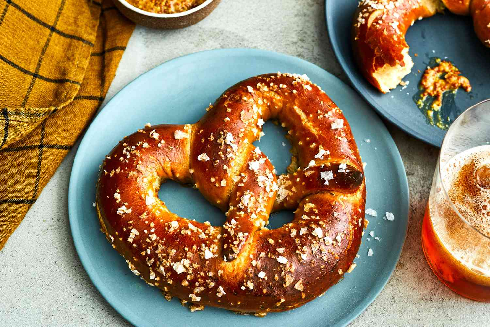

# Brezel (Bavarian Soft Pretzel)

*Bavaria's iconic twisted bread: a yeasted dough rolled into a long rope, twisted into the canonical pretzel shape, dipped in a lye (or baking-soda) bath, sprinkled with coarse rock salt, and baked till deeply browned and shiny. The canonical Bavarian beer-garden bread; the symbol of Bavarian baking; the most distinctively German bread in the canon.*

**Serves:** Makes 8 large pretzels

**Prep Time:** 30 minutes (plus 1.5 hours rising + 30 minutes rest)

**Cook Time:** 20 minutes

## Overview
The Brezel (or Brezn in Bavaria, Pretzel in English) is one of Germany's most iconic foods - a yeasted bread rolled into the unmistakable pretzel shape, dipped briefly in a hot lye or baking-soda solution (the canonical lye bath gives the deep mahogany colour and characteristic flavour; the baking-soda substitute is safer for home use), sprinkled with coarse rock salt, and baked till deeply browned. The pretzel's history dates to medieval European monastic bakeries (early Christian monks made pretzels as Lenten food - no eggs, no butter, no milk; the shape was said to represent arms folded in prayer), and the Bavarian/Swabian version is the most refined evolution. The construction: a yeasted dough of flour, water, salt, and a small amount of butter is kneaded, allowed to rise once, divided into 8 portions, each rolled into a long rope (about 50 cm) that's thicker in the middle and tapered at the ends, then twisted into the pretzel shape: the two ends are crossed twice in the middle, then folded down onto the bottom edge. Each pretzel is dipped briefly in the hot lye (or baking-soda) bath, sprinkled with coarse rock salt, and baked at high heat (220°C) for 15-20 minutes. The result is the canonical Bavarian pretzel: deeply mahogany-coloured, glossy-shiny, with a soft chewy interior and characteristic pretzel-bread flavour. Served warm with butter and Bavarian sweet mustard (Süssersenf), alongside a stein of beer. Three details: LYE BATH (the canonical Bavarian technique; gives the deep colour and authentic flavour - but lye is dangerous; baking soda is the safer home substitute), SHAPE PROPERLY (the canonical pretzel form; the twist is the bread's identity), and COARSE ROCK SALT (canonical; fine salt doesn't give the right look or texture).

## Ingredients

### Pretzel dough
- 500 g strong bread flour
- 10 g instant dried yeast (or 15 g fresh yeast)
- 12 g fine sea salt
- 30 g butter (softened)
- 300 ml warm water (about 40°C)
- 1 tablespoon malt syrup OR honey (optional; gives slight sweetness and helps with browning)

### Lye bath (canonical Bavarian - caution required)
- 1 litre water
- 30 g food-grade sodium hydroxide (lye/caustic soda; available at chemical supply shops; HANDLE WITH GLOVES AND EYE PROTECTION; never use household lye)

### Baking-soda bath (the safe home substitute)
- 1.5 litres water
- 60 g baking soda (sodium bicarbonate)

### Topping
- 4 tablespoons coarse rock salt (canonical pretzel salt; or Maldon flakes; or pearl sugar for sweet pretzels)

### To serve
- Bavarian sweet mustard (Süssersenf; Händlmaier is the famous brand)
- Butter (for spreading)
- A stein of Bavarian lager (Helles)
- Optional: a slice of Leberkäse (Bavarian meatloaf) for stuffing - see [Leberkäse recipe](leberkase.md)

## Method

### Stage 1 - Make the dough
1. In a large bowl (or stand mixer with dough hook), combine the flour, yeast, salt, and butter.
2. Pour in the warm water (with the malt syrup or honey if using).
3. Mix till a dough forms; knead 8-10 minutes till smooth and elastic.
4. The dough should be slightly stiff (less wet than a typical bread dough).

### Stage 2 - First rise
1. Place the dough in a lightly oiled bowl.
2. Cover with cling film.
3. Let rise at room temperature for 1-1.5 hours till roughly doubled.

### Stage 3 - Divide and shape
1. Punch down the dough; turn onto a lightly floured surface.
2. Divide into 8 equal portions (about 100 g each).
3. Roll each portion into a long rope (about 50 cm), thicker in the middle and tapered at the ends.
4. Each rope should be about 1.5 cm thick at the centre.

### Stage 4 - Shape into pretzels
1. Lay one rope flat.
2. Bring the two tapered ends up to form a U shape.
3. Cross the ends twice in the middle (like a twist).
4. Lay the crossed ends down onto the bottom curve of the U.
5. Press lightly to secure.
6. The pretzel should look like the classic shape.

### Stage 5 - Rest
1. Place each shaped pretzel on a lined baking tray (don't crowd).
2. Cover loosely with a tea towel.
3. Rest 20-30 minutes at room temperature.
4. The pretzels should look slightly puffy.

### Stage 6 - Optional pre-bath chill
1. For the most authentic result, refrigerate the rested pretzels uncovered for 30-60 minutes (this dries the surface slightly; gives a better crust).

### Stage 7a - The lye bath (for purists; CAUTION - lye is dangerous)
1. ONLY ATTEMPT WITH PROPER SAFETY GEAR - chemical gloves, safety goggles, well-ventilated kitchen.
2. In a stainless-steel saucepan (NOT aluminium - it reacts), heat 1 litre water to about 70-80°C.
3. SLOWLY add the food-grade lye to the water (NEVER water to lye - it can splash dangerously).
4. Stir gently with a wooden spoon.
5. Once dissolved, briefly dip each pretzel in the lye bath (5 seconds maximum) using a slotted spoon.
6. Lift out; place on a parchment-lined tray.

### Stage 7b - The baking-soda bath (safe home method)
1. In a wide pan, bring 1.5 litres of water to a boil.
2. Add the 60 g baking soda very carefully (it will foam dramatically).
3. Reduce heat to a steady simmer.
4. Dip each pretzel briefly (10-15 seconds) using a slotted spoon.
5. Lift out; place on a parchment-lined tray.

### Stage 8 - Salt and slash
1. Sprinkle the wet pretzels generously with coarse rock salt.
2. Optional: with a sharp knife or razor blade, make a 1 cm slash through the thickest part of the pretzel (the bottom curve) - this is the canonical Bavarian "Brezenschnitt" (pretzel cut), gives the characteristic split.

### Stage 9 - Bake
1. Preheat oven to 220°C / 200°C fan / 425°F.
2. Bake the pretzels for 15-20 minutes till deeply mahogany-brown and glossy.
3. The lye-bath versions brown more deeply; the baking-soda versions are slightly paler.

### Stage 10 - Cool and serve
1. Transfer to a wire rack.
2. Cool 5 minutes.
3. Serve warm with butter and sweet mustard.
4. Pair with a stein of Bavarian lager.

## Notes
- **Lye gives the canonical colour:** the food-grade sodium hydroxide solution creates the deep mahogany brown and the authentic pretzel flavour. But it's a hazardous chemical; only attempt with proper safety gear. The baking-soda substitute is far safer and gives an acceptable (slightly less deep) colour.
- **Shape properly:** the canonical pretzel form. A misshapen pretzel is just a knot of bread.
- **Coarse rock salt:** the canonical topping. Fine salt would dissolve into the dough during baking.
- **Don't crowd the tray:** the pretzels expand slightly; need space.
- **Serve warm:** pretzels are at their peak warm from the oven. Cold pretzels can be refreshed by 5 minutes in a 180°C oven.

## Variations
**Brezel with sesame seeds (Vienna style):** sprinkle sesame seeds instead of salt - Austrian variant.
**Pretzel sticks (Pretzel Stangen):** shape the dough into long thin sticks instead of pretzels - beer-garden snack version.
**Mini pretzels (Brezelchen):** make small bite-sized pretzels (40 g each) - perfect for parties.
**Sweet pretzels (with pearl sugar):** brush with butter after baking; sprinkle pearl sugar - sweet variant.
**Cinnamon-sugar pretzels:** dust with cinnamon-sugar after baking - modern dessert variant.
**Pretzel rolls (Brezelbrötchen):** shape the dough into rolls instead of pretzels - the famous pretzel sandwich roll.
**Stuffed pretzel (Leberkäs Brezel):** sandwich slices of Leberkäse between two pretzel halves with mustard - Munich street food.
**Pretzel with cheese filling:** stuff with grated cheese before baking - modern variant.

## Serving
At a Munich beer garden with a stein of Helles (the canonical setting) · at Oktoberfest · at a Bavarian Hofbräuhaus · at a Berlin breakfast café · at a German bakery counter on Sunday morning · at a German Christmas market · at a German wedding canapé reception · at home for a Bavarian-themed dinner party.

## Storage
- Best eaten same day, warm from the oven.
- Refrigerates 2 days; refresh in a 180°C oven for 4-5 minutes.
- Freezes baked pretzels well for 2 months; reheat from frozen at 180°C for 10 minutes.
- Stale pretzels (3+ days) make excellent croutons or breadcrumbs.
- The dough can be made 1 day ahead (refrigerate after the first rise; bring to room temperature before shaping).
