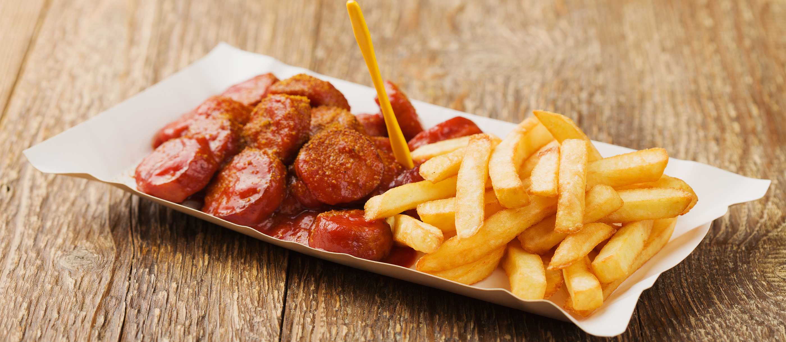

# Currywurst

*Berlin's iconic street snack: a grilled bratwurst sliced into rounds, drowned in a curry-spiced tomato sauce, dusted with curry powder, served with crispy pommes frites and a slice of white bread. Invented in West Berlin in 1949 by Herta Heuwer; the traditional late-night and lunchtime German fast food.*

**Serves:** 4

**Prep Time:** 15 minutes

**Cook Time:** 25 minutes

## Overview
Currywurst is one of Germany's most beloved street foods and the traditional Berlin fast-food snack, invented in 1949 by Herta Heuwer at her Imbiss stand in the British sector of post-war West Berlin (she's credited with combining ketchup obtained from British soldiers with curry powder also brought in by them, then pouring the mixture over German sausage). The dish is now sold from thousands of Imbiss stands across Germany, with Berlin alone consuming about 70 million currywursts per year. The construction is simple: a grilled or pan-fried bratwurst sausage sliced into rounds (the slicing is part of the eating; the sausage slides onto a plastic fork), drowned in a curry-spiced tomato sauce (ketchup + tomato paste + curry powder + paprika + onion + sugar + apple cider vinegar), dusted heavily with curry powder on top. Served on a small paper plate with a plastic fork, accompanied by pommes frites (German fries) and a slice of white bread for mopping.

## Ingredients

### Sauce
- 200 ml ketchup
- 2 tablespoons tomato paste
- 1 small onion (very finely chopped)
- 2 tablespoons mild [curry powder](../../../base-ingredients/curry-powder/bir-curry-powder.md)
- 1 tablespoon paprika
- 2 tablespoons apple cider vinegar
- 1 tablespoon brown sugar
- 1 tablespoon Worcestershire sauce
- 1 teaspoon ground cumin
- ½ teaspoon ground ginger
- ½ teaspoon cayenne (optional)
- 100 ml water
- 1 tablespoon vegetable oil

### Sausages
- 4 quality bratwurst sausages (or knockwurst; German-style pork sausages)
- 1 tablespoon vegetable oil

### Topping
- 2 tablespoons mild [curry powder](../../../base-ingredients/curry-powder/bir-curry-powder.md) (for dusting)
- Sweet paprika (optional)

### To serve
- 600 g hand-cut pommes frites or thick-cut chips
- 4 slices soft white bread
- Mayonnaise (German Imbiss style: mayo for the fries; not on the sausage)
- Cold German pilsner

## Method

### Stage 1 - Make currywurst sauce
1. Heat the tablespoon of oil in a saucepan over medium heat.
2. Add chopped onion; cook 6 minutes till soft.
3. Stir in curry powder, paprika, cumin, ginger, cayenne. Cook 30 seconds.
4. Add tomato paste; cook 1 minute.
5. Add ketchup, vinegar, sugar, Worcestershire, water.
6. Simmer 12 minutes till slightly thickened.

### Stage 2 - Cook sausages
1. Heat oil in a wide pan or grill pan over medium-high heat.
2. Cook the bratwursts 8-10 minutes, turning, till deeply browned and cooked through (internal temp 72°C).
3. Transfer to a board; let rest 2 minutes.

### Stage 3 - Slice
1. Slice each bratwurst into 2cm rounds.

### Stage 4 - Build
1. Arrange sliced bratwurst on each plate.
2. Ladle warm currywurst sauce generously over the rounds, drowning them.
3. Dust generously with extra curry powder.
4. Optional: a final sprinkle of paprika for colour.

### Stage 5 - Serve immediately
1. Pommes frites in a side cone or alongside.
2. A slice of soft white bread for mopping the sauce.
3. Mayo for the fries.
4. Cold beer.

## Notes
- **Slice into rounds:** the eating geometry depends on it.
- **Curry powder both in sauce AND dusted on top:** double-curry is the Berlin signature.
- **Bratwurst, not regular hot dog:** the German pork-sausage texture matters.
- **Eaten with a small plastic fork at an Imbiss stand:** the traditional experience.

## Variations
- **Mit Darm (with skin):** the casing left on (traditional Berlin).
- **Ohne Darm (without skin):** the casing removed before slicing (Ruhr / Hamburg style).
- **With chopped raw onion:** scattered on top.
- **Spicier:** double the cayenne; add a chopped fresh chilli.

## Serving
- At a Berlin Imbiss stand at 2 am. At an Oktoberfest food tent. At home with crispy fries and beer.

## Storage
- Sauce refrigerates 1 week; freezes 3 months.
- Cooked sausages refrigerate 4 days.
- Don't store assembled.
