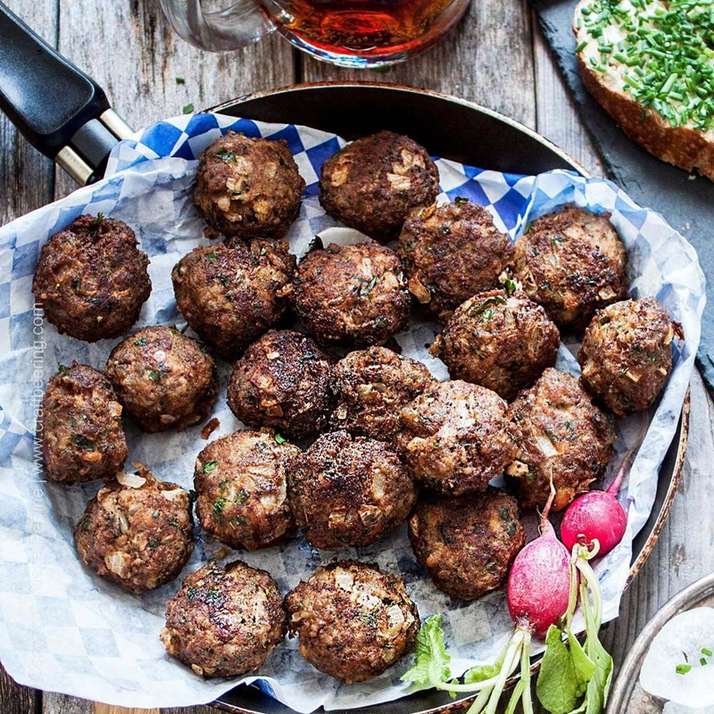

# Frikadellen

*Northern German pan-fried meatballs: a mix of pork and beef bound with bread soaked in milk, seasoned with mustard, onion and marjoram, then pan-fried in butter until deeply browned. Eaten hot with potato salad or cold in a bread roll with mustard. The German answer to the burger.*

**Serves:** 4 (makes 8 patties)

**Prep Time:** 20 minutes

**Cook Time:** 15 minutes

## Overview
A bread roll soaks in milk, squeezes out and mixes with minced pork and beef, finely chopped onion sweated soft, an egg, mustard, marjoram and plenty of pepper. Shaped into flat patties (frikadellen are flat, not round like meatballs) and pan-fried in butter. The bread keeps them tender; the flat shape gives more crust.

## Ingredients

### Meat mix
- 1 stale bread roll (or 60 g good white bread, crust off)
- 100 ml whole milk
- 350 g minced pork (about 20% fat)
- 350 g minced beef (about 15% fat)
- 1 onion (large, very finely chopped)
- 1 tablespoon butter (for sweating the onion)
- 1 egg (large)
- 2 tablespoons German mustard (or Dijon mustard)
- 2 teaspoons dried marjoram
- 2 teaspoons fine salt
- 1 teaspoon freshly ground black pepper
- ¼ teaspoon ground nutmeg

### To cook
- 30 g unsalted butter
- 2 tablespoons neutral oil

### To serve
- German mustard (mittelscharf)
- Bread rolls (or rye bread)
- Gherkins

## Method

### Stage 1 - Soak the bread
1. Tear the bread roll into chunks; place in a bowl with the milk.
2. Leave to soak 10 minutes until completely soft.
3. Squeeze gently to remove excess milk (keep the bread soft but not dripping).

### Stage 2 - Sweat the onion
1. Melt the 1 tablespoon butter in a small pan.
2. Cook the chopped onion on low heat for 8 minutes until translucent and soft, not coloured.
3. Tip into a large bowl and cool 5 minutes.

### Stage 3 - Mix
1. To the bowl with the cooled onion, add the soaked bread, pork, beef, egg, mustard, marjoram, salt, pepper and nutmeg.
2. Mix thoroughly with your hands for 1-2 minutes until uniform and slightly tacky.
3. Fry a teaspoon of mix in a small pan to taste-check; adjust salt or mustard if needed.

### Stage 4 - Shape
1. Divide into 8 equal portions (about 110 g each).
2. Roll each into a ball, then flatten into a disc about 2 cm thick and 9 cm wide.
3. Press a slight dimple in the centre of each (helps even cooking).

### Stage 5 - Pan-fry
1. Heat the butter and oil in a heavy frying pan over medium heat.
2. Once the butter foams, lay in the patties (in 2 batches if needed; don't crowd).
3. Fry 5-6 minutes a side until deep golden brown and cooked through (internal 75°C).
4. Lift onto a warm plate; rest 2 minutes.

## Notes
- **Pork and beef together:** All-beef is dry; all-pork is bland. The 50/50 mix gives the right richness and bind.
- **Bread, not breadcrumbs:** Milk-soaked fresh bread keeps frikadellen tender. Dry breadcrumbs work but you'll lose the soft middle.
- **Flat, not round:** Frikadellen are patties, not meatballs. The flat shape gives proper crust on both sides.

## Variations
**Königsberger Klopse:** A different dish but related; poached meatballs in a creamy caper sauce.
**Bouletten (Berlin name):** Same recipe, sometimes with a pinch of caraway.

## Serving
Serve with: German potato salad, kartoffelpüree (mash), or simply a bread roll with mustard and a gherkin. Beer-garden classic.

## Storage
- Keeps 3 days refrigerated; eat cold in a roll or reheat in a pan with a knob of butter.
- Freezes 2 months cooked.
