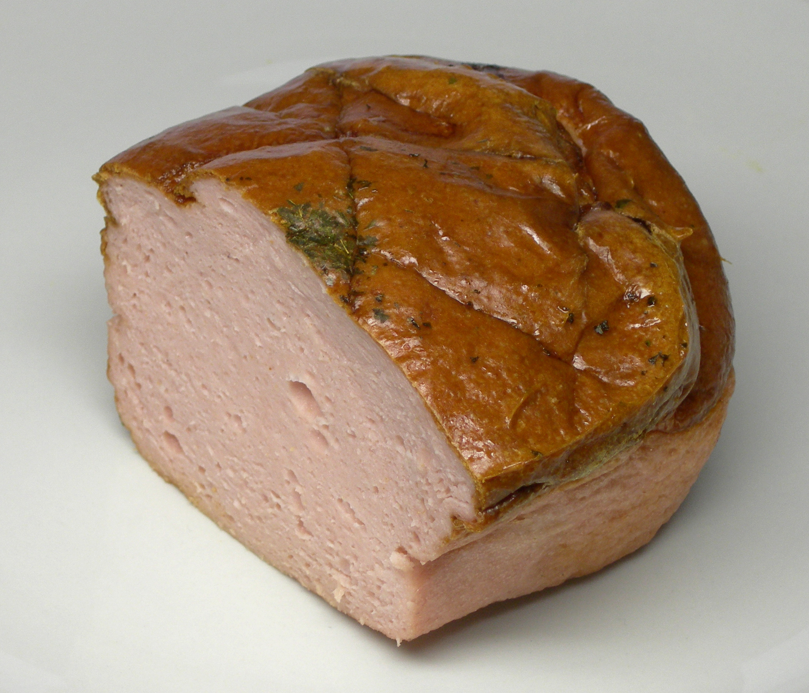

# Leberkäse (Bavarian Meatloaf)

*Bavaria's lunchtime meatloaf: a smooth pork-and-beef sausage emulsion baked in a tin till the top lacquers mahogany and the inside stays pale pink; sliced warm onto a pretzel or a bread roll with mustard, sold at every metzgerei in Munich before noon.*

**Serves:** 6-8 (one 30 cm loaf)

**Prep Time:** 30 minutes (plus chilling)

**Cook Time:** 1 hour

## Overview
Leberkäse (the name translates to "liver cheese", though the Bavarian version contains neither) is the Munich and southern German lunchtime sausage-loaf. The construction is a fine sausage emulsion: pork and beef are ground twice, blitzed with ice water and curing salt (Pökelsalz) into a pale pink paste, packed into a long rectangular tin, and baked till the surface crisps and the inside is just-firm. A slice goes between two halves of a freshly-baked pretzel (Leberkäs Brezel), or onto a Semmel roll with sweet Bavarian mustard, or onto a plate with a fried egg (Leberkäse mit Spiegelei). The metzgerei (butcher shops) sell warm Leberkäse from 9 am till they sell out, usually around 1 pm. Bavarians eat it standing up at the shop counter or take it back to the office in greaseproof paper. Outside Bavaria it's almost unknown; inside Bavaria it's an institution.

## Ingredients

### Meat (ground twice, chilled)
- 500 g pork shoulder (lean, cubed)
- 400 g beef chuck (cubed)
- 100 g pork back fat (cubed; or use very fatty pork belly)

### Cure and emulsion
- 18 g Pökelsalz (curing salt with 0.4-0.6% nitrite; or substitute with 18 g fine sea salt + a small pinch of pink salt #1; without the nitrite the loaf is grey, not the signature pink)
- 1 teaspoon ground white pepper
- 1/2 teaspoon ground nutmeg
- 1/4 teaspoon ground mace
- 1/4 teaspoon ground cardamom
- 1 small pinch ground ginger
- 1 teaspoon caster sugar
- 1 small onion (very finely grated, juice and all)
- 200 ml ice-cold water (plus 100 ml crushed ice)

### To serve
- A freshly-baked Brezel OR a Semmel roll
- Sweet Bavarian mustard (süßer Senf, Händlmaier's if you can find it)
- 1 fried egg (the Leberkäse mit Spiegelei option)
- Pickled gherkins
- A glass of Helles beer

## Method

### Stage 1 - Pre-chill everything
1. Place the cubed pork, beef, and back fat on a tray.
2. Freeze 30 minutes till the surfaces firm up but the meat isn't solid (essential for a clean emulsion; warm meat smears instead of grinding cleanly).
3. Chill the mixer bowl and blade in the freezer too.

### Stage 2 - Grind twice
1. Pass the chilled meat through a meat grinder fitted with a 4 mm plate.
2. Re-chill 10 minutes.
3. Pass through again on the 4 mm plate (the double-grind gives the smooth Leberkäse texture).

### Stage 3 - Emulsify
1. Tip the ground meat into a food processor or stand mixer with a paddle.
2. Add the Pökelsalz, all the spices, sugar, grated onion.
3. Run on medium speed for 1 minute to combine.
4. Add the ice-cold water and the crushed ice in 3 batches; let the meat fully absorb each addition before the next (about 30 seconds between).
5. The mixture should look smooth, pale, and slightly sticky (like a fine pâté).
6. Keep the temperature below 12°C throughout; if it warms above that, stop and re-chill 20 minutes.

### Stage 4 - Pack the tin
1. Heat the oven to 180°C (160°C fan, gas 4).
2. Line a 30 x 10 cm loaf tin with baking paper, or grease it well with butter.
3. Pack the meat mixture into the tin firmly; press down to expel air pockets.
4. Smooth the top.
5. Score the surface in a shallow diamond pattern with a sharp knife (Bavarian signature; helps the crust form).

### Stage 5 - Bake
1. Place the tin on a baking tray (catches any rendered fat).
2. Bake 60 minutes till the surface is deep mahogany and a thermometer in the centre reads 72°C.
3. The top should be visibly crisp and slightly puffed.

### Stage 6 - Rest and slice
1. Rest the loaf 10 minutes in the tin.
2. Lift onto a board.
3. Slice with a sharp serrated knife: 1.5 cm thick slabs for sandwiches, 2 cm thick for plating with fried egg.

### Stage 7 - Serve
1. **As a Leberkäs Brezel:** split a warm pretzel; spread one half with sweet mustard; lay a warm slice of Leberkäse inside; close.
2. **As Leberkäse mit Spiegelei:** lay a 2 cm slab on a plate; fry an egg sunny-side-up alongside; serve with a pile of potato salad.
3. **In a Semmel:** split a fresh Bavarian Semmel roll; spread with mustard; tuck a warm slice inside.

## Notes
- **Pökelsalz (curing salt) is the dish:** the nitrite gives the signature pink centre and the cured-meat flavour. Without it the loaf is grey-brown and tastes like ordinary meatloaf.
- **Cold meat, cold bowl, cold blade:** the emulsion only sets if the temperature stays below 12°C throughout the grind-and-blitz stages. Warm meat = greasy, broken loaf.
- **Double grind, then emulsify:** the texture is the dish. A single grind gives chunky meatloaf, not Leberkäse.
- **Bake at 180°C, not higher:** the surface crisps without overcooking the centre. Higher heat gives a burnt top and a tough loaf.
- **Eat warm:** Bavarians eat it within 2 hours of baking. Cold Leberkäse is a different (and lesser) thing.

## Variations
**Käseleberkäse:** stir 100 g cubed Emmental or mild Cheddar through the emulsion before packing the tin; the cheese melts into pockets.
**Pizza Leberkäse:** mix 50 g chopped olives, 30 g sun-dried tomatoes and 1 teaspoon dried oregano into the emulsion (a modern Munich variant).
**Smaller portions:** bake in 4 small ramekins for 35 minutes; perfect for sandwiches.
**With chestnuts (Maronen Leberkäse):** fold 100 g cooked diced chestnuts through the emulsion for an autumn version.
**Vegetarian "Leberkäse":** the seitan-based version sold in modern German supermarkets is a different dish; the meat version is the classic.

## Serving
At a Munich metzgerei before noon (the traditional setting) · between two halves of a fresh pretzel for breakfast · with a fried egg and potato salad for lunch · on a Wiesn beer-table at Oktoberfest · cold sliced thin in a sandwich for an Alpine hike · alongside Sauerkraut and Senfgurken on a Bavarian dinner plate.

## Storage
- Eat warm within 2 hours of baking for the best texture.
- Refrigerates 4 days wrapped in greaseproof paper.
- Reheat slices 4 minutes in a hot pan with a small knob of butter (the surface re-crisps).
- Freezes well 2 months wrapped in foil; defrost in the fridge then reheat at 160°C for 12 minutes.
- The Pökelsalz extends shelf life vs. ordinary meatloaf; uncured Leberkäse keeps only 2 days.
