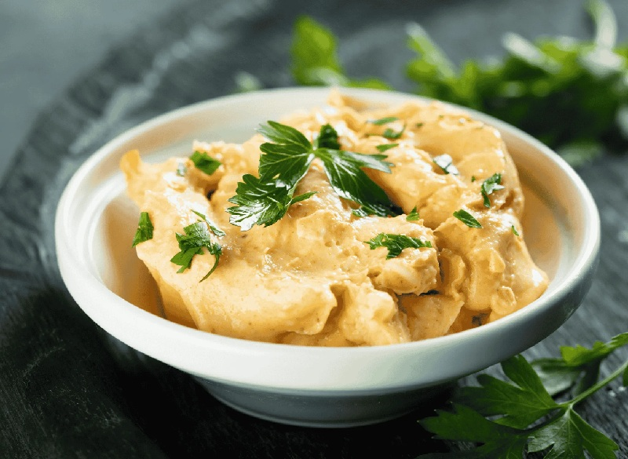

# Obatzda

*Bavarian beer-garden cheese spread: ripe Camembert mashed with soft butter, sharp onion, sweet paprika and caraway. Pinky-orange, soft, savoury. Served piled on a wooden board with pretzels, radish slices and a litre of cold Helles. The Munich standard.*

**Serves:** 4-6 (as a snack)

**Prep Time:** 10 minutes (plus 30 minutes resting)

**Cook Time:** none

## Overview
Obatzda is the Bavarian beer-garden cheese spread, soft ripe Camembert smashed with butter, paprika and a splash of beer until it goes a rosy orange and you can spread it thick on pretzels. You start with very ripe Camembert (the kind that's almost runny in the centre); mash it with cubed butter, finely grated onion, sweet paprika, caraway seeds and a generous splash of beer. The colour goes pale orange; the texture is spreadable but still slightly chunky. Rest in the fridge for half an hour so the flavours marry. Pile in a bowl, top with raw onion rings sliced thin and an extra dust of paprika. Eat cold with warm pretzels, dark bread and a tall cold beer.

## Ingredients

### Spread
- 250 g ripe Camembert cheese (room temperature; the riper the better)
- 100 g soft unsalted butter
- 50 g cream cheese (or quark, smooths the mix; optional)
- 1 white onion (small, finely grated; about 60 g)
- 1 garlic clove (finely grated; optional)
- 2 teaspoons sweet paprika
- ½ teaspoon caraway seeds (lightly crushed in a mortar)
- 2 tablespoons Pilsner (or wheat beer, or water)
- salt
- pepper

### To finish
- 1 white onion (small, very thinly sliced into rings)
- A pinch of sweet paprika (for dusting)
- A small bunch of fresh chives (snipped; optional)

### To serve
- Soft Bavarian pretzels (Brezn)
- Dark rye bread
- Radishes (sliced)

## Method

### Stage 1 - Soften the cheese
1. Cut the Camembert into rough chunks (rind and all; the rind is part of the flavour).
2. Place in a bowl with the soft butter and the cream cheese if using.
3. Leave at room temperature 20 minutes to soften fully.

### Stage 2 - Mix
1. Mash with a fork until roughly combined but still a little chunky (this isn't a smooth dip; texture matters).
2. Add the grated onion, garlic if using, paprika, crushed caraway and beer.
3. Mix to a thick, spoonable, rosy-orange paste.
4. Season with a small pinch of salt and several grinds of pepper. Taste; the Camembert is already salty, so go easy.

### Stage 3 - Rest
1. Cover and refrigerate 30 minutes (or up to 4 hours) so the flavours blend.
2. Bring back to room temperature for 15 minutes before serving; cold Obatzda is hard to spread.

### Stage 4 - Serve
1. Pile into a shallow bowl; smooth the top lightly.
2. Scatter the raw onion rings over.
3. Dust with paprika; scatter chives.
4. Serve with pretzels, dark bread and sliced radishes.

## Notes
- **Use ripe Camembert:** A young firm Camembert won't mash properly. If yours is hard, leave it at room temperature 2-3 hours first. A wedge of Brie works too.
- **Beer matters but not much:** Use what you'd drink; a light lager is traditional. Water works if you'd rather skip alcohol.
- **Keep some texture:** Don't blitz this smooth. A few small lumps of cheese are the Bavarian sign of homemade.

## Variations
**Spicier:** Add ½ teaspoon hot paprika or a pinch of cayenne.
**Smokier:** Swap half the sweet paprika for smoked paprika.

## Serving
Serve with: Soft pretzels (warmed in the oven 5 minutes), dark rye, radishes, gherkins. Beer-garden plate. Pair with a cold Helles or Weissbier.

## Storage
- Keeps 4 days refrigerated, covered.
- Doesn't freeze (the butter splits on thaw).
