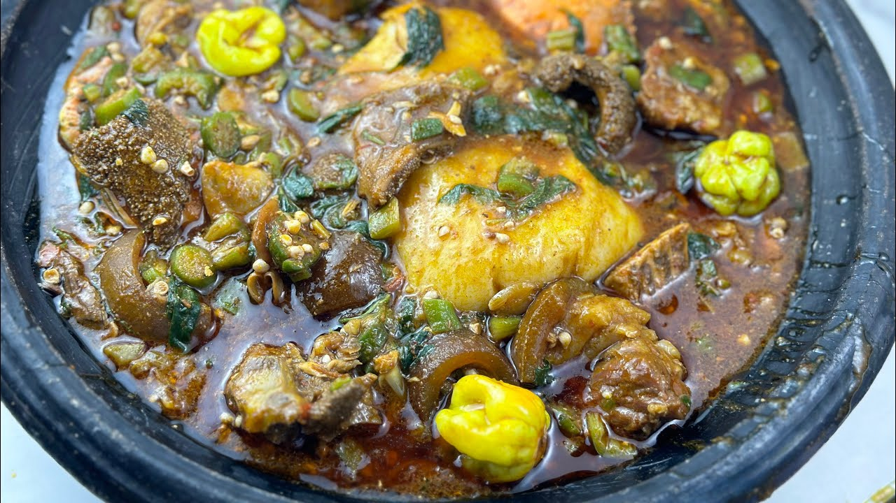

# Banku with Okra Stew

*A smooth fermented-corn-and-cassava dough ball served with okro stew, the slippery palm-oil-rich palaver of okra, tomato and dried fish that defines Ga and Ewe coastal cooking.*

**Serves:** 4

**Prep Time:** 15 minutes (plus 2 days fermentation for the corn dough)

**Cook Time:** 45 minutes

## Overview
Banku is the smooth, slightly-sour swallow of southern Ghana, fermented corn dough combined with cassava dough and cooked down with constant stirring until elastic and glossy. The fermentation gives it a tang that cuts through the palm-oil richness of the stew it carries. The okro stew (or palaver) is the classic pair, okra cooked until ropy and thickened, with tomato base, onion, dried fish, and often smoked turkey or beef. The slipperiness is the point, the stew slides off the banku ball as you tear and scoop with your fingers. Many cooks buy ready-fermented corn dough from the market; here we use a quick approximation.

## Ingredients

For the banku:
- 300 g fermented corn dough (from African grocers, or use 250 g cornmeal + 50 g cassava flour soaked overnight in 600 ml warm water with 1 tsp lemon juice)
- 100 g cassava dough (or 80 g cassava flour)
- 700 ml water
- 1 tsp salt

For the okra stew:
- 400 g fresh okra, topped, tailed and sliced into 1 cm rounds
- 80 ml red palm oil
- 1 large onion, finely chopped
- 4 ripe tomatoes, blended
- 2 tbsp tomato paste
- 2 scotch bonnets, chopped
- 3 garlic cloves, minced
- 2 cm ginger, grated
- 100 g dried fish (such as tilapia or stockfish), soaked 30 minutes, flaked
- 300 g smoked turkey or beef (optional), cut into chunks
- 1 tsp ground crayfish
- 500 ml stock or water
- 1 tsp salt
- 1 stock cube (optional)

## Method

### Stage 1 - Start the stew
1. Heat the palm oil in a wide pot over medium heat.
2. Add the onion; cook for 5 minutes until soft.
3. Stir in the tomato paste; fry for 3 minutes until it darkens.
4. Pour in the blended tomato, scotch bonnets, garlic and ginger; cook 10 minutes until thick and oil separates.

### Stage 2 - Build the okra
1. Add the dried fish, smoked turkey or beef if using, ground crayfish, stock and salt.
2. Simmer for 15 minutes.
3. Stir in the sliced okra; cook 10 minutes more until the okra goes ropy and the stew thickens. Do not over-stir.

### Stage 3 - Cook the banku
1. In a heavy pot off the heat, whisk the corn dough and cassava dough with the water and salt until smooth.
2. Set over medium heat; stir constantly with a strong wooden spoon (turn-stick) as the mixture thickens. This takes 15-20 minutes.
3. Once it pulls cleanly from the sides and is glossy and elastic, lower the heat.
4. Cover briefly; rest 2 minutes.
5. Wet your hands; shape into 4 balls.

### Stage 4 - Plate
1. Place one banku ball on each plate.
2. Ladle the okra stew alongside, with the protein piled on top.

## Notes
- **The fermented corn dough is the foundation:** Without the tang, banku is bland. African grocers sell it pre-fermented; the soak with lemon is only a stop-gap.
- **The arm work matters:** Banku must be stirred hard and constantly. A weak stir gives lumps.
- **Okra goes ropy on purpose:** That sliminess is the texture you want. Cook on a low heat after adding it and stir gently.

## Variations
- **Vegan banku stew:** Drop the dried fish and meat; double the okra and add mushrooms.
- **Garden egg version:** Add 200 g sliced garden eggs (small eggplants) with the okra.
- **With fried fish:** Skip the dried fish in the stew; serve a whole fried tilapia on top instead.
- **Light banku:** Use more cassava flour for a softer ball.

## Serving
- Eat hot with your hands · tear a piece of banku, dip into the stew · shito on the side · a piece of cold cucumber.

## Storage
- Stew keeps 3 days refrigerated and freezes 2 months
- Banku is best fresh; the ball dries and stiffens overnight
- Reheat banku by steaming for 5 minutes; reheat stew on the stove
