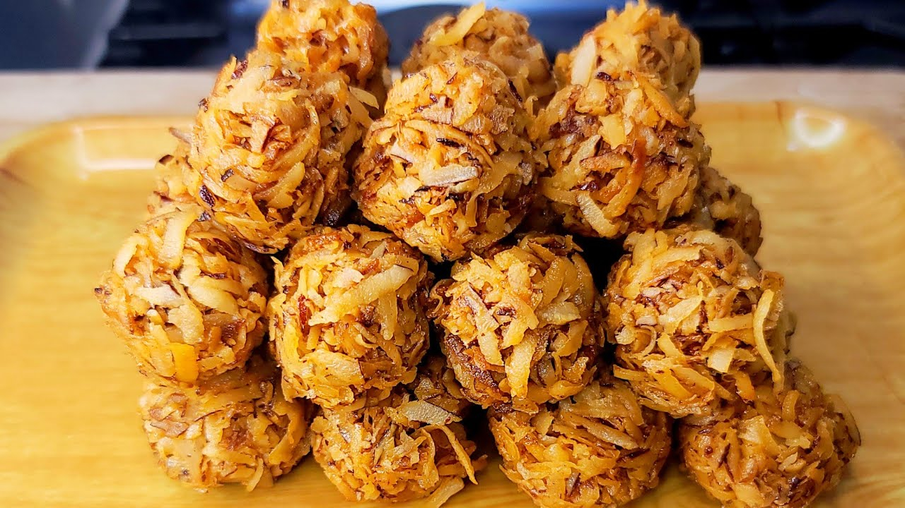

# Coconut Cake

*A one-bowl Ghanaian coconut sponge with desiccated coconut, evaporated milk and a hint of nutmeg, baked until the top is gold and the crumb is moist and fragrant.*

**Serves:** 8

**Prep Time:** 15 minutes

**Cook Time:** 45 minutes

## Overview
The Ghanaian coconut cake is the Sunday baking standard, an easy one-bowl sponge made with desiccated coconut, evaporated milk and a touch of nutmeg, baked in a loaf tin or a round and sliced thick. The crumb is denser than a Victoria sponge but lighter than a pound cake, and the flavour is pure coconut, sweet but not cloying. Evaporated milk gives the moisture and a faintly caramelised undertone that fresh milk does not deliver. Many Ghanaian home cooks make the cake without butter, using only oil, which gives a softer crumb and longer keep. It is served with tea, taken to wakes and weddings, packed for school lunches. A simple cake, not a showy one.

## Ingredients

- 250 g plain flour
- 100 g desiccated coconut
- 200 g caster sugar
- 2 tsp baking powder
- 1/2 tsp salt
- 1/2 tsp ground nutmeg
- 3 large eggs
- 150 ml vegetable oil
- 200 ml evaporated milk
- 1 tsp vanilla extract
- Extra coconut for topping (optional, 2 tbsp)

## Method

### Stage 1 - Prepare
1. Heat the oven to 170 C (fan).
2. Grease a 23 cm round cake tin or a 1 kg loaf tin; line the base with baking paper.

### Stage 2 - Mix the dry
1. In a large bowl, whisk together the flour, desiccated coconut, sugar, baking powder, salt and nutmeg.

### Stage 3 - Mix the wet
1. In a separate bowl, whisk the eggs, oil, evaporated milk and vanilla until smooth.

### Stage 4 - Combine
1. Pour the wet into the dry; fold gently with a spatula until just combined. Do not over-mix.
2. The batter should be thick but pourable.

### Stage 5 - Bake
1. Pour into the prepared tin; smooth the top.
2. Scatter the extra coconut on top if using.
3. Bake for 40-45 minutes until a skewer comes out clean and the top is deep gold.

### Stage 6 - Cool
1. Cool in the tin for 10 minutes.
2. Turn out onto a rack; cool fully before slicing.

## Notes
- **Evaporated milk is the keeper:** Do not swap for fresh milk; the caramelised note and the moisture come from the evaporation.
- **Do not over-mix:** Fold just until the flour disappears. Over-mixed batter goes tough.
- **The oven temperature is moderate:** Too hot and the top browns before the centre cooks. 170 C fan is right.

## Variations
- **Coconut-lime cake:** Add the zest of 2 limes to the batter; brush with a lime syrup after baking.
- **With pineapple:** Fold in 80 g chopped tinned pineapple; reduce the milk by 30 ml.
- **Glazed:** Drizzle with a glaze of 100 g icing sugar and 2 tbsp coconut milk.
- **Loaf style:** Bake in a 1 kg loaf tin for 50 minutes instead.

## Serving
- Eat with a cup of strong tea · a glass of cold milk · for tea-time alongside a slice of fresh pineapple · taken to a wake or a wedding as a parcel.

## Storage
- Keeps 4 days wrapped in foil at room temperature
- Keeps 1 week refrigerated; bring to room temperature before eating
- Freezes 2 months; thaw at room temperature
