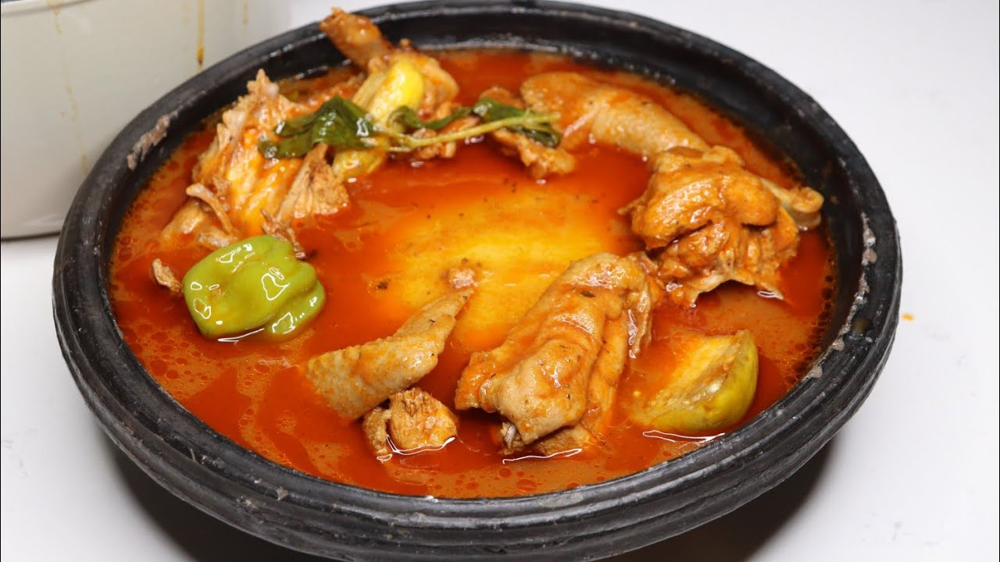

# Fufu with Light Soup

*Pounded plantain-and-cassava ball, smooth and stretchy, served in a clear chicken-tomato-pepper broth scented with garden egg, ginger and a single floating scotch bonnet.*

**Serves:** 4

**Prep Time:** 15 minutes

**Cook Time:** 1 hour 15 minutes

## Overview
Fufu is the Akan swallow, traditionally pounded in a wooden mortar (the rhythmic thud is the sound of an Akan compound at lunch). The dough is half boiled plantain and half boiled cassava, pounded together until smooth, glossy and stretchy. Light soup (nkrakra) is the classic pair, a clear tomato-based broth simmered with chicken or goat, ginger, garlic, onion, a whole scotch bonnet and chunks of garden egg. The soup is light in colour and body but big in heat. Modern home cooks use fufu flour or boiled-and-blended plantain (no pounding required), and that is what is used here.

## Ingredients

For the fufu (quick method):
- 2 large green plantains, peeled and chopped
- 400 g cassava, peeled and chopped (or 250 g cassava flour)
- 600 ml water

For the light soup:
- 1 kg chicken pieces (thigh, drumstick, wings)
- 1 large onion, halved
- 4 ripe tomatoes
- 1 red bell pepper
- 2 scotch bonnets (one whole, one chopped)
- 4 cm ginger, peeled
- 4 garlic cloves
- 200 g garden eggs (small eggplants), halved
- 2 tbsp tomato paste
- 1.2 litres water
- 1 tsp ground crayfish (optional)
- 1 stock cube
- 2 tsp salt

## Method

### Stage 1 - Start the soup
1. Place the chicken in a heavy pot with half the onion (chopped), 4 cm ginger (sliced), 2 garlic cloves (minced), the chopped scotch bonnet, salt and stock cube.
2. Add 200 ml of the water; cover and steam over medium heat for 10 minutes to release the chicken's own juices.

### Stage 2 - Blend the base
1. Blend the tomatoes, red bell pepper, the other onion half, the remaining garlic and the tomato paste with 200 ml of the water until smooth.
2. Pour over the chicken; stir.

### Stage 3 - Simmer
1. Add the remaining 800 ml of water, the whole scotch bonnet (do not pierce) and the garden eggs.
2. Simmer 35 minutes until the chicken is tender and the broth is fragrant.
3. Lift the garden eggs out; peel off the skins, mash the flesh, return to the pot. This thickens the broth slightly.
4. Stir in the ground crayfish; check the salt.

### Stage 4 - Cook the fufu
1. Boil the chopped plantain and cassava in plenty of water for 25 minutes until very soft.
2. Drain; pound in a mortar (the traditional way) or process in a food processor with 2-3 tbsp of the cooking water until smooth, glossy and stretchy.
3. Wet your hands; shape into 4 balls.
4. If using cassava flour instead, whisk it into 600 ml simmering water and stir hard for 10 minutes until elastic.

### Stage 5 - Plate
1. Place a fufu ball in each wide bowl.
2. Ladle the soup around it, with chicken pieces and garden egg on top.

## Notes
- **The whole scotch bonnet trick:** A whole pepper floating in the soup releases aroma without overwhelming heat. Diners can break it open if they want more fire.
- **Garden eggs are key:** They thicken the soup slightly and add a faint bitterness that balances the tomato.
- **The fufu ball is not chewed:** It is torn, dipped in soup and swallowed.

## Variations
- **Goat light soup:** Replace the chicken with goat shoulder cut into chunks; simmer 90 minutes.
- **Fish light soup:** Use whole tilapia or smoked fish; reduce simmer time to 20 minutes.
- **With kontomire:** Add 100 g chopped cocoyam leaves (or spinach) in the last 5 minutes.
- **Plantain-only fufu:** Skip the cassava for a sweeter, softer ball.

## Serving
- Eat with the right hand · tear a knob of fufu, swallow with broth · a glass of cold water · shito on the side if you want extra heat.

## Storage
- Soup keeps 3 days refrigerated and freezes 2 months
- Fufu is best eaten fresh; the ball hardens quickly
- Reheat soup on the stove; reheat fufu by steaming briefly
