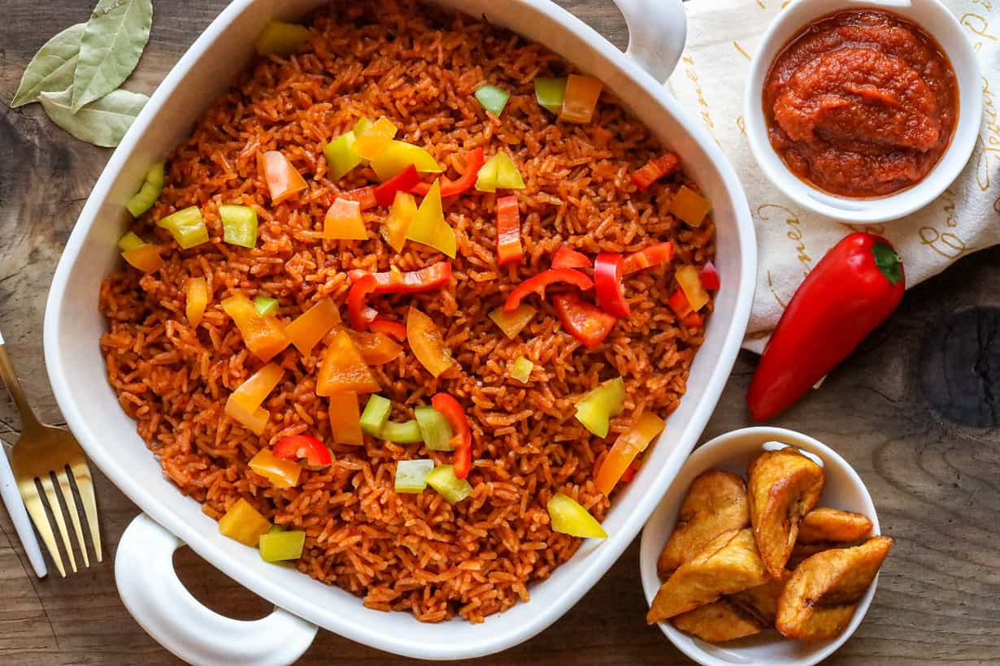

# Jollof Rice

*The Ghanaian one-pot, where jasmine rice cooks in a smoky tomato-and-scotch-bonnet stew base, drier than its Nigerian rival and finished with a dark crust at the bottom of the pot.*

**Serves:** 6

**Prep Time:** 20 minutes

**Cook Time:** 50 minutes

## Overview
Ghanaian jollof rice is the centrepiece of every party table, a one-pot rice cooked through in a thick base of blended tomato, red bell pepper, onion and scotch bonnet, with ginger and garlic, bay leaf and curry powder. Long-grain jasmine is the Accra preference (Nigeria leans on parboiled basmati or local long-grain), and the rice cooks drier, with each grain coated rather than swimming. The kicker is the burnt bottom, the dark crust at the base of the pot that everyone fights over. Tomato paste is the trick for colour; the stew base must fry down dark before the rice goes in. Serve with fried plantain and a scoop of shito on the side.

## Ingredients

- 500 g jasmine rice, rinsed twice
- 4 large tomatoes, roughly chopped
- 1 red bell pepper, deseeded
- 1 large onion, halved (one half blended, one half sliced)
- 2 scotch bonnet peppers (deseed for less heat)
- 4 garlic cloves
- 3 cm ginger, peeled
- 4 tbsp tomato paste
- 80 ml vegetable oil
- 2 bay leaves
- 1 tsp curry powder
- 1 tsp dried thyme
- 1 tsp smoked paprika
- 600 ml chicken or vegetable stock
- 2 tsp salt
- 1 tsp sugar

## Method

### Stage 1 - Blend the base
1. Blend the tomatoes, red bell pepper, half the onion, scotch bonnets, garlic and ginger to a smooth puree.
2. Slice the remaining onion half thinly.

### Stage 2 - Fry the stew
1. Heat the oil in a heavy pot over medium-high heat.
2. Add the sliced onion; cook for 5 minutes until soft and gold.
3. Stir in the tomato paste; fry for 5 minutes until darkened and the oil starts to separate.
4. Pour in the blended tomato-pepper mixture; add bay leaves, curry powder, thyme and paprika.
5. Cook for 15-20 minutes, stirring often, until the base reduces by half and turns a deep brick-red. The oil should rise to the top.

### Stage 3 - Add the rice
1. Stir in the rinsed rice, coating every grain in the stew.
2. Pour in the stock, add the salt and sugar; stir once.
3. Bring to a simmer, then cover with a tight-fitting lid (foil under the lid helps).
4. Reduce the heat to low; cook undisturbed for 25-30 minutes.

### Stage 4 - Finish
1. Lift the lid; fluff with a fork.
2. If you want the burnt bottom (and you should), leave on low heat uncovered for another 5 minutes.
3. Rest 5 minutes before serving.

## Notes
- **The bottom crust:** The slightly burnt rice at the base of the pot is called the bottom-pot in Ghana and is the most prized layer. Do not stir during cooking.
- **The tomato base must fry down:** If it still tastes raw and acidic, keep cooking. A dark, oily, jam-like base is what carries the rice.
- **Scotch bonnet heat:** Keep one whole and deseed one for layered heat without blowing the dish out.

## Variations
- **Party jollof:** Add smoked turkey wings or chicken pieces fried first; the rice cooks in the pan drippings.
- **Seafood jollof:** Stir in prawns and chunks of fish during the last 10 minutes of cooking.
- **Coconut jollof:** Swap 200 ml of the stock for coconut milk; common on the coast.
- **Vegan:** Use vegetable stock and skip the meat additions; the base carries the dish.

## Serving
- Serve hot with fried plantain · shito on the side · a wedge of cucumber and tomato salad · a piece of grilled chicken or fried fish.

## Storage
- Keeps 3 days refrigerated
- Reheat with a splash of water in a covered pan
- Freezes 2 months
