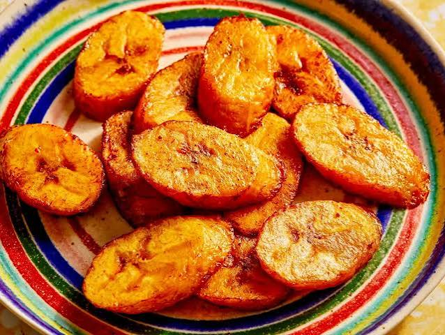

# Fried Plantain

*Ripe yellow plantain sliced on the diagonal, salted, fried in shallow oil until the edges caramelise and the centre stays creamy, the everyday side that goes with everything on a Ghanaian plate.*

**Serves:** 4 as a side

**Prep Time:** 5 minutes

**Cook Time:** 10 minutes

## Overview
Fried plantain (kelewele's milder cousin, no spice rub) is the simplest plantain preparation in Ghana and the most universal: it goes with red-red, with jollof, with waakye, with stew, with eggs at breakfast, with everything. The only requirements are a ripe-yellow plantain (some black flecks fine, no green), enough heat to caramelise the edges, and salt. No spice, no batter. The plantain is sliced on the diagonal for surface area, fried in shallow oil until the edges go deep gold and the inside is soft and sweet. Served hot. The difference between a great plate and an average one is plantain ripeness and pan temperature, nothing else.

## Ingredients

- 4 ripe plantains (yellow with black flecks, soft to the touch but not mushy)
- 60-80 ml vegetable oil (groundnut or sunflower)
- 1/2 tsp fine salt

## Method

### Stage 1 - Prepare
1. Peel the plantains by cutting off both ends, scoring the skin lengthways and lifting the skin off.
2. Slice on the diagonal, 1 cm thick, for the long oval shape.

### Stage 2 - Fry
1. Heat the oil in a wide pan over medium-high heat until shimmering (about 170 C).
2. Slide in the plantain slices in a single layer; do not crowd.
3. Fry 2 minutes on the first side until the underside is deep gold and the edges caramelised.
4. Flip; fry 90 seconds on the second side.
5. Lift onto kitchen paper; salt lightly while still hot.

### Stage 3 - Serve
1. Pile on a plate; serve immediately.

## Notes
- **Plantain ripeness:** Yellow with black spots is the sweet spot. Green plantain will not caramelise. Black-and-mushy plantain falls apart in the pan.
- **Oil temperature:** Too cool and the plantain absorbs oil and goes soggy. Too hot and the outside burns before the inside softens. A piece dropped in should sizzle steadily, not violently.
- **Salt while hot:** Salt the slices the second they leave the pan, while the oil is still beading on the surface.

## Variations
- **Kelewele:** Toss raw plantain cubes in ginger, scotch bonnet, anise and salt before frying.
- **Plantain crisps:** Slice green plantain very thin and deep-fry for a crunchy snack.
- **Tatale:** Mash over-ripe plantain into a batter and pancake-fry.
- **Sugar coating:** Sprinkle a pinch of sugar with the salt for extra caramelisation (some prefer it).

## Serving
Serve hot alongside red-red · with jollof rice · with waakye · with grilled chicken or fish · with a fried egg for breakfast.

## Storage
- Best eaten fresh
- Cooked plantain keeps 1 day refrigerated; reheat in a hot oven (200 C) for 5 minutes
- Do not microwave; it goes rubbery
