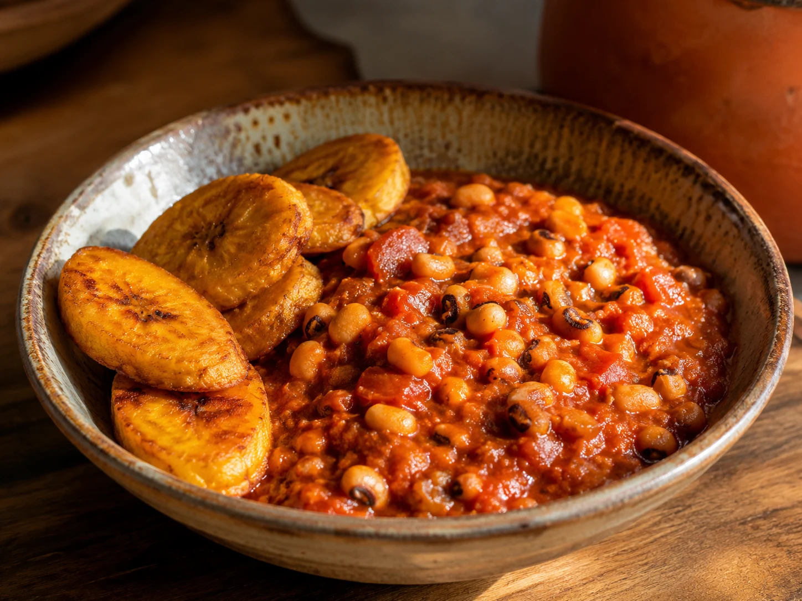

# Red-Red

*Black-eyed peas stewed in red palm oil with onion, tomato and scotch bonnet, served with fried ripe plantain, the colour of the stew and the plantain giving the dish its double-red name.*

**Serves:** 4

**Prep Time:** 15 minutes (plus overnight bean soak)

**Cook Time:** 1 hour

## Overview
Red-red is the Ghanaian street and home staple that takes its name from the two reds on the plate: the stew base of beans cooked in palm oil with tomato, and the slabs of fried ripe plantain that go on top. The beans (black-eyed peas) are simmered until tender, then folded into a palm-oil stew built with onion, tomato, scotch bonnet, ginger and dried fish or smoked turkey for depth. Palm oil is non-negotiable, it gives the colour and a faintly smoky-floral note that no other oil replicates. The plantain must be very ripe (yellow with black flecks), fried until caramelised. The combination is sweet, smoky, hot and rich all at once.

## Ingredients

For the stew:
- 300 g black-eyed peas, soaked overnight
- 60 ml red palm oil
- 1 large onion, finely chopped
- 3 ripe tomatoes, blended
- 2 tbsp tomato paste
- 2 scotch bonnets, chopped (or 1 deseeded)
- 3 garlic cloves, minced
- 2 cm ginger, grated
- 100 g dried fish, soaked 20 minutes and flaked (or 150 g smoked turkey)
- 1 stock cube
- 1 tsp salt
- 600 ml water

For the plantain:
- 4 very ripe plantains, peeled and sliced 1 cm thick on the diagonal
- Vegetable oil for frying
- 1/2 tsp salt

## Method

### Stage 1 - Cook the beans
1. Drain the soaked beans into a pot; cover with fresh water by 5 cm.
2. Bring to a boil, then reduce to a simmer; cook 35 minutes until tender but not bursting.
3. Drain, reserving 300 ml of the cooking liquid.

### Stage 2 - Build the stew
1. Heat the palm oil in a wide pan over medium heat (do not let it smoke).
2. Add the onion; cook 5 minutes until soft.
3. Stir in the tomato paste; fry 3 minutes until darkened.
4. Pour in the blended tomato, scotch bonnets, garlic and ginger; cook 10 minutes until thick and oil separates.

### Stage 3 - Combine
1. Add the dried fish or smoked turkey, stock cube and 200 ml of the reserved bean liquid.
2. Simmer 5 minutes.
3. Fold in the drained beans gently (do not crush them); add salt to taste.
4. Cook on low for 15 minutes; the stew should be thick but spoonable.

### Stage 4 - Fry the plantain
1. Heat 1 cm of vegetable oil in a wide pan over medium-high heat.
2. Fry the plantain slices in batches, 2 minutes per side, until deep gold and caramelised at the edges.
3. Drain on kitchen paper; salt lightly.

### Stage 5 - Plate
1. Spoon the bean stew onto each plate.
2. Lean the plantain slices alongside or on top.

## Notes
- **Palm oil is the colour and the flavour:** Heat it gently; smoking palm oil turns acrid. A good red palm oil should smell faintly like violets when warm.
- **Plantain ripeness:** Yellow with black flecks is right. Green plantain will not caramelise; over-ripe goes mushy in the pan.
- **Do not crush the beans:** Gentle folding keeps the texture; mashed beans become refried, which is a different dish.

## Variations
- **Vegan:** Skip the fish and turkey; add 100 g of crumbled smoked tofu for the umami.
- **With gari:** Sprinkle gari over the top for crunch.
- **With egg:** Top with a fried egg, the yolk runs into the beans.
- **Hotter:** Stir in 1 tsp ground dried chilli with the tomato.

## Serving
- Eat warm with the plantain alongside · a spoon of shito on the side · a wedge of avocado · a cold glass of water or sobolo.

## Storage
- Stew keeps 4 days refrigerated and freezes 2 months
- Fry plantain fresh for each meal; reheated plantain goes soft
- Reheat the bean stew with a splash of water
