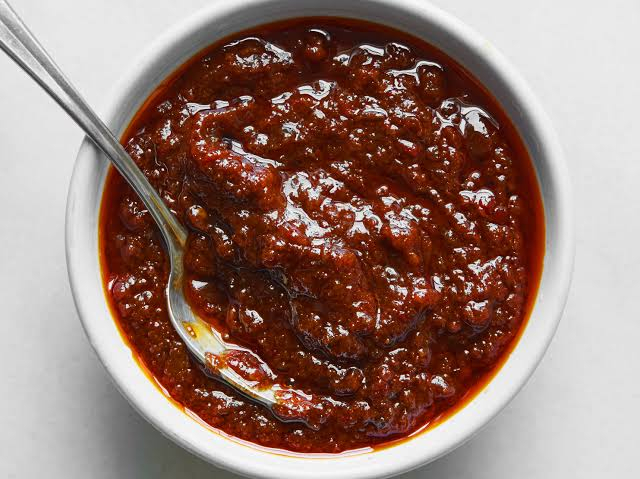

# Shito

*The Ghanaian black hot sauce, a slow-fried paste of dried fish, dried prawns, ginger, garlic and dried chilli, cooked dark in oil until it goes deep mahogany and keeps for months.*

**Serves:** Makes about 600 g (lasts months in the fridge)

**Prep Time:** 20 minutes

**Cook Time:** 1 hour 15 minutes

## Overview
Shito (the Ga word simply means pepper) is the dark, smoky, fermented-tasting condiment that sits on every Ghanaian table next to the salt. It is built on three dried foundations (dried fish, dried prawns, dried chilli) plus tomato paste, onion, ginger, garlic and a generous pour of oil. Everything is fried slowly together until it goes deep mahogany-black, the colour of long-cooked caramel. The flavour is intense, salty, fishy-sweet and hot, used by the spoonful with rice, beans, waakye, kenkey, fried fish, or just a piece of bread. Made well, shito keeps for three months in a sealed jar in the fridge; sealed under a layer of oil, longer. It is the single most important condiment in the cuisine.

## Ingredients

- 100 g dried fish (such as herring, mackerel or sole), bones removed
- 80 g dried prawns or shrimp
- 60 g dried red chilli (such as bird's eye or African dried), stems off
- 4 large onions, roughly chopped
- 100 g tomato paste
- 5 cm ginger, peeled
- 8 garlic cloves
- 350 ml vegetable oil
- 2 tsp ground crayfish (optional)
- 1 tsp salt
- 1 tsp sugar
- 1 tsp ground dried ginger
- 1 stock cube (crumbled)

## Method

### Stage 1 - Prepare the dry ingredients
1. Lightly toast the dried fish and dried prawns in a dry pan for 3 minutes until fragrant. Cool.
2. Blitz the dried fish, dried prawns and dried chillies separately in a spice grinder or food processor to a coarse powder. Set aside.

### Stage 2 - Blend the aromatics
1. Blend the onions, ginger and garlic to a smooth paste (no water).

### Stage 3 - Fry the aromatics
1. Heat the oil in a wide heavy-bottomed pan over medium heat.
2. Add the onion-ginger-garlic paste; fry 25 minutes, stirring often, until it loses all moisture and turns deep gold. Be patient, this stage cannot be rushed.

### Stage 4 - Add the tomato
1. Stir in the tomato paste; fry 10 minutes until it darkens to brick-red and the oil separates around the edges.

### Stage 5 - Add the dry powders
1. Stir in the chilli powder; fry 3 minutes.
2. Add the dried fish and dried prawn powders, ground crayfish, dried ginger, salt, sugar and stock cube.
3. Reduce the heat to low; cook 30-40 minutes, stirring every few minutes, until everything turns deep mahogany-black and the oil rises in a clear layer at the top.

### Stage 6 - Cool and bottle
1. Cool completely.
2. Spoon into a clean dry jar; make sure a layer of oil sits over the surface (top up with hot oil if needed).
3. Seal and refrigerate.

## Notes
- **The oil layer is the seal:** Always keep a layer of oil over the top of the jar. This is what gives shito its long shelf life.
- **The colour tells you it is ready:** Stop when everything is properly dark, almost black, with the oil clearly separated. Under-cooked shito tastes raw and tomato-y.
- **Smell test:** Properly cooked shito smells smoky-sweet, not fishy-raw. Taste a tiny amount on rice to check.

## Variations
- **Vegan shito:** Skip the dried fish and dried prawns; double the ginger and add 100 g shiitake powder for the umami. It will not be traditional but is delicious.
- **Hotter shito:** Add 2 tbsp scotch bonnet powder with the chilli.
- **Sweet shito:** Add 2 tbsp molasses for a darker, almost sticky version.
- **With dawadawa:** Add 1 tbsp ground fermented locust beans for a deeper savoury note.

## Serving
Spoon a teaspoon onto rice, waakye, jollof or kenkey · spread on bread with butter · stir into stews for heat and depth · serve alongside fried fish or grilled meat.

## Storage
- Keeps 3 months refrigerated in a sealed jar with an oil layer on top
- Keeps 1 month at room temperature if the oil cap is intact (Ghanaian-stand style)
- Spoons must be clean and dry; any water shortens the life
