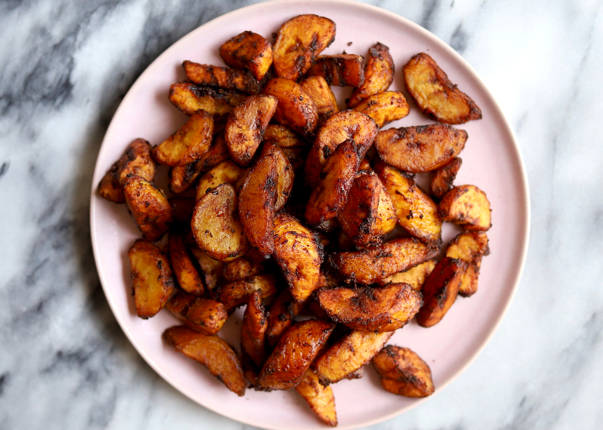

# Kelewele

*Cubes of ripe plantain tossed with ginger, scotch bonnet, anise and salt and deep-fried until the spice crust caramelises, served hot in paper cones with roasted peanuts on the side.*

**Serves:** 4 as a snack

**Prep Time:** 15 minutes

**Cook Time:** 10 minutes

## Overview
Kelewele is the celebrated Accra night-market plantain, a spice-rubbed cousin of plain fried plantain. The plantain is cut into cubes (not slabs), tossed with a wet rub of grated ginger, scotch bonnet, anise seed, ground cloves, salt and a splash of water, then deep-fried until the rub caramelises into a fragrant dark crust. The plantain inside stays sweet and soft; the outside crackles with heat and aroma. Served hot in newspaper cones, often with roasted peanuts shaken in for crunch. The five-spice profile (ginger-pepper-anise-clove-salt) is unmistakable. Every street vendor swears by a slightly different blend, but no kelewele is without ginger and anise.

## Ingredients

- 4 ripe plantains (yellow with black flecks)
- 4 cm ginger, finely grated
- 1-2 scotch bonnets, deseeded and finely chopped
- 2 garlic cloves, grated (optional)
- 1 tsp ground anise seed
- 1/2 tsp ground cloves
- 1/2 tsp ground dried ginger
- 1 tsp salt
- 1 small onion, finely grated (optional, traditional)
- 2 tbsp water
- Vegetable oil for deep-frying
- 80 g roasted peanuts (to serve)

## Method

### Stage 1 - Mix the spice rub
1. In a large bowl, combine the grated fresh ginger, scotch bonnet, garlic if using, anise, cloves, dried ginger, salt and grated onion if using.
2. Add 2 tbsp water; stir to a wet paste.

### Stage 2 - Cube and rub the plantain
1. Peel the plantains; slice into 2 cm rounds, then cut each round into quarters (small cubes).
2. Add to the spice paste; toss thoroughly to coat every cube.
3. Rest 5 minutes for the flavour to penetrate.

### Stage 3 - Fry
1. Heat 5 cm of oil in a deep pan to 170 C.
2. Fry the plantain cubes in batches, 3-4 minutes per batch, until the spice rub turns deep mahogany and the edges caramelise.
3. Lift with a slotted spoon onto kitchen paper.

### Stage 4 - Serve
1. Pile into bowls or paper cones.
2. Scatter the roasted peanuts over the top or alongside.
3. Eat immediately, while hot.

## Notes
- **Plantain ripeness:** Yellow with black flecks, soft to gentle pressure. Too green and the cubes will not caramelise; too black and they fall apart.
- **The wet rub is key:** A dry spice rub will not stick to the plantain. The small amount of water (and the onion juice if you use it) makes the rub cling.
- **Fry hot enough:** 170 C lets the rub caramelise without overcooking the inside. Cooler oil gives soggy kelewele.

## Variations
- **Kelewele with prawns:** Fold a handful of dried prawns into the spice rub.
- **Without anise:** Use 1 tsp grains of paradise or 1/2 tsp ground cinnamon instead.
- **Sweeter:** Add 1 tsp sugar to the rub for extra caramelisation.
- **Hotter:** Add an extra scotch bonnet or 1/2 tsp dried chilli flakes.

## Serving
Eat hot in a paper cone · with roasted peanuts shaken through · alongside cold sobolo · as a side to grilled tilapia or a beer.

## Storage
- Best eaten fresh and hot
- Keeps 1 day at room temperature in a covered tin; reheat in a hot oven at 200 C for 5 minutes
- Do not microwave; the crust goes soft
