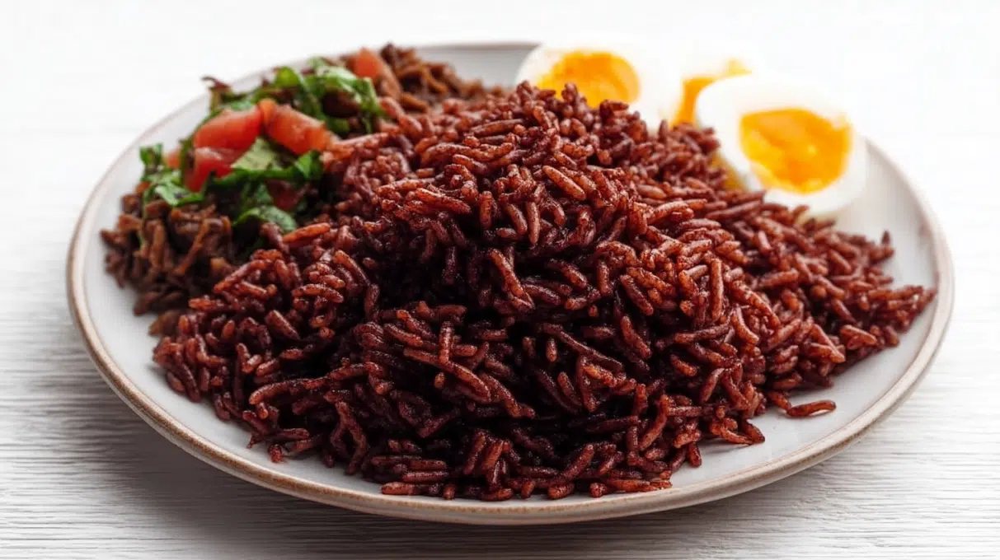

# Waakye

*Rice and beans cooked with dried sorghum leaves that turn the pot a deep reddish-brown, served piled with shito, gari, boiled egg, fried plantain and stew at every road-side stand.*

**Serves:** 4

**Prep Time:** 15 minutes (plus overnight bean soak)

**Cook Time:** 1 hour

## Overview
Waakye (pronounced waa-chay) is the rice-and-beans dish of northern Ghana that became a nationwide breakfast and lunch staple. The signature is the reddish-brown colour, dyed by waakye leaves (dried sorghum stalks), boiled with the beans before the rice goes in. A waakye plate is built in layers: rice and beans, then shito (the black hot sauce), a scoop of gari (toasted cassava grit), a piece of boiled egg, fried plantain and a ladle of stew (tomato or salad). Every stand has its own configuration; the leaves are non-negotiable. Bicarbonate of soda is sometimes used as a colour shortcut; the leaves give a better, smokier flavour.

## Ingredients

- 300 g black-eyed peas or cowpeas, soaked overnight
- 350 g long-grain rice, rinsed
- 6-8 waakye leaves (dried sorghum stalks; or 1/4 tsp bicarbonate of soda as substitute)
- 1.5 litres water
- 2 tsp salt
- 1 bay leaf

To serve (per plate):
- 2 tbsp shito ([shito](side-dishes/shito.md))
- 2 tbsp gari (toasted cassava grit)
- 1 hard-boiled egg, halved
- 2 slices fried plantain
- A ladle of tomato stew or salad

## Method

### Stage 1 - Cook the beans
1. Drain the soaked beans into a heavy pot.
2. Add the waakye leaves (or bicarbonate of soda), bay leaf and 1.2 litres of the water.
3. Bring to a boil; reduce to a steady simmer, cover and cook 35 minutes until the beans are tender. The water should turn a deep reddish-brown.

### Stage 2 - Add the rice
1. Fish out the waakye leaves.
2. Stir in the rice, salt and the remaining 300 ml water.
3. The water should sit about 2 cm above the rice; top up if needed.
4. Cover tightly; cook on low heat for 20 minutes undisturbed.

### Stage 3 - Finish
1. Lift the lid; fluff with a fork.
2. Rest 5 minutes covered.

### Stage 4 - Plate
1. Spoon a generous mound of waakye onto each plate.
2. Add a spoon of shito on the side.
3. Sprinkle gari over the top.
4. Arrange the halved egg, plantain slices and a ladle of stew alongside.

## Notes
- **The leaves are the colour and the smoke:** Bicarbonate of soda mimics the colour but not the flavour. Source the leaves from a West-African grocer if you can.
- **The gari trick:** Sprinkle the gari just before eating; it absorbs the stew and crunches between bites.
- **Layer order matters:** Waakye is built in layers on the plate, not stirred together. Each spoonful is a different composition.

## Variations
- **Waakye with goat stew:** A piece of slow-cooked goat in tomato stew.
- **Waakye with kontomire:** A spoon of cocoyam-leaf stew instead of (or alongside) the tomato.
- **Waakye with fish:** A piece of fried tilapia on top.
- **Vegan waakye:** Skip the egg; double the plantain.

## Serving
- Eat warm with your hands or a spoon · gari on top, shito on the side · a glass of sobolo or cold water · a slice of avocado if you can find one.

## Storage
- Keeps 3 days refrigerated
- Reheat with a splash of water in a covered pan
- Freezes 2 months
