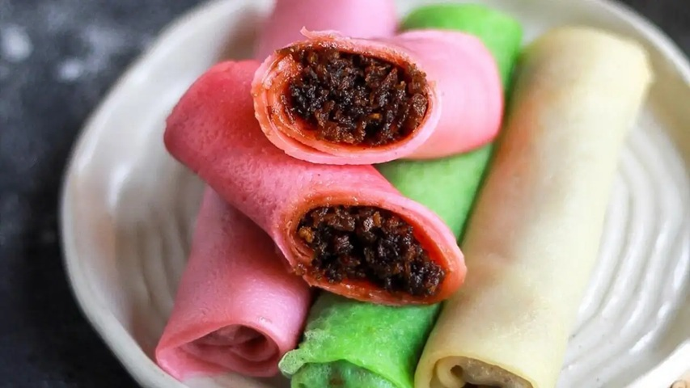

# Alle Belle

*Goan coconut-and-jaggery pancakes: thin yellow crêpes filled with a warm coconut-jaggery mixture flavoured with cardamom and a hint of nutmeg. Sunday teatime in every Goan Catholic home.*

**Serves:** 4 (makes 8 pancakes)

**Prep Time:** 15 minutes (plus 30 minutes rest)

**Cook Time:** 30 minutes

## Overview
A simple eggy flour-and-coconut-milk batter is whisked together with turmeric for colour and left to rest. A separate filling of palm jaggery is melted with grated coconut, cardamom, nutmeg and a pinch of salt until thick and glossy. Pancakes are cooked in a hot pan with a thin film of ghee, the filling spooned along one edge and rolled into a long log. Served warm, with a dusting of fresh coconut on top.

## Ingredients

### Pancake batter
- 150 g plain flour
- 2 eggs (large)
- 300 ml coconut milk
- 100 ml water
- 1 tablespoon caster sugar
- ½ teaspoon turmeric
- A pinch of salt
- ½ teaspoon vanilla extract (optional)

### Filling
- 200 g palm jaggery (or dark soft brown sugar)
- 4 tablespoons water
- 200 g fresh grated coconut (or 160 g desiccated, rehydrated in 60 ml of warm water and squeezed)
- ½ teaspoon ground cardamom
- ¼ teaspoon ground nutmeg
- A pinch of salt

### To cook
- 4 tablespoons ghee (for the pan)

### To serve
- A few tablespoons of extra fresh grated coconut

## Method

### Stage 1 - Make the batter
1. Whisk the flour and eggs in a bowl until smooth.
1. Add the coconut milk, water, sugar, turmeric, salt and vanilla.
1. Whisk until completely smooth, no lumps.
1. Rest for 30 minutes at room temperature.

### Stage 2 - Make the filling
1. Place the palm jaggery and 4 tablespoons of water in a saucepan over medium heat.
1. Stir until the jaggery has fully melted.
1. Strain through a fine sieve into a clean pan.
1. Add the grated coconut, cardamom, nutmeg and salt.
1. Cook over medium heat for 6-8 minutes, stirring, until the mixture is thick, glossy and pulls away from the sides of the pan.
1. Pull from the heat and cool to warm.

### Stage 3 - Cook the pancakes
1. Heat a 22 cm non-stick pan over medium heat.
1. Brush with ½ teaspoon of ghee.
1. Pour in a ladle of batter (about 80 ml) and tilt the pan to coat the base in a thin layer.
1. Cook for 1 minute 30 seconds until the top has set and the underside is pale gold.
1. Flip and cook for 30 seconds.
1. Slide onto a plate.

### Stage 4 - Fill
1. Place 2 tablespoons of the coconut filling along one edge of each pancake.
1. Roll the pancake over the filling to form a long log.
1. Tuck the ends in if you like (optional).
1. Place on a serving plate, seam-side down.

### Stage 5 - Serve
1. Sprinkle a little extra grated coconut over the rolled pancakes.
1. Serve warm.

## Notes
- **Turmeric for colour:** A tiny amount turns the pancakes the traditional pale yellow. Don't overdo it; ¼ teaspoon is too much.
- **Rest the batter:** The 30-minute rest hydrates the flour. Pancakes from rested batter cook smoother and don't crack at the edges.
- **Filling consistency:** It should be tacky enough to hold its shape on the pancake, not loose. If yours is loose, cook it for another 2-3 minutes.

## Storage
- Best eaten warm, within an hour of cooking.
- The filling can be made up to 3 days ahead and stored in the fridge; warm gently before using.
