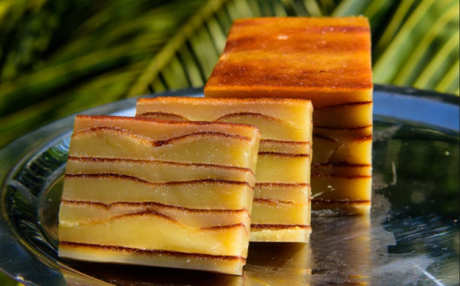

# Bebinca

*Goa's most-famous dessert: a layered coconut and egg-yolk cake, grilled one thin layer at a time so each disc has its own caramelised crust. The Christmas-table centrepiece of Goan Catholic homes.*

**Serves:** 12-14

**Prep Time:** 30 minutes

**Cook Time:** 2 hours (much of it under the grill)

## Overview
A single batter is made from coconut milk, egg yolks, plain flour, sugar and nutmeg. The bebinca is built in a small round dish layer by layer: a ladle of batter, ghee brushed on top, grilled until the surface is dark brown, then another ladle of batter, ghee, grill, repeat. Each layer is paper-thin; the finished cake has 16-20 visible layers when sliced. Patient work but the technique is simple. Tastes of coconut, nutmeg and gentle caramel.

## Ingredients
- 12 egg yolks (large)
- 400 ml coconut milk (full-fat, well-shaken)
- 200 g plain flour
- 350 g caster sugar
- ½ teaspoon ground nutmeg
- ¼ teaspoon ground cardamom (optional)
- A pinch of salt
- 250 g ghee (melted; you'll need a brushable bowl of it nearby)

### Equipment
- A 20 cm round cake tin (deep enough for 8 cm of layers; a small cake tin is correct)
- A pastry brush
- An oven with a grill function

## Method

### Stage 1 - Make the batter
1. Whisk the egg yolks gently in a large bowl until smooth (don't aerate).
1. Add the coconut milk and whisk again.
1. Sift the flour and salt over and whisk until completely smooth, no lumps.
1. Add the sugar, nutmeg and cardamom; whisk to dissolve.
1. Strain the batter through a sieve into a second bowl (this removes any cooked-egg specks and ensures a smooth pour).
1. Rest the batter for 15 minutes.

### Stage 2 - Set up the grill
1. Heat the oven grill on its highest setting; place the rack one slot down from the top.

### Stage 3 - First layer
1. Brush the cake tin generously with melted ghee.
1. Pour in 60-80 ml of batter (enough to coat the base in a thin layer, no more).
1. Place under the grill for 4-6 minutes, watching closely, until the surface is dark golden brown (almost burnt at the edges; a deep caramel colour overall).

### Stage 4 - Repeat
1. Lift the tin out (use a long oven glove).
1. Brush the top of the cooked layer generously with melted ghee.
1. Pour in another 60-80 ml of batter on top (it will sit on the cooked layer below).
1. Return to the grill for 4-6 minutes.
1. Repeat: ghee, batter, grill, ghee, batter, grill, working through all the batter.
1. You should end up with 16-20 layers depending on layer thickness.

### Stage 5 - Final layer
1. The top layer goes a shade darker than the others (you can hold this one under the grill for 7-8 minutes for a deep mahogany finish).
1. Brush a final layer of ghee over the top while it's still hot.

### Stage 6 - Cool and serve
1. Cool in the tin for 30 minutes at room temperature.
1. Run a thin knife around the edge.
1. Invert onto a board, then flip back the right way up.
1. Slice into thin wedges or fingers to show the layers.
1. Serve at room temperature.

## Notes
- **Layer thickness matters:** Each layer should be paper-thin. Pouring too much batter at once gives a cake that's only 6-8 layers; the look is wrong and so is the texture.
- **Ghee between every layer:** Skimping makes the layers fuse. Brush every layer thoroughly.
- **The top can be very dark:** Bebinca is meant to look almost-burnt on top. The deep caramelisation is the dish.

## Storage
- Wrap in foil and store at room temperature up to 5 days; the flavour deepens.
- Refrigerate up to 2 weeks; bring back to room temperature before serving.
- Doesn't freeze well (the texture suffers).
