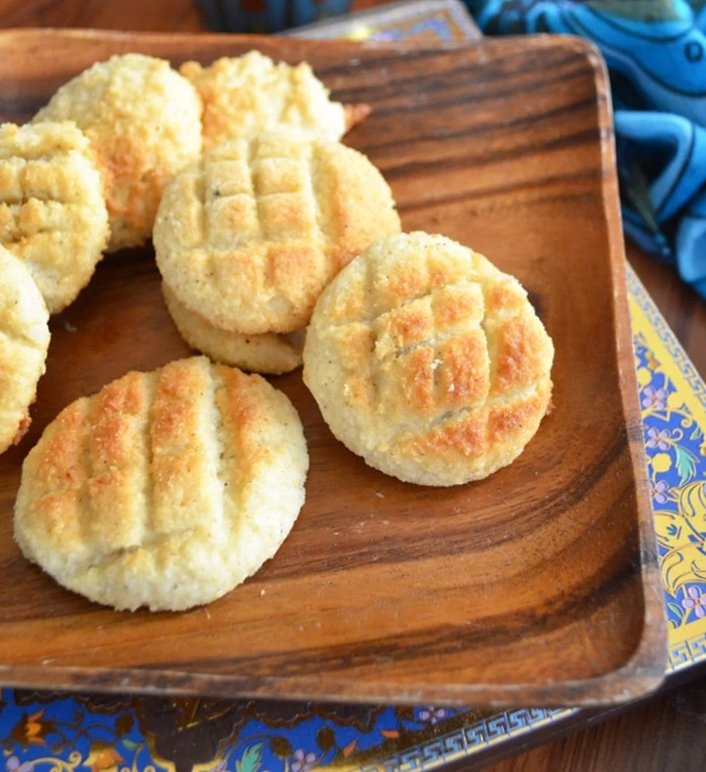

# Bolinhas de Coco

*Goan coconut macaroons: tender cookies of grated coconut, semolina and sugar, lightly bound with egg yolk. A Christmas-tree staple; eaten with afternoon tea or coffee throughout the year.*

**Serves:** Makes about 30 cookies

**Prep Time:** 20 minutes (plus 4 hours rest)

**Cook Time:** 20 minutes

## Overview
A wet dough is made from fresh grated coconut, sugar and water cooked together into a thick paste, then enriched with butter, semolina and egg yolks. The dough rests for several hours so the semolina can hydrate and the dough firms up. Small balls are shaped, pressed gently and baked low and slow until the bottoms turn golden and the tops set into pale-gold domes.

## Ingredients
- 200 g fresh grated coconut (or 160 g desiccated, rehydrated in 80 ml of warm water for 15 minutes and squeezed lightly)
- 250 g caster sugar
- 100 ml water
- 60 g salted butter (softened)
- 100 g fine semolina (rava)
- 3 egg yolks (large)
- ½ teaspoon ground cardamom
- ¼ teaspoon ground nutmeg
- ½ teaspoon vanilla extract (optional)
- A pinch of salt

### To bake
- 30 g semolina (extra, for dusting and shaping)
- 1 tablespoon butter (for greasing)

## Method

### Stage 1 - The coconut syrup
1. Combine the sugar and water in a saucepan over medium heat.
1. Stir to dissolve.
1. Add the grated coconut.
1. Cook for 8-10 minutes, stirring, until the mixture has reduced to a thick paste that pulls away from the sides of the pan when stirred (one-thread consistency).
1. Pull from the heat.

### Stage 2 - Build the dough
1. Stir the softened butter into the warm coconut paste.
1. Once smooth, stir in the semolina, cardamom, nutmeg and salt.
1. Let the mixture cool to lukewarm (about 30 minutes).
1. Whisk the egg yolks lightly and add to the cooled mixture with the vanilla.
1. Stir until a soft, sticky dough forms.

### Stage 3 - Rest
1. Cover the bowl and refrigerate for 4 hours, ideally overnight.
1. The semolina hydrates during the rest and the dough firms up.

### Stage 4 - Shape
1. Preheat the oven to 160°C (fan 140°C).
1. Line a baking tray with baking parchment and grease lightly with butter.
1. Dust your hands with the extra semolina.
1. Scoop walnut-sized portions of dough (about 25 g each).
1. Roll into balls and place on the tray, spacing 3 cm apart.
1. Press the top of each ball gently with a fork to make a small flat top (or press a thumbprint into the centre, the traditional finish).

### Stage 5 - Bake
1. Bake for 18-22 minutes, until the bottoms are golden and the tops are pale gold (the top should set firm to the touch but not brown deeply).
1. Cool on the tray for 10 minutes (the cookies firm up as they cool).
1. Transfer to a wire rack to cool completely.

## Notes
- **The rest is essential:** Skipping it gives a wet dough that spreads in the oven. After 4 hours minimum the semolina absorbs the moisture and the dough holds its shape.
- **Don't overbake:** Pull the cookies when the tops are pale, not deep gold. They firm up as they cool; overbaked cookies are dry and hard.
- **One-thread sugar syrup:** The traditional Goan signal. When the sugar paste falls off the spoon in a single thin thread, it's the right consistency for the dough.

## Storage
- Store in an airtight tin at room temperature up to 2 weeks.
- Freezes well for 3 months; defrost at room temperature for 1 hour before serving.
