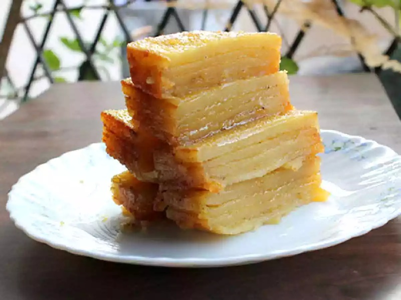

# Doce de Grão

*Goan chickpea-and-coconut fudge: cooked chickpeas blended smooth and cooked with coconut, sugar and ghee into a soft, pale-cream sweet. The Portuguese-inheritance dessert that surprises every first-time eater.*

**Serves:** 16 squares

**Prep Time:** 15 minutes (plus overnight soak)

**Cook Time:** 1 hour

## Overview
Chickpeas are soaked overnight, simmered until completely tender, then drained and pureed into a smooth paste. The paste is cooked over low heat with sugar, fresh coconut milk and grated coconut, stirred constantly as the mixture thickens. Ghee is added in stages; the fudge is ready when it pulls away from the sides of the pan and the ghee separates at the edges. Cardamom and a touch of rose water lift the chickpea flavour into something dessert-like. Tastes nothing like chickpeas.

## Ingredients
- 200 g dried chickpeas (soaked overnight) (or 350 g cooked weight)
- 1 teaspoon salt (for cooking)
- 300 g caster sugar (or fine palm jaggery for a deeper colour)
- 200 ml coconut milk
- 100 g fresh grated coconut (or 80 g desiccated, rehydrated)
- 60 g ghee
- ½ teaspoon ground cardamom
- 1 teaspoon rose water (optional, traditional)
- A pinch of salt
- 20 g cashews (chopped, optional)
- 20 g pistachios (chopped, optional)

## Method

### Stage 1 - Cook the chickpeas
1. Drain the soaked chickpeas and rinse.
1. Place in a pot with the salt and water to cover.
1. Boil hard for 10 minutes, then reduce to a simmer and cook for 1 hour to 1 hour 15 minutes, until completely tender.
1. Drain and rinse.

### Stage 2 - Puree
1. Cool the chickpeas to lukewarm.
1. Place in a blender or food processor with 4 tablespoons of water.
1. Blend to a smooth, fine paste (no graininess).
1. Pass through a sieve if you want the finest texture (traditional doce was sieved twice).

### Stage 3 - Build the fudge
1. Combine the chickpea paste, sugar and coconut milk in a heavy saucepan.
1. Place over low heat.
1. Stir continuously with a wooden spoon (essential; the paste catches the bottom quickly).
1. After 15 minutes, the mixture will thin slightly as the sugar dissolves.
1. Continue stirring; after 25 minutes total, it will start to thicken again.
1. Add the grated coconut.
1. Stir in 20 g of the ghee.

### Stage 4 - The final cook
1. Continue cooking and stirring over low heat for another 15-20 minutes.
1. Add the remaining 40 g of ghee in two more additions, 5 minutes apart.
1. The fudge is done when it pulls away from the sides of the pan in a single mass and the ghee starts to separate at the edges (about 50-55 minutes total).
1. Stir in the cardamom, rose water (if using) and salt.

### Stage 5 - Set
1. Grease a 20 cm square tray with ghee.
1. Tip the hot doce into the tray and smooth the top with the back of a greased spoon.
1. Scatter the chopped cashews and pistachios over.
1. Press the nuts gently into the surface.

### Stage 6 - Cut and serve
1. Cool at room temperature for 2 hours, then refrigerate for 4 hours to firm up.
1. Cut into 4 cm squares with a greased knife.
1. Serve at room temperature.

## Notes
- **Sieve the puree:** A double sieve gives the silky, restaurant-style texture. One blend gets you 90% of the way; sieving finishes it.
- **Don't stop stirring:** Doce de grão burns quickly at the base. The low-heat, continuous-stir is the technique.
- **Ghee in stages:** Adding the ghee all at once causes it to puddle. Three additions space the absorption.

## Storage
- Refrigerate up to 2 weeks; the flavour improves overnight.
- Freezes well for 3 months; defrost in the fridge.
