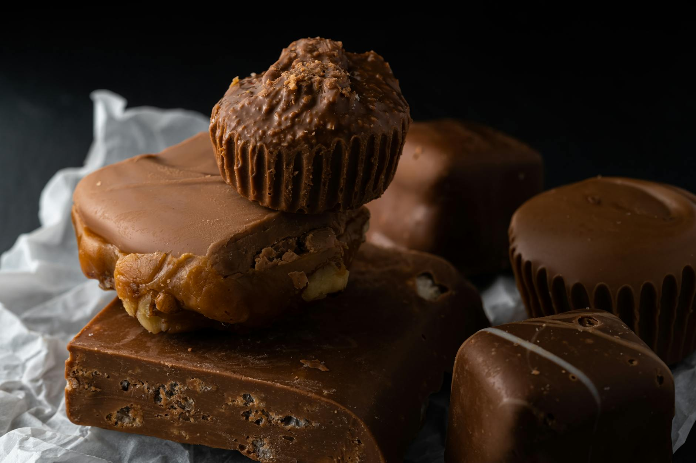

# Dodol

*Goan dark fudge: rice flour cooked low and slow with palm jaggery and coconut milk until thick, dark and glossy. Set into squares and eaten by the slab. A Christmas-sweet tradition.*

**Serves:** 16 (small squares)

**Prep Time:** 10 minutes

**Cook Time:** 1 hour 30 minutes

## Overview
A batter is made from rice flour, coconut milk and palm jaggery and stirred slowly over a low heat for over an hour. The mixture darkens and thickens through three distinct stages: pale and thin, golden and porridge-like, then deep mahogany and glossy with ghee separating at the edges. Knowing when to pull the pot is the only difficulty. Poured into a tray, cooled, and cut into squares; the texture sits between fudge and a firm jelly.

## Ingredients
- 200 g rice flour (fine, not coarse)
- 400 ml coconut milk (full-fat)
- 300 ml coconut cream (or 100 ml extra coconut milk + 4 tablespoons ghee)
- 300 g palm jaggery (gur; broken into small pieces) (or dark soft brown sugar)
- 200 ml water (for dissolving the jaggery)
- ½ teaspoon salt
- ½ teaspoon ground cardamom
- ¼ teaspoon ground nutmeg
- 2 tablespoons ghee (plus extra for greasing)
- 30 g cashews (chopped, optional)

## Method

### Stage 1 - Dissolve the jaggery
1. Place the palm jaggery in a small saucepan with the water.
1. Warm over medium heat, stirring, until the jaggery has fully dissolved.
1. Pass through a fine sieve to remove any solids.

### Stage 2 - Make the batter
1. In a large bowl, whisk the rice flour with the coconut milk until completely smooth.
1. Add the coconut cream, jaggery syrup, salt, cardamom and nutmeg.
1. Whisk until smooth and uniform.

### Stage 3 - The long cook
1. Tip the batter into a heavy-bottomed pan (the larger the surface area, the faster it cooks down).
1. Place over medium-low heat.
1. Stir continuously with a wooden spoon (this is genuinely continuous; the pot demands attention).
1. For the first 20-25 minutes, the mixture is pale and thin. It will thicken slowly.
1. After 30-40 minutes, it will reach a porridge consistency, the colour deepening to mid-caramel.
1. Keep stirring. Add 1 tablespoon of ghee at this point; the mixture will absorb it.

### Stage 4 - The final stage
1. After 50-60 minutes total, the mixture will start to thicken dramatically and pull away from the sides of the pan.
1. The colour will deepen to a glossy mahogany.
1. Ghee will start to separate from the dough at the edges (this is the signal the dodol is done).
1. Stir in the second tablespoon of ghee and the chopped cashews (if using).
1. Cook for 2-3 more minutes.

### Stage 5 - Set
1. Grease a 20 cm square tray with ghee.
1. Tip the hot dodol into the tray and smooth the top with the back of a greased spoon.
1. Cool to room temperature (about 2 hours), then refrigerate for 4 hours to set fully.

### Stage 6 - Cut and serve
1. Cut into 4 cm squares with a greased knife.
1. Serve at room temperature.

## Notes
- **Don't stop stirring:** Dodol scorches the moment you turn your back. The slow, patient stir is the whole technique.
- **The ghee separation is the sign:** When small puddles of ghee start to appear at the edges of the dough, the dodol is finished. Stopping earlier gives a soft, sticky result; continuing gives a hard, dry one.
- **Palm jaggery vs brown sugar:** Palm jaggery gives the deep, faintly smoky caramel that makes dodol distinct. Brown sugar works but the flavour is one-dimensional.

## Storage
- Refrigerate up to 3 weeks in an airtight container.
- Freezes well for 3 months; defrost in the fridge.
