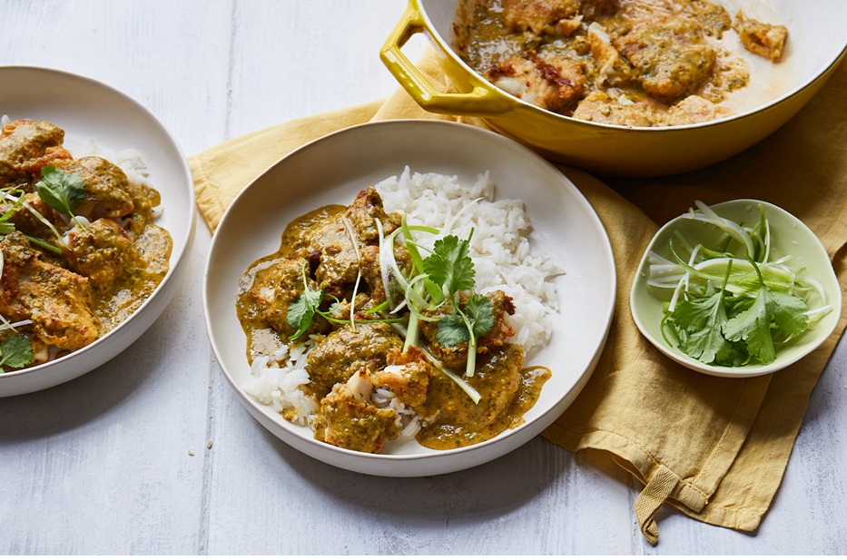

# Goan Fish Curry

*Peixe caril: the daily Goan fish curry. Pomfret or mackerel poached in a coconut and tamarind gravy bright with Kashmiri chilli and curry leaves. The rice-and-curry lunch of every Goan home.*

**Serves:** 4

**Prep Time:** 15 minutes

**Cook Time:** 25 minutes

## Overview
Goan fish curry is the dish that turns up at every Goan family lunch, a sharply acidic, deeply red coconut curry that takes a fish from neutral to memorable in fifteen minutes. You grind a Goan coconut masala from soaked Kashmiri chillies (for the deep red colour without scorching heat), coriander seeds, cumin, peppercorns, garlic and ginger with fresh grated coconut and tamarind. Onion softens slowly in coconut oil with green chilli and curry leaves; the masala paste fries until the oil separates from the solids (this is the Goan signal that the paste is properly cooked); water and salt add for a brief simmer. The fish slides into the gravy for a gentle poach, four to five minutes for white fish, longer for prawn. Serve with steamed rice and a wedge of lime.

## Ingredients

### Fish
- 600 g firm white fish (pomfret, mackerel, kingfish, snapper or sea bream; cut into steaks or 4 cm chunks)
- ½ teaspoon turmeric
- 1 teaspoon salt
- ½ lime (juice)

### Masala paste
- 12 dried Kashmiri chillies
- 3 dried byadgi chillies (or 1 hotter chilli)
- 1 tablespoon coriander seeds
- 1 teaspoon cumin seeds
- 1 teaspoon black peppercorns
- 80 g fresh grated coconut (or 60 g desiccated, rehydrated)
- 6 garlic cloves
- 25 g fresh ginger
- 1 tablespoon tamarind paste (or 1 walnut-sized lump in 80 ml hot water, strained)

### Curry
- 3 tablespoons coconut oil
- 1 onion (finely sliced)
- 2 green chillies (slit)
- 15 fresh curry leaves
- 500 ml water (or thin coconut milk for a richer curry)
- 1 teaspoon salt (to taste)

### To finish
- 5 small pieces of dried kokum (optional, traditional) (or 1 teaspoon palm vinegar)
- A handful of coriander (chopped)

## Method

### Stage 1 - Marinate the fish
1. Rub the fish with the turmeric, salt and lime juice.
1. Set aside while building the masala.

### Stage 2 - Soak and grind the masala
1. Soak the dried chillies in hot water for 15 minutes to soften.
1. Drain.
1. Toast the coriander, cumin and peppercorns in a dry pan for 30 seconds.
1. Grind the soaked chillies, toasted spices, coconut, garlic, ginger and tamarind paste to a smooth red paste with 80 ml of water.

### Stage 3 - Build the base
1. Heat the coconut oil in a wide pan over medium heat.
1. Add the sliced onion, green chilli and curry leaves.
1. Cook for 6-8 minutes until the onion is soft and golden.

### Stage 4 - The masala
1. Add the ground paste.
1. Cook for 6-8 minutes, stirring, until the oil starts to separate from the masala at the edges (skipping this gives a raw-tasting curry).

### Stage 5 - The gravy
1. Pour in the water and salt.
1. Add the kokum (if using).
1. Bring to a gentle simmer.
1. Cook uncovered for 5 minutes for the flavours to combine.

### Stage 6 - Poach the fish
1. Slide the fish into the gravy in a single layer.
1. Cover and simmer over very low heat for 6-8 minutes, until the fish is just cooked through (don't stir; tilt the pan to baste).
1. Taste and adjust salt.

### Stage 7 - Rest and serve
1. Rest off the heat for 10 minutes.
1. Scatter the coriander.
1. Serve with steamed rice (the only correct pairing).

## Notes
- **Kokum or vinegar:** Kokum (dried mangosteen) gives the curry its distinct Goan sour-fruit note. Tamarind is the everyday substitute; cider vinegar is a third choice.
- **Don't stir the fish:** Tilt the pan instead. Stirring breaks the pieces and clouds the gravy.
- **The right red:** Kashmiri chillies give the curry its colour without making it inedibly hot. Byadgi adds heat in measured doses. Always soak the dried chillies first; raw-grinding gives a gritty paste.

## Storage
- Refrigerate up to 2 days; the fish softens slightly.
- Doesn't freeze well (the coconut milk separates).
