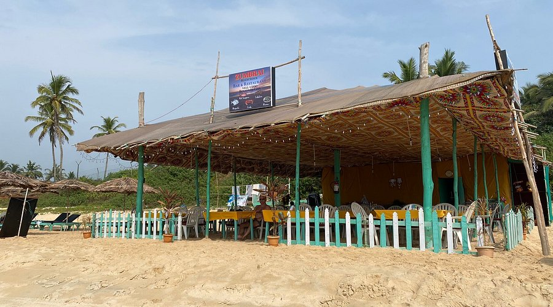

# Goan Cuisine

A Konkan-coast cuisine where Portuguese, Hindu and Muslim traditions collided over 450 years of colonial rule. Coconut (milk, oil and grated flesh), tamarind, kokum, jaggery and a strong line of vinegar mark the kitchen; chouriço, sorpotel, bebinca and alle belle carry the Portuguese inheritance, while xacuti, cafreal, vindaloo and the daily fish curry-rice belong to the local Catholic and Hindu tables. Roasted spice pastes (kashmiri chillies, coriander, peppercorns, cloves), feni-spiked marinades and the use of vinegar as a souring agent (rather than tamarind alone) distinguish Goan cooking from its Maharashtran and Karnatakan neighbours.
