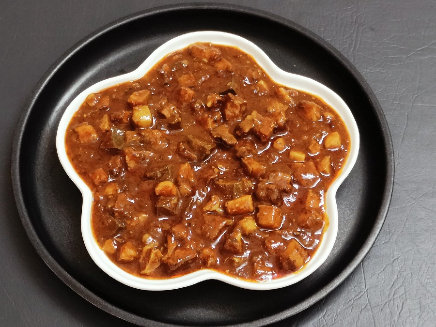

# Pork Sorpotel

*The Goan Catholic feast curry: pork, liver and heart cooked in a thick, vinegar-sharp masala of roasted chillies and warming spices. Made days ahead so the flavour can deepen.*

**Serves:** 6-8

**Prep Time:** 30 minutes (plus overnight rest)

**Cook Time:** 2 hours

## Overview
Pork sorpotel is the Portuguese-Goan vinegar pork stew, traditionally made for celebrations and improving dramatically with a day or two of resting in the fridge before serving. Pork shoulder and liver par-boil with whole spices, drain, then dice fine. A masala paste of roasted Kashmiri chillies, peppercorns, cinnamon, cloves and cumin grinds with garlic, ginger and a generous splash of palm vinegar. The diced meat browns in pork fat, the paste fries until the oil separates, the reserved cooking stock pours in for a slow simmer. The dish improves dramatically after twenty-four to forty-eight hours in the fridge; Goans traditionally make it the day before serving for that reason. Eat with sannas (Goan steamed bread) or plain rice.

## Ingredients

### Pork
- 800 g pork shoulder (with a good cap of fat, cut into 8 cm chunks)
- 200 g pork liver (cut into 4 cm chunks)
- 100 g pork heart (cut into 4 cm chunks, optional but traditional)
- 1 cinnamon stick (small)
- 4 cloves
- 6 black peppercorns
- 1 teaspoon salt
- 800 ml water

### Masala paste
- 15 dried Kashmiri chillies (stems removed)
- 4 dried byadgi chillies (or 2 hotter chillies, for the heat)
- 1 tablespoon cumin seeds
- 1 tablespoon black peppercorns
- 8 cloves
- 1 cinnamon stick (small, broken)
- 1 teaspoon ground turmeric
- 30 g fresh ginger
- 12 garlic cloves
- 150 ml palm vinegar (or cider vinegar)

### Curry
- 3 tablespoons rendered pork fat (or vegetable oil)
- 3 onions (finely chopped)
- 1 teaspoon salt (to adjust)
- 1 tablespoon palm vinegar (to finish)

## Method

### Stage 1 - Par-boil the meat
1. Place the pork shoulder, liver and heart in a pot with the whole spices, salt and water.
1. Bring to a boil; skim foam.
1. Reduce to a low simmer and cook for 25-30 minutes, until the meat is just cooked.
1. Lift the meat out with a slotted spoon and reserve the stock (about 500 ml).
1. Cool the meat, then dice into 1 ½ cm cubes.

### Stage 2 - Make the masala paste
1. Soak the dried chillies in hot water for 15 minutes to soften.
1. Drain.
1. Toast the cumin, peppercorns, cloves and cinnamon in a dry pan for 30 seconds until fragrant.
1. Grind the toasted spices, soaked chillies, turmeric, ginger, garlic and palm vinegar to a smooth paste in a blender; add a splash of the pork stock if needed.

### Stage 3 - Brown the meat
1. Heat the pork fat in a wide, heavy pan over medium heat.
1. Add the chopped onions; cook for 8-10 minutes until golden.
1. Push the onions to the side and add the diced pork in batches.
1. Brown for 4-5 minutes a batch.

### Stage 4 - Cook the masala
1. Add the masala paste to the pan.
1. Cook for 8-10 minutes, stirring often, until the oil separates from the paste at the edges (this is the moment the dish is built; cut it short and the curry tastes raw).

### Stage 5 - Simmer
1. Add the reserved pork stock and the salt.
1. Bring to a gentle simmer.
1. Cover and cook for 1 hour 15 minutes over the lowest heat, stirring every 15 minutes, until the sauce thickens and the fat starts to float at the edges.
1. Add the diced liver and heart in the final 10 minutes (longer makes them rubbery).

### Stage 6 - Rest
1. Stir in the final tablespoon of palm vinegar.
1. Cool to room temperature.
1. Refrigerate for 24-48 hours before serving (this isn't optional; sorpotel is built to improve).

### Stage 7 - Serve
1. Reheat gently with a small splash of water if needed.
1. Serve with sannas (steamed rice cakes) or plain rice.

## Notes
- **Vinegar matters:** Palm vinegar is the Goan standard. Cider vinegar substitutes well. White malt is too sharp; balsamic too sweet.
- **Make ahead:** Sorpotel served the day it's cooked tastes harsh and undeveloped. The 24-48 hour rest is what makes it sorpotel.
- **The liver question:** Traditional sorpotel uses liver and heart; the dish without them is just spicy pork. If you want the easier version, the same recipe works with shoulder alone.

## Storage
- Refrigerate up to 7 days; the flavour continues to improve.
- Freezes brilliantly for 3 months.
