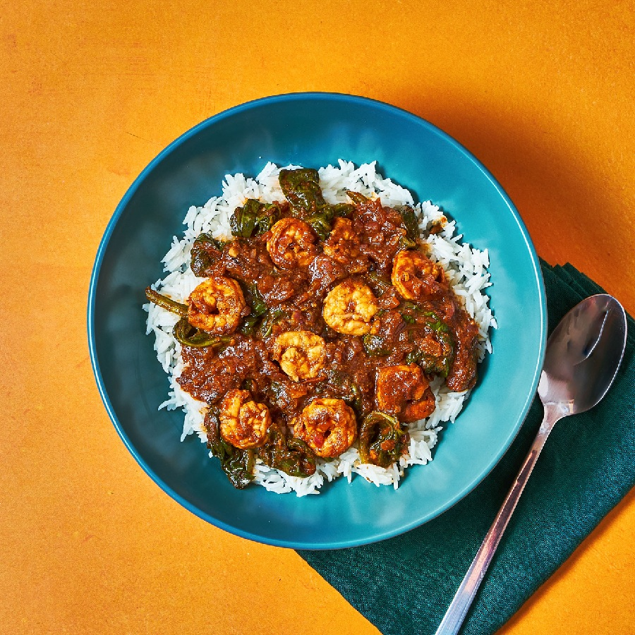

# Prawn Balchão

*Goan prawn pickle-curry: prawns simmered in a thick vinegar-and-chilli paste, almost a condiment in its intensity. A spoonful with rice or bread is plenty; eaten by Goan Catholics as a make-ahead larder dish.*

**Serves:** 4-6 (as a condiment); 4 (as a main with rice)

**Prep Time:** 20 minutes

**Cook Time:** 30 minutes

## Overview
Prawns are seasoned briefly with turmeric and salt. A balchão masala is built from soaked dried Kashmiri chillies, garlic, ginger, cumin, peppercorns, cloves and cinnamon ground with palm vinegar. Onions are caramelised in oil to deep gold, tomato is added, the masala paste fried until the oil separates, then sugar and a second hit of vinegar make this a pickle rather than a curry. The prawns go in late so they stay juicy. The dish thickens to a jam-like consistency.

## Ingredients

### Prawns
- 500 g large peeled prawns (raw, deveined; tail on or off)
- ½ teaspoon turmeric
- 1 teaspoon salt

### Balchão masala
- 12 dried Kashmiri chillies
- 4 dried byadgi (or guntur chillies, for the heat)
- 1 tablespoon cumin seeds
- 1 teaspoon black peppercorns
- 6 cloves
- 1 cinnamon stick (small)
- 30 g fresh ginger
- 8 garlic cloves
- 3 tablespoons palm vinegar (or cider vinegar)
- ½ teaspoon ground turmeric

### Curry
- 4 tablespoons coconut oil (or vegetable oil)
- 2 onions (finely chopped)
- 1 teaspoon salt (to taste)
- 4 ripe tomatoes (finely chopped)
- 1 tablespoon palm jaggery (or soft brown sugar)
- 3 tablespoons palm vinegar (the second hit; do not skip)
- 200 ml water

## Method

### Stage 1 - Season the prawns
1. Toss the prawns with turmeric and salt.
1. Set aside for 10 minutes.

### Stage 2 - Soak and grind the masala
1. Soak the dried chillies in hot water for 15 minutes; drain.
1. Dry-toast the cumin, peppercorns, cloves and cinnamon in a pan for 30 seconds.
1. Grind the soaked chillies, toasted spices, ginger, garlic, palm vinegar and turmeric to a smooth thick paste.

### Stage 3 - Caramelise the onions
1. Heat the oil in a wide heavy pan over medium heat.
1. Add the chopped onions and a pinch of salt.
1. Cook for 12-15 minutes, stirring, until deep golden brown (slow caramelisation is the foundation of balchão; rushed onions give a thin dish).

### Stage 4 - Add the tomato and masala
1. Add the chopped tomato.
1. Cook for 6-8 minutes until it breaks down completely.
1. Stir in the balchão masala.
1. Cook for 8-10 minutes, stirring often, until the oil separates from the masala at the edges and the kitchen smells of toasted spice.

### Stage 5 - The vinegar and sugar
1. Add the jaggery, second vinegar hit and water.
1. Bring to a simmer.
1. Cook uncovered for 10-12 minutes, stirring occasionally, until the sauce has thickened to a jam-like consistency (the oil should float at the surface).
1. Taste and adjust salt and vinegar.

### Stage 6 - Cook the prawns
1. Add the prawns to the sauce.
1. Stir gently to coat.
1. Cook over medium heat for 3-4 minutes, just until the prawns turn opaque (longer makes them rubbery).

### Stage 7 - Rest
1. Pull from the heat.
1. Rest for at least 30 minutes (the dish improves dramatically as it cools; the flavours settle and the masala thickens further).

### Stage 8 - Serve
1. Serve at room temperature with steamed rice or pao (Goan bread rolls).

## Notes
- **Vinegar in two stages:** The first vinegar goes into the masala paste and cooks down; the second goes in with the sugar and finishes the dish raw-edged. Both are essential.
- **Balchão is a pickle:** Thick, jammy, dark, oily on top. It should hold its shape on a spoon, not pour like curry. If yours is thin, cook longer.
- **Make ahead:** Improves over 2-3 days in the fridge. The fresh vinegar mellows; the spices settle.

## Storage
- Refrigerate up to 2 weeks; oil rises to the top and seals the surface.
- Freezes well for 3 months. Defrost overnight in the fridge.
