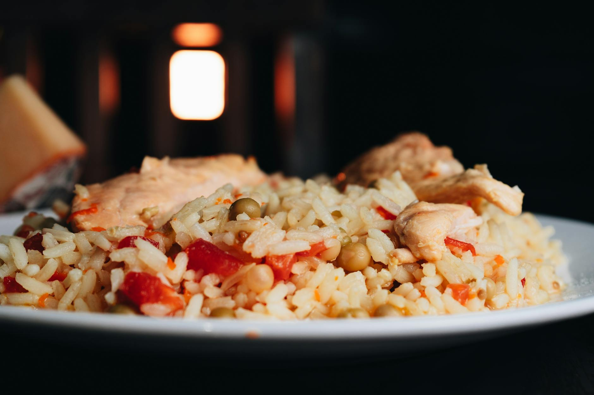

# Arroz Refogado

*Goan-Portuguese sautéed rice: short-grain rice cooked in a tomato-and-chouriço base with garlic, bay and a splash of stock. The colonial inheritance of Goa's kitchen; eats as a side or a meal.*

**Serves:** 4-6

**Prep Time:** 10 minutes

**Cook Time:** 30 minutes

## Overview
Rice is rinsed but not soaked (this is Portuguese-style rice, where short-grain is preferred for its slight starchiness). Goan chouriço is rendered in olive oil with garlic and bay, onion is softened, tomato is cooked down to a paste, and the rice is toasted briefly before stock is poured in for a covered steam. Peas are folded through in the final minutes. The dish has a faintly smoky paprika colour and a clear Portuguese DNA.

## Ingredients
- 300 g short-grain rice (Calrose, bomba or arborio; if unavailable use long-grain basmati)
- 150 g Goan chouriço (or Spanish chorizo; diced into 5 mm cubes)
- 2 tablespoons olive oil
- 1 onion (finely chopped)
- 4 garlic cloves (finely chopped)
- 2 bay leaves
- 1 teaspoon sweet paprika
- 1 teaspoon Kashmiri chilli powder (optional, for colour)
- 2 ripe tomatoes (finely chopped) (or 200 g passata)
- 1 tablespoon tomato paste
- 700 ml chicken stock (or water)
- 1 teaspoon salt (to taste)
- 80 g peas (frozen)
- A handful of flat-leaf parsley (chopped)
- A handful of coriander (chopped)

### To serve
- 1 lime (cut into wedges)

## Method

### Stage 1 - Render the chouriço
1. Heat the olive oil in a wide pan with a tight-fitting lid over medium heat.
1. Add the diced chouriço.
1. Cook for 4-5 minutes, stirring, until it crisps and releases its red-orange oil.

### Stage 2 - Soften the base
1. Add the chopped onion and a pinch of salt; cook for 6-8 minutes until soft and lightly golden.
1. Stir in the garlic and bay leaves; cook for 1 minute.

### Stage 3 - Build the base
1. Add the paprika and Kashmiri chilli; stir for 15 seconds.
1. Add the chopped tomato and tomato paste.
1. Cook for 5-6 minutes, stirring, until the tomato has broken down into the chouriço oil.

### Stage 4 - Toast the rice
1. Rinse the rice briefly under cold water and drain well.
1. Tip into the pan and stir for 2 minutes to coat the grains in the tomato-chouriço base.

### Stage 5 - Steam
1. Pour in the chicken stock and salt.
1. Bring to a boil.
1. Reduce to the lowest heat, cover with a tight-fitting lid.
1. Cook for 16-18 minutes (don't lift the lid).
1. Scatter the peas on top in the final 3 minutes.

### Stage 6 - Rest and serve
1. Pull from the heat and rest, still covered, for 10 minutes.
1. Fluff gently with a fork.
1. Discard the bay leaves.
1. Scatter the parsley and coriander.
1. Serve with lime wedges.

## Notes
- **Goan chouriço is hot and tangy:** Spanish chorizo is the everyday substitute (milder, smokier). Avoid Mexican chorizo here; it's a different texture entirely.
- **Rinse, don't soak:** Short-grain rice wants some of its surface starch left intact; that's what gives arroz refogado its slight stickiness.
- **Tomato cooked through:** The dish is built on tomato cooked down until it's almost a paste in the chouriço oil. Undercooked tomato gives a watery dish.

## Storage
- Refrigerate up to 3 days; reheat covered with a splash of water.
- Freezes well for 2 months.
