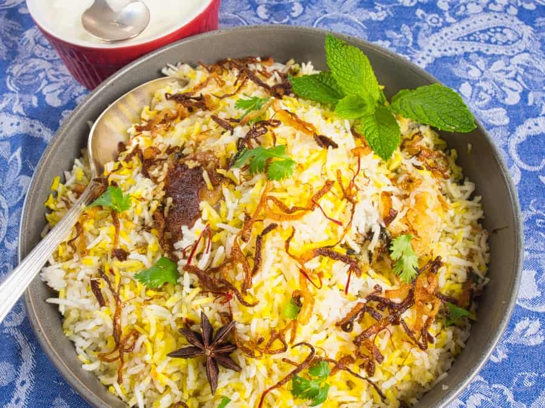

# Goan Chicken Biryani

*The Goan Catholic biryani: chicken marinated in a vinegar-spiked Goan masala, layered with saffron-fragrant basmati and finished in the dum. Distinct from its Hyderabadi cousin, with palm vinegar and a touch of toasted coconut in the masala.*

**Serves:** 6

**Prep Time:** 30 minutes (plus 2 hours marinade)

**Cook Time:** 1 hour 15 minutes

## Overview
Chicken thighs are marinated overnight in a yogurt-and-vinegar paste with a freshly-ground Goan masala (Kashmiri chillies, peppercorns, cinnamon, cloves, coriander, cumin and fennel) plus a touch of toasted coconut and ginger-garlic paste. Basmati is parboiled in salted water with whole spices. Fried onions are crisped and reserved. The biryani is built in layers: marinated chicken, rice, fried onions, saffron milk, mint, coriander, repeated; sealed under a tight lid and cooked under dum for 45 minutes. Distinctively Goan: palm vinegar in the marinade and a small splash of coconut milk in the layering.

## Ingredients

### Goan masala paste
- 40 g fresh grated coconut (or 30 g desiccated)
- 8 dried Kashmiri chillies (soaked 15 min, drained)
- 1 tablespoon coriander seeds
- 1 teaspoon cumin seeds
- 1 teaspoon fennel seeds
- 1 teaspoon black peppercorns
- 1 cinnamon stick (small, broken)
- 4 cloves
- 4 garlic cloves
- 25 g fresh ginger
- 2 tablespoons palm vinegar (or cider vinegar)
- 1 tablespoon palm jaggery (or soft brown sugar)
- ½ teaspoon turmeric

### Chicken marinade
- 1 kg chicken thighs (bone-in if possible, skinless, cut into 8 pieces)
- 200 g natural yogurt
- 1 teaspoon salt

### Rice
- 500 g aged basmati rice (rinsed)
- 3 litres water
- 2 tablespoons salt (for the water; aggressive seasoning at parboil)
- 1 bay leaf
- 1 cinnamon stick (small)
- 4 cloves
- 3 green cardamom pods (lightly crushed)
- 1 black cardamom pod

### Layering
- 2 onions (thinly sliced, fried until deep gold in 4 tablespoons of ghee or oil; reserve the cooking fat)
- ¼ teaspoon saffron threads
- 3 tablespoons warm milk
- 100 ml coconut milk
- A handful of coriander (chopped)
- A handful of mint leaves (chopped)
- 2 tablespoons ghee
- Dough for the seal (or foil + a tight lid)

## Method

### Stage 1 - Make the masala paste
1. Dry-toast the coconut over medium heat for 4-5 minutes until deep brown.
1. Tip into a small bowl.
1. Dry-toast the soaked Kashmiri chillies, coriander, cumin, fennel, peppercorns, cinnamon and cloves for 1 minute.
1. Grind everything with the garlic, ginger, palm vinegar, jaggery and turmeric to a smooth paste with 3 tablespoons of water.

### Stage 2 - Marinate the chicken
1. Combine the masala paste with the yogurt and salt.
1. Rub into the chicken pieces.
1. Refrigerate for at least 2 hours, ideally overnight.

### Stage 3 - Parboil the rice
1. Bring 3 litres of water to a hard boil with 2 tablespoons of salt and all the whole spices.
1. Add the rinsed rice.
1. Cook for 5-6 minutes, until the grains are 70% cooked (firm at the centre, soft outside).
1. Drain immediately in a colander.

### Stage 4 - Brown the marinated chicken
1. Heat 2 tablespoons of the fried-onion oil in a wide heavy pot.
1. Add the marinated chicken (with all the marinade) in a single layer.
1. Cook for 12-15 minutes over medium-high heat, stirring once or twice, until the chicken is browned and most of the moisture has cooked off.

### Stage 5 - Bloom the saffron
1. Crumble the saffron into the warm milk; rest for 10 minutes.

### Stage 6 - Layer
1. Spread half the parboiled rice over the chicken.
1. Scatter half the fried onions, half the coriander and mint.
1. Drizzle half the saffron milk and half the coconut milk over.
1. Add the second layer of rice; top with the remaining fried onions, coriander, mint and saffron milk.
1. Dot the ghee over the top.

### Stage 7 - Dum
1. Cover the pot tightly with a sheet of foil pressed onto the rice.
1. Press the lid down on top (use dough around the rim if you want the authentic seal).
1. Place over high heat for 3 minutes to start the steam.
1. Reduce to the lowest heat (use a heat diffuser or a flat skillet underneath) and cook for 40 minutes.
1. Pull from the heat and rest, sealed, for 15 more minutes.

### Stage 8 - Serve
1. Lift the lid and gently fold the layers from the bottom up so the chicken comes through the rice.
1. Serve with raita and a sliced cucumber-tomato salad.

## Notes
- **Toasted coconut is the Goan signature:** The mahogany-roasted coconut in the masala is what distinguishes Goan biryani from its Mughal cousins.
- **Don't over-parboil the rice:** 70% is the target. The dum finishes it; overcooked rice turns mushy in the steam.
- **Palm vinegar gives the tang:** Cider vinegar is a workable substitute, but malt is too sharp.

## Storage
- Refrigerate up to 3 days; reheat covered with a splash of water.
- Freezes well in portions for 2 months.
