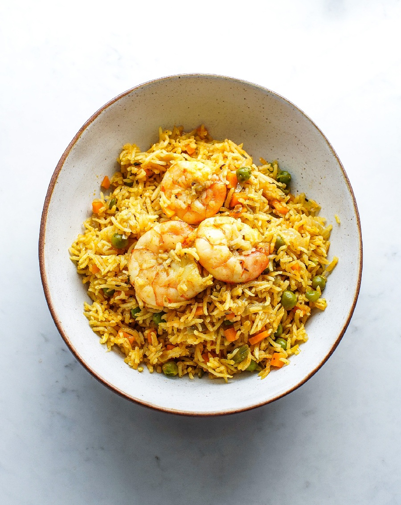

# Goan Prawn Pulao

*Goan prawn pulao: basmati cooked with a green-masala paste of coriander, mint and ginger, the prawns folded through at the end. A coastal weekday rice that does the work of a whole meal.*

**Serves:** 4-6

**Prep Time:** 15 minutes (plus 30 minutes soak)

**Cook Time:** 30 minutes

## Overview
A bright green masala paste of coriander, mint, green chilli, ginger and garlic is ground with a splash of vinegar. Basmati is rinsed, soaked and drained. Whole spices and onion are softened in coconut oil, the prawns briefly seared and lifted out, then the green masala is fried into the onion before the rice is added to toast. Stock goes in for the steam; the prawns return at the end so they don't overcook.

## Ingredients

### Rice
- 300 g aged basmati rice (rinsed, soaked for 30 minutes)
- 500 ml water (or hot fish stock)
- 1 teaspoon salt

### Prawns
- 400 g large peeled prawns (raw, deveined)
- ½ teaspoon turmeric
- 1 teaspoon salt
- Juice of ½ lime

### Green masala
- 30 g fresh coriander (stems included)
- 20 g fresh mint leaves
- 2 green chillies (chopped)
- 25 g fresh ginger
- 4 garlic cloves
- 1 tablespoon palm vinegar (or cider vinegar)
- ½ teaspoon salt

### Cooking
- 3 tablespoons coconut oil
- 1 onion (finely sliced)
- 1 small cinnamon stick
- 4 green cardamom pods (lightly crushed)
- 4 cloves
- 1 bay leaf
- 1 teaspoon cumin seeds

### To finish
- A handful of coriander (chopped)
- 1 lime (cut into wedges)

## Method

### Stage 1 - Marinate the prawns
1. Toss the prawns with turmeric, salt and lime juice.
1. Set aside.

### Stage 2 - Make the green masala
1. Blend the coriander, mint, green chillies, ginger, garlic, palm vinegar and salt to a smooth paste with 2 tablespoons of water.

### Stage 3 - Soften the base
1. Heat the coconut oil in a saucepan with a tight-fitting lid over medium heat.
1. Add the cinnamon, cardamom, cloves, bay and cumin seeds; sizzle for 30 seconds.
1. Add the sliced onion and a pinch of salt; cook for 8 minutes until golden.

### Stage 4 - Sear the prawns
1. Increase the heat to high.
1. Push the onion to the side and tip in the prawns in a single layer.
1. Cook for 1 minute a side until just starting to colour (they should not be fully cooked).
1. Lift the prawns out with a slotted spoon and set aside.

### Stage 5 - Cook the masala
1. Reduce the heat to medium.
1. Add the green masala paste to the pan.
1. Cook for 3-4 minutes, stirring, until the raw smell goes and the oil starts to separate.

### Stage 6 - Toast the rice
1. Drain the soaked rice well.
1. Tip into the pan and stir gently for 2 minutes to coat in the green masala.

### Stage 7 - Steam
1. Pour in the water (or stock) and salt.
1. Bring to a boil.
1. Reduce to the lowest heat, cover with a tight-fitting lid.
1. Cook for 12-14 minutes (don't lift the lid).

### Stage 8 - Add the prawns and rest
1. Lift the lid, scatter the seared prawns on top.
1. Cover and pull from the heat.
1. Rest, still covered, for 10 minutes (the prawns finish cooking in the residual heat).

### Stage 9 - Serve
1. Fluff gently with a fork.
1. Scatter the coriander and serve with lime wedges.

## Notes
- **Sear, don't cook the prawns:** A minute a side at the start. Adding them in raw at the end would overcook by the time the rice rests; a quick sear gives the right finish.
- **Green masala vinegar:** Palm vinegar is the Goan choice. The acid brightens the herbs and keeps the green from oxidising to olive.
- **The 10-minute rest:** Doubles as cooking time for the prawns. Don't lift the lid early.

## Storage
- Refrigerate up to 2 days; reheat covered with a splash of water.
- The prawn texture suffers on freezing; not recommended.
