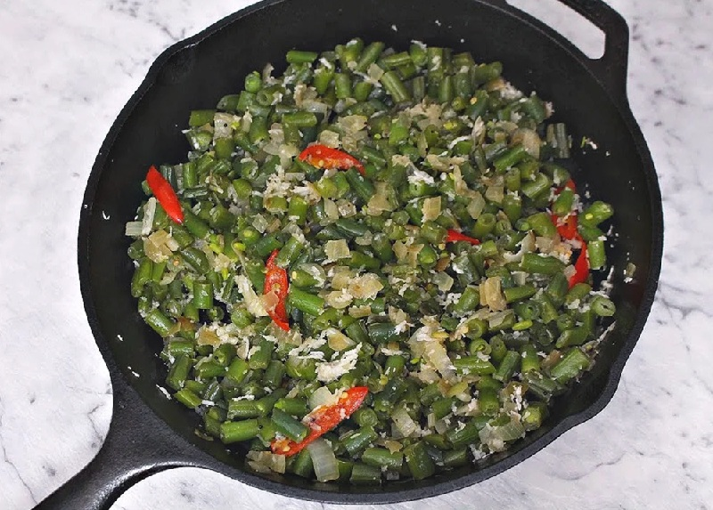

# French Bean Foogath

*Goan green beans with coconut and curry leaves: thin, snapped beans tossed with a mustard-seed temper and fresh coconut. A weekday side that takes 15 minutes from chopping board to plate.*

**Serves:** 4

**Prep Time:** 10 minutes

**Cook Time:** 12 minutes

## Overview
French beans are trimmed and chopped into 1 cm pieces. A temper of mustard seeds, urad dal, dried red chilli and curry leaves is bloomed in coconut oil, sliced onion is softened briefly, and the beans are tossed in with a splash of water to steam-cook them through. Fresh grated coconut is folded through at the end with a finishing pinch of green chilli.

## Ingredients

### Beans
- 400 g French beans (or fine green beans; trimmed and cut into 1 cm pieces)
- ½ teaspoon turmeric
- 1 teaspoon salt (to taste)

### Temper
- 2 tablespoons coconut oil
- 1 teaspoon black mustard seeds
- 1 teaspoon urad dal
- 2 dried red chillies (broken in half)
- 15 fresh curry leaves
- 1 onion (small, finely chopped)
- 2 garlic cloves (finely chopped)

### To finish
- 60 g fresh grated coconut (or 50 g desiccated, rehydrated in 2 tablespoons of warm water)
- 1 green chilli (finely chopped)
- 50 ml water (for the brief steam)

## Method

### Stage 1 - Temper
1. Heat the coconut oil in a wide pan over medium heat.
1. Add the mustard seeds; when they pop, add the urad dal and dried red chilli.
1. Cook for 30 seconds until the dal turns golden.
1. Add the curry leaves; sizzle for 5 seconds.

### Stage 2 - Soften the base
1. Add the chopped onion and garlic with a pinch of salt.
1. Cook for 3-4 minutes until soft and lightly golden.

### Stage 3 - Cook the beans
1. Add the chopped beans, turmeric and salt.
1. Toss for 1 minute to coat.
1. Pour in the 50 ml of water.
1. Cover and cook for 5-6 minutes, stirring once midway, until the beans are tender but still bright green.
1. Lift the lid and cook for 2 more minutes for any water to evaporate.

### Stage 4 - Coconut
1. Sprinkle in the grated coconut and chopped green chilli.
1. Toss for 1 minute until the coconut is warm through.
1. Taste and adjust salt.

### Stage 5 - Serve
1. Serve hot alongside rice, fish curry or any Goan main.

## Notes
- **Don't overcook the beans:** Pull while they still have a definite bite. Foogath should crunch slightly between the teeth.
- **Tiny dice on the beans:** Chopping the beans to a uniform 1 cm makes the dish eat well with a spoon and a fork. Long beans are awkward.
- **Coconut goes in last:** Adding it at the start risks burning. Folded in off the heat (or under low heat for 1 minute) it stays soft and white.

## Storage
- Best the day it's made.
- Refrigerate up to 2 days; the beans dull but the flavour holds.
