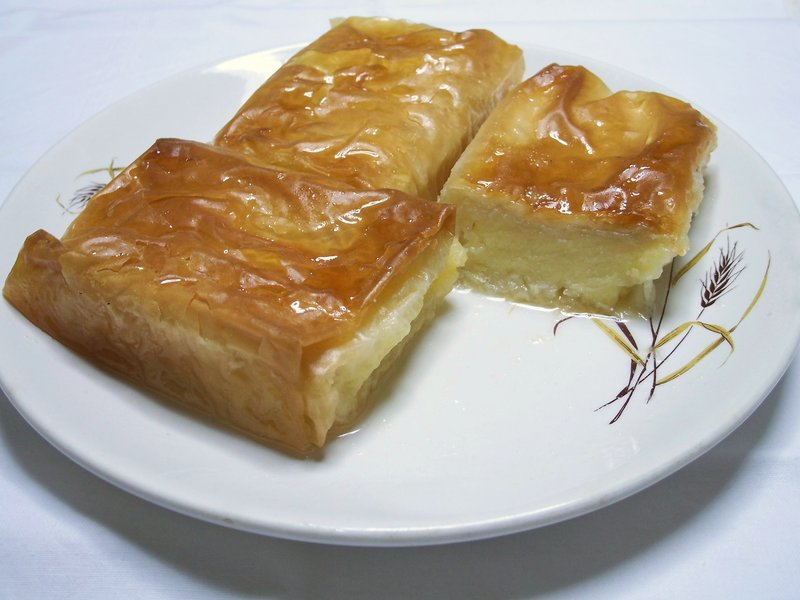

# Galaktoboureko

*Greece's milk pastry: a semolina custard cradled in layers of crackling buttered filo, soaked in lemon syrup straight from the oven.*

**Serves:** 8-10

**Prep Time:** 45 minutes

**Cook Time:** 50 minutes (plus 4 hours resting)

## Overview
A semolina custard simmers on the stove - milk, semolina, sugar, lemon zest, eggs - until thick. Off heat, butter and vanilla stir in. A 30 × 22 cm tin layers with 10 sheets of buttered filo on the bottom. Custard pours in. 8 more buttered filo sheets cover. Top scores into diamonds. Bakes 45 minutes at 180°C till deep gold. While baking, a syrup of sugar, water, lemon juice and cinnamon stick simmers. The HOT syrup pours over the JUST-OUT-OF-OVEN galaktoboureko. Rests 4 hours minimum (overnight ideal) before cutting.

## Ingredients

### Custard
- 1 litre whole milk
- 120 g fine semolina
- 200 g caster sugar
- 1 tablespoon vanilla extract
- Zest of 1 lemon
- 4 large eggs
- 80 g unsalted butter

### Filo
- 18 sheets filo pastry (approx 30 × 22 cm; thaw fully)
- 200 g unsalted butter (melted)

### Syrup
- 300 g caster sugar
- 250 ml water
- 1 strip lemon peel
- 1 small cinnamon stick
- 2 tablespoons lemon juice

## Method

### Stage 1 - Custard
1. In a heavy saucepan, whisk the milk, semolina and 200 g sugar.
1. Place over medium heat; whisk constantly as the milk heats.
1. When it reaches a simmer, reduce heat to low and continue whisking 6-8 minutes - the semolina absorbs moisture and the mixture thickens to a thick porridge.
1. Off the heat, stir in the lemon zest and vanilla.

### Stage 2 - Temper the eggs
1. In a separate bowl, whisk the eggs.
1. Slowly drizzle 200 ml of the hot semolina into the eggs, whisking constantly (tempers them without scrambling).
1. Pour the tempered egg mix back into the saucepan; whisk over very low heat 1 minute (don't simmer - eggs will curdle).
1. Off heat, whisk in the 80 g butter.
1. Cover the surface with cling film (pressed directly on, to prevent skin); cool 15 minutes.

### Stage 3 - Build the pastry
1. Heat the oven to 180°C (160°C fan).
1. Brush a 30 × 22 cm baking tin generously with melted butter.
1. Lay 1 sheet of filo in the tin (it'll come up the sides - that's fine).
1. Brush with melted butter.
1. Layer 9 more sheets, brushing each.

### Stage 4 - Add the custard
1. Pour the warm custard evenly over the filo base; smooth with a spatula.

### Stage 5 - Top filo
1. Lay 8 more sheets of filo over the custard, brushing each with butter.
1. Tuck the edges of any overhanging sheets neatly down the sides.
1. Brush the top with the remaining butter.

### Stage 6 - Score
1. With a sharp thin knife, score the top filo (ONLY the top layers, not all the way down) in a diamond pattern - diagonal cuts 4 cm apart, then crossing diagonals 4 cm apart.
1. Scoring only the top lets the syrup penetrate later.

### Stage 7 - Bake
1. Bake 45-50 minutes until the top is deep gold and the filo is fully crisp.
1. Remove from oven.

### Stage 8 - Syrup (made while baking)
1. While the galaktoboureko bakes, combine sugar, water, lemon peel and cinnamon stick in a small pan.
1. Bring to a simmer; cook 10 minutes.
1. Stir in the lemon juice; remove from heat; remove the lemon peel and cinnamon stick.

### Stage 9 - Pour syrup
1. While the galaktoboureko is still HOT (just out of the oven), slowly pour the WARM syrup evenly over the entire top.
1. The syrup will hiss and absorb.
1. The temperature differential is what makes the soak work.

### Stage 10 - Rest
1. Cool to room temperature (about 1 hour).
1. Rest UNCUT at room temperature 4 hours minimum (overnight is better) so the custard sets and the syrup distributes.

### Stage 11 - Cut and serve
1. Re-trace the scored diamond lines, cutting all the way down through the custard.
1. Lift each piece with a palette knife.
1. Serve cool or just-warm.

## Notes
- **Score only the top, not all the way:** cutting through the custard before baking lets the custard escape. Score only the filo so the syrup can absorb through the cuts.
- **HOT pastry, WARM syrup:** the temperature gap drives absorption. Cold syrup on cold pastry sits on the surface; warm syrup on hot pastry soaks in.
- **Rest the cake before cutting:** custard cuts cleanly once it has set fully. Cutting too early gives messy slices and oozing custard.
- **Don't overbake the custard during cooking:** the semolina should be thick but still pourable. Overcooked semolina-custard is grainy and gluey.

## Storage
- Keeps 4 days at room temperature in a covered tin.
- Refrigerate in hot weather; bring to room temperature 30 minutes before serving.
- The filo softens slightly over the days but the dessert improves in flavour.
