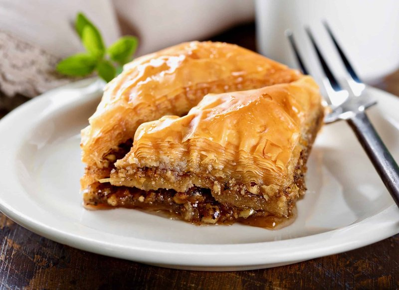

# Greek Baklava

*Greece's defining filo dessert: layered pastry packed with walnut and cinnamon, soaked in lemon-honey syrup. A clove pegs each diamond square.*

**Serves:** Makes 20-24 squares

**Prep Time:** 45 minutes

**Cook Time:** 50 minutes (plus overnight resting)

## Overview
A 30 × 22 cm tin is built in layers: 8 buttered filo sheets on the bottom; walnut-cinnamon filling; 4 buttered filo sheets; more walnut; 4 more filo; walnut; finally 8 more buttered filo on top. The top is scored into squares; a clove is pressed into the centre of each. Baked for 45 minutes at 180°C till amber. Syrup of honey, sugar, water, lemon and cinnamon stick simmers separately. The COOL syrup is poured over the HOT baklava. Rested overnight, non-negotiable.

## Ingredients

### Filling
- 600 g walnuts (roughly chopped, not powdered - a coarse grind keeps texture)
- 100 g caster sugar
- 2 teaspoons ground cinnamon
- ½ teaspoon ground cloves
- 1 teaspoon orange zest (optional)

### Pastry
- 24 sheets filo pastry (approx 30 × 22 cm)
- 250 g unsalted butter (melted)

### Topping
- 24 whole cloves

### Syrup
- 250 g caster sugar
- 200 ml water
- 200 g clear honey
- 1 strip lemon peel
- 1 cinnamon stick
- 2 tablespoons lemon juice

## Method

### Stage 1 - Filling
1. Chop the walnuts coarse with a knife (don't use a food processor - it pulverises). The texture should be like coarse couscous.
1. In a bowl, mix the walnuts with the sugar, cinnamon, cloves and optional orange zest.

### Stage 2 - Syrup (made first to cool)
1. Combine sugar, water, honey, lemon peel and cinnamon stick in a saucepan.
1. Bring to a simmer; cook 10 minutes.
1. Stir in the lemon juice; remove from heat.
1. Cool completely (this is the cold side of the temperature gap).

### Stage 3 - Build the pastry
1. Heat the oven to 180°C (160°C fan).
1. Brush a 30 × 22 cm baking tin with melted butter.
1. Lay 8 sheets of filo in the tin, brushing each with butter (don't be stingy - every layer needs butter).
1. Sprinkle one-third of the walnut mixture evenly.
1. Add 4 more buttered filo sheets.
1. Sprinkle another third of the walnut mixture.
1. Add 4 more buttered filo sheets.
1. Sprinkle the final third of the walnut mixture.
1. Add the final 8 buttered filo sheets.
1. Brush the top with the remaining butter.

### Stage 4 - Score and clove
1. With a sharp thin knife, score the top into squares - long cuts at 4 cm intervals, cross cuts at 4 cm intervals.
1. Important: cut all the way down through every layer (different from galaktoboureko).
1. Press a whole clove into the centre of each square.

### Stage 5 - Bake
1. Bake 45-50 minutes until the top is amber-gold and the layers visibly puffed.

### Stage 6 - Pour syrup
1. Remove from oven.
1. Slowly pour the COOL syrup evenly over the HOT baklava.
1. The syrup will hiss; the temperature gap drives absorption into the layers.

### Stage 7 - Rest
1. Cool completely in the tin (about 2 hours).
1. Rest overnight at room temperature, UNCOVERED.

### Stage 8 - Serve
1. The pre-cut squares lift out cleanly with a small palette knife.
1. Pluck the clove out before eating (or leave for the diner to remove).
1. Serve with strong Greek coffee.

## Notes
- **Walnuts, not pistachios:** Greek baklava is walnut-forward. The Turkish pistachio version is excellent but different.
- **Cut all the way down BEFORE baking:** unlike galaktoboureko, baklava is cut through. This is what gives the syrup absorption path.
- **COOL syrup on HOT baklava:** the Greek convention is opposite to galaktoboureko. Hot-on-hot makes a sticky mess; cool-on-hot drives the syrup into the layers cleanly.
- **Overnight rest:** every Greek grandmother insists. The flavours fuse, the syrup distributes, the texture sets. Cut too early and you get a soggy crumbly mess.
- **Don't refrigerate:** baklava sweats in the fridge and the filo softens. Room temperature only.

## Storage
- Keeps 2 weeks at room temperature in a sealed tin.
- The texture peaks on day 2-3.
- Freezes 3 months pre-cut between parchment; thaw at room temperature.
