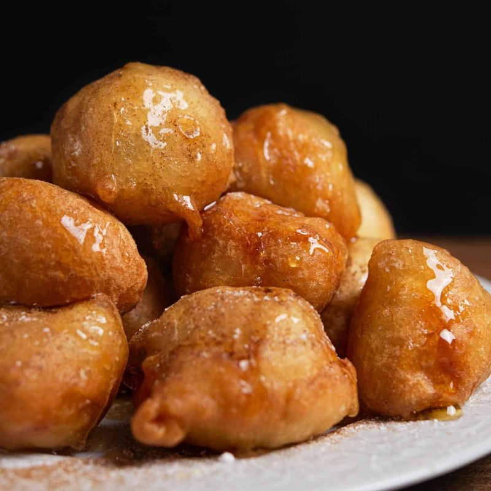

# Loukoumades

*Greece's festival doughnut: golf-ball puffs of yeasted batter dropped from a wet hand into hot oil, drenched in warm honey syrup, scattered with walnut.*

**Serves:** 6 (makes about 30 loukoumades)

**Prep Time:** 30 minutes (plus 1 hour rising)

**Cook Time:** 25 minutes (in batches)

## Overview
A wet yeasted batter - flour, warm water, yeast, salt, sugar - rests for 1 hour. A small syrup of honey, water, lemon and cinnamon stick simmers for 5 minutes. Oil heats to 175°C. The cook scoops a tablespoon of batter at a time from a wet hand, dropping into the oil - the puff is roughly walnut-sized. Fries for 2-3 minutes till deep gold, turning once. Drains briefly; tumbles into the warm syrup; lifts onto plates; showers with walnuts and cinnamon. Eats immediately.

## Ingredients

### Batter
- 500 g plain flour
- 7 g instant yeast
- 1 teaspoon salt
- 1 tablespoon caster sugar
- 600 ml warm water (this is a wet batter)

### Syrup
- 200 g clear honey
- 100 ml water
- 1 strip lemon peel (yellow zest only)
- 1 small cinnamon stick
- 1 tablespoon lemon juice

### Frying
- 1 litre neutral oil for deep frying (sunflower, rapeseed, or olive)

### To finish
- 80 g walnuts (roughly chopped, lightly toasted)
- 1 teaspoon ground cinnamon
- 2 tablespoons sesame seeds (optional)

## Method

### Stage 1 - Batter
1. In a wide bowl, whisk the flour, yeast, salt and sugar.
1. Pour in the warm water all at once.
1. Whisk vigorously for 1 minute - the batter should be smooth and sticky (it's much wetter than a bread dough; pourable from a spoon).
1. Cover with cling film; rest in a warm spot 1 hour. The surface should be bubbly and the volume doubled.

### Stage 2 - Syrup
1. Combine the honey, water, lemon peel and cinnamon stick in a small saucepan.
1. Bring to a simmer; cook 5 minutes.
1. Stir in the lemon juice; remove from heat.
1. Keep warm but not boiling.

### Stage 3 - Heat the oil
1. Heat the oil in a wide deep pan to 175°C.
1. A small drop of batter should sizzle and rise immediately; if it browns in 20 seconds, you're good.

### Stage 4 - Fry
1. Dip your hand in a bowl of cold water (this is the key to working with sticky batter).
1. Grab a small handful of batter; squeeze your fist gently - the batter pops out the top of your fist like toothpaste.
1. With a wet teaspoon (or just your wet hand), scoop a walnut-sized piece off the top of your fist and drop into the hot oil.
1. Continue until you have 6-8 loukoumades frying.
1. Fry 2-3 minutes total, turning with a slotted spoon, until deep gold and puffed.
1. The loukoumades will roll themselves over once their underside crisps.

### Stage 5 - Syrup soak
1. Lift the fried loukoumades with a slotted spoon; drain briefly on a wire rack (10 seconds).
1. Tumble into the warm syrup; let soak 30 seconds while you start the next batch.
1. Lift out with the slotted spoon onto a serving platter.

### Stage 6 - Serve
1. Pile the syrup-soaked loukoumades on a warm platter.
1. Sprinkle with chopped walnuts, cinnamon and sesame seeds.
1. Drizzle a little extra syrup over the top.
1. Serve IMMEDIATELY - loukoumades cool fast and the crisp shell goes soft.

## Notes
- **Wet hand, wet spoon:** working with sticky yeasted batter is impossible dry. Keep a bowl of cold water next to you and re-wet constantly.
- **Squeeze-from-fist technique:** Greek cooks shape loukoumades by squeezing batter through a fist and scraping the protrusion with a teaspoon. Practise the motion before frying; it's the difference between round puffs and irregular blobs.
- **Hot syrup, hot loukoumades:** the temperature drives absorption. Cold syrup on hot loukoumades sits on the surface; warm syrup soaks in.
- **Eat immediately:** the crisp-soaked contrast lasts about 10 minutes. After that you have a soggy honey ball - still good but the magic is gone.

## Storage
- Best within 30 minutes of frying.
- Day-2 loukoumades soften and lose their crisp; warm gently in a 160°C oven 5 minutes (won't fully revive but acceptable).
- Don't refrigerate - the syrup crystallises and the texture suffers.
